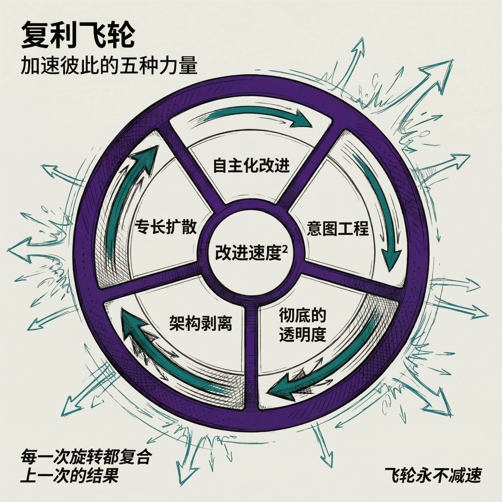
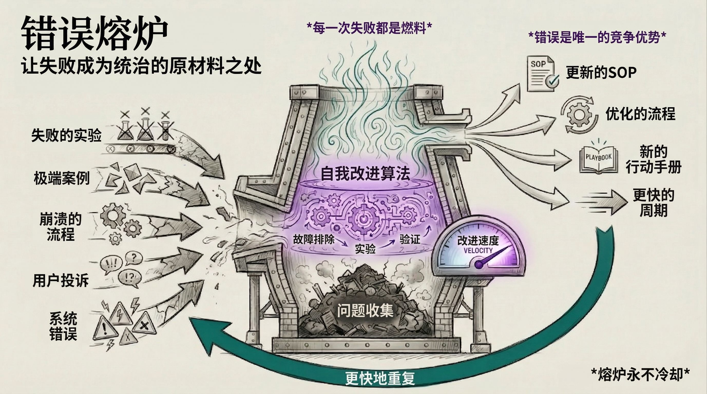
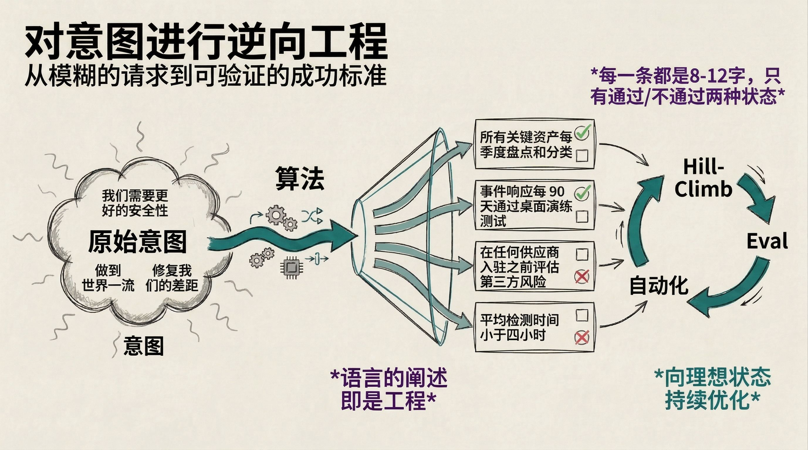
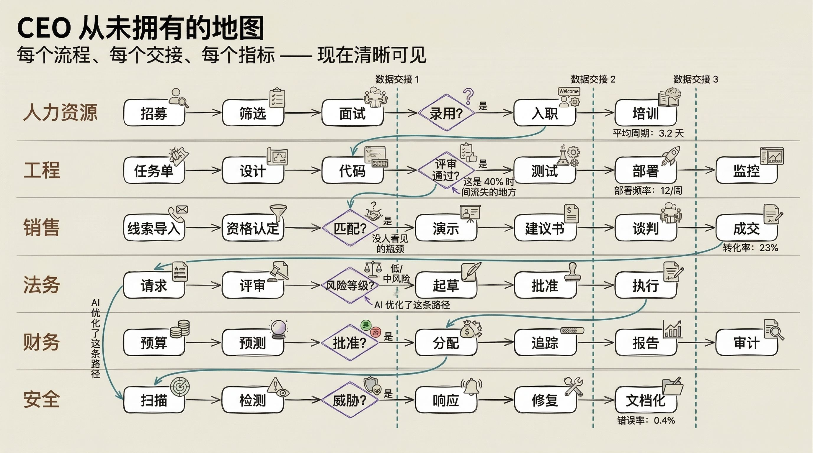
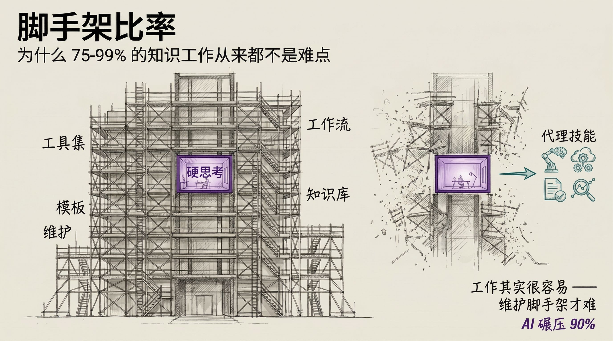
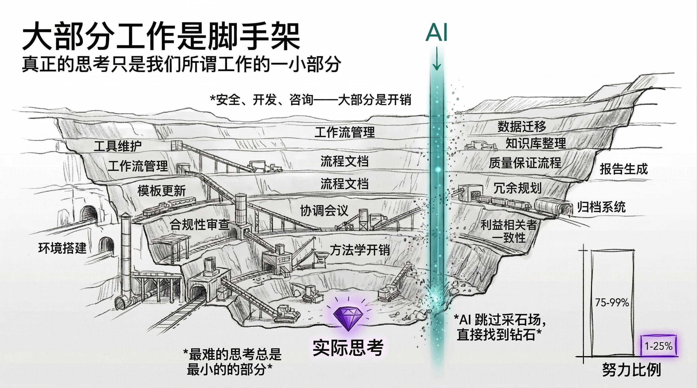
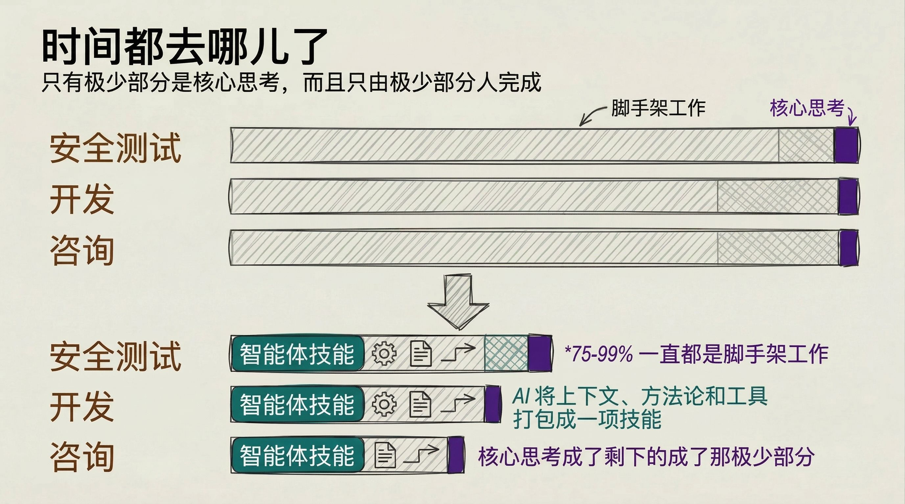
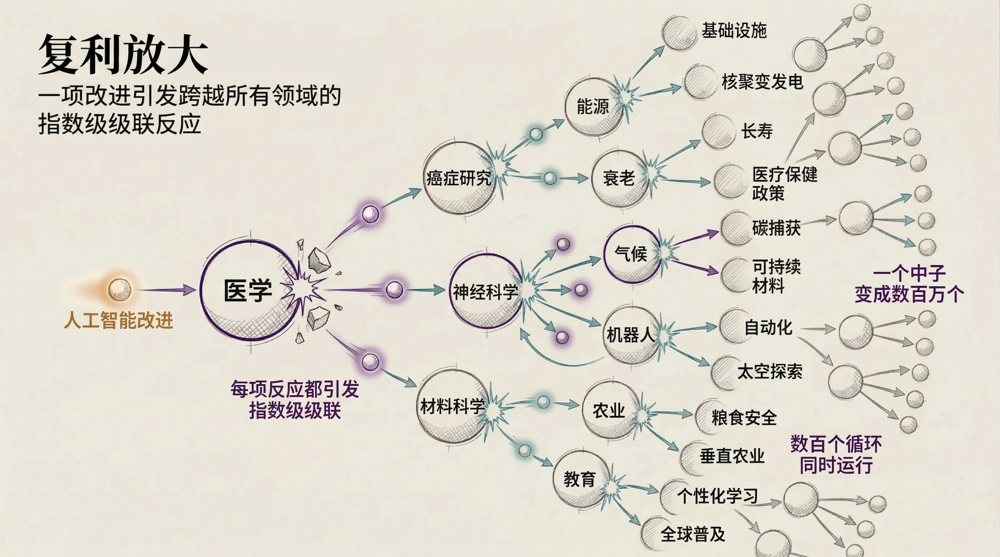

# 2026年当下AI领域最核心的理念是这个

> 原文链接：https://www.36kr.com/p/3756455985840901
> 文章时间：未标注

## 重点内容与核心观点

文章认为 AI 正从“对话框工具”走向“自我优化循环”，未来竞争的关键会变成能否清晰定义目标、记录执行过程、收集失败并让系统持续改进。核心观点是，自主组件优化、基于意图的工程、透明可验证指标、脚手架商品化和专家知识公共化会相互放大，使组织进入“定义目标—Agent 执行—记录—失败反馈—再优化”的复利循环。

[神译局](https://www.36kr.com/user/1864046570)_·_ 2026年05月05日 20:00

自我优化与透明化正以意想不到的方式改变一切

> 神译局是36氪旗下编译团队，关注科技、商业、职场、生活等领域，重点介绍国外的新技术、新观点、新风向。

编者按：AI正从“对话框”转向“自我进化循环”。当99%的知识工作被证明只是冗余的脚手架，能否清晰定义并验证“意图”，将成为区分顶级精英与平庸者的分水岭。文章来自编译。

经过大约一周的思考，并在此期间参加了 RSA 大会，我认为有几个核心的 AI 理念会以压倒其他一切的深刻方式改变现状。

1. 自主组件优化

2. 向“基于意图的工程”转型

3. 从模糊走向透明

4. 意识到绝大多数工作只是“脚手架”

5. 专业知识向公共知识扩散

### 1\. 自主组件优化

该理念与“现状到理想态”的转换、算法化以及通用可验证性等概念紧密相连。

而让这一理念真正落地、变得触手可及的，是 Karpathy 的 Autoresearch 项目。

他的项目专注于 AI 研究本身，即“对 AI 研究中的‘研究环节’进行自动研究”。这意味着自动处理那些繁琐耗时的杂事，比如调整模型参数、调教脆弱的环境以及各种选项组合。

在他的发布版本中，你只需要在 \`PROGRAM.md\` 文件里写下一些想法，系统就会自动处理所有那些乱七八糟的杂活。你只管去睡觉，系统会利用机器学习优化技术，产生比你手头更好的结果。

#### 扩展Autoresearch

现在已经出现了“Autoresearch for X”，这意味着它正在成为一种范式、一场运动，本质上变成了一件通用工具。

他引发了很多人的思考：

> 我能不能把类似的方法应用到我现在的工作中？

这确实非同寻常。

#### 将 Autoresearch 与我的研究相结合

我一直关注的是“通用可验证性”这一整体概念，或者说“通用爬山算法（优化）”。这再次借鉴了 Karpathy 很久以前在“软件 2.0”中所说的内容，以及他最近的一条推文，他在其中提到软件的未来在于一切皆可验证。

因此，我在 PAI 算法中所做的，就是尝试将所有内容分解为“理想态准则”。这些准则实质上是为我想要的结果构建一个理想的蓝图。

以此为基础，算法就可以朝着这个目标不断优化（爬山）。

#### 万物皆可评估（Evals）

与此相关的是“万物皆可评估”的概念。这与我的通用可验证性或通用爬山优化非常相似。其核心观点是：我们所做的每一件事都变得可衡量，更重要的是——可改进。

而让“万物皆可评估”成为可能的，正是透明化。

#### 通用优化循环

这将成为每个公司、组织、政府和个人的标准运行模式。这个循环如下所示：

你以目标导向的结构（使命、目标、工作流、SOP）绘制出想要完成的所有任务。由 AI智能体执行这些工作流。所有内容都会被广泛记录下来——包括输出内容、对话过程、最终结果以及质量情况等。每当日志中捕获到错误、失败或质量问题时，它们都会汇集到该实体的“问题搜集点”。

这个搜集点就是自我优化算法的养料来源。智能体从这里提取问题，创建类似 Autoresearch 的执行任务来排查故障、尝试解决方案、通过评估进行验证并优化。一旦找到修复方案，它们就会更新 SOP，确保问题不再发生。然后，循环往复。

跑任何东西都是这么个生命周期。 **明确目标。由智能体执行。记录一切。收集失败。自主改进。更新 SOP。不断重复——且每一次的速度都比上一次更快。**

### 2\. 向“基于意图的工程”转变

AI 的真正威力在于从“现状”跨越到“理想态”。定义现状，定义目标，然后让 AI 缩小现状与目标的差距。概念很简单，但在一切奏效之前还有一个前提：你必须能够清晰表达你到底想要什么。事实证明，这一点极其困难。如果你无法描述什么是“好”，那么再多的工具也帮不了你。

这对公司来说是一个巨大问题。如果你问一位 CEO 理想的安保方案是什么样的，你得到的只会是空泛的描述。如果你问一位团队组长，项目的“完成”意味着什么，你会得到一段文字，而三个人会有三种不同的解读。这种“表达鸿沟”不仅存在于专家与 AI 之间，也存在于领导者与其组织内部。大多数公司无法清晰描述自己在做什么，更不用说将其分解为可衡量或可优化的组件了。

我在算法内部构建的正是这种能力——一种将任何请求逆向工程为离散、可测试的“理想态准则”的方法。每条准则八到十二个字，判断标准是非黑即白的“通过/失败”。一旦拥有了这些，你就可以进行优化（爬山），可以进行评估，可以实现自动化改进。但这一切的起点，在于能够准确说出你想要什么。这就是新的工程技能——不是写代码，也不是写提示词，而是将意图表达得足够清晰，使其变得可验证。

### 3\. 从模糊走向透明

公司从未真正看清过自己内部发生的事情。流程的实际成本是多少？到底花了多长时间？产出的质量如何？谁在做核心工作，谁又在做核心工作之外的“脚手架”活计？

大多数组织的运作全凭“感觉”和表格。而 AI 让一切变得可见。实际的工作、成本和质量——所有这些都以以前根本无法实现的方式变得可衡量。一旦你看到了它们，你就可以改进它们。这适用于企业、政府、三个人的小团队——适用任何你关注的对象。

而透明化首先揭示的一点就是：有多少工作其实根本就不是核心工作。

### 4\. 绝大多数工作其实不过是“脚手架”罢了

AI 正在揭示一个事实：75% 到 99% 的知识型工作其实都是“脚手架”式的管理开销。在安全测试、开发、咨询等领域，大部分时间都花在了维护工具、工作流、模板和知识库上。真正的深度思考只占极小的比例，由极少数人在极少的时间内完成。

AI 能够彻底碾压这些“脚手架”部分的工作。智能体的技能（Agent Skills）已经证明，你可以将所有的上下文、方法论和工具打包成一项技能，而 AI 的执行效果不仅能比肩、甚至能超越大多数专业人士。核心工作其实并不难，难的是维护那些支撑性的脚手架。

### 5\. 专业知识向公共知识扩散

专家所掌握的知识与被记录下来的知识之间存在着“表达鸿沟”。大多数专业知识都存在于人们的脑子里。比如 62 岁的 Cliff，他知道一切是如何运作的，但他从来都没记录过。当 Cliff 退休时，那些知识也随他而去了。

现在正在发生的是，专业知识正从大脑扩散到技能、SOP、上下文文件和开源项目中。一旦这些知识被捕获，就再也不会流失。这就像往泳池里面尿尿一样（无法收回）。每一项发布的技能，每一个记录下来的流程，每一次捕获到的专家汇报——都会永久进入集体知识库。它让每一个 AI 实例都变得更聪明。不是一个，而是全部，同时变强。

在这方面目前已经形成了一个庞大的行业，专门致力于将专家知识提取到模型中，而大多数对此并不知情。这是一个单向的棘轮效应。人类需要 20 到 30 年的时间才能在单一领域培养出深厚的专业知识。他们会遗忘，会退休，会离职。而 AI 能瞬间吸收所有捕获到的专业知识，永不遗忘，且可以无限复制。人类与 AI 在专业知识积累速度上的差距正在日益扩大。

### 影响

#### 自主优化改变了一切事物的速度

许多领域的进步速度即将以超乎想象的方式加速。当你能够定义什么是“好”，并以此衡量、自动迭代时，过去需要数月手动调整的工作现在一夜之间就能完成。Autoresearch 在机器学习研究中证明了这一点。但这同样适用于安保方案、咨询成果、内容流水线、招聘流程。任何拥有可定义“理想态”的事物，都将变得可以自主优化。

每个实体——公司、政府、团队、个人——都将运行相同的循环：明确目标、智能体执行、记录一切、收集失败、自主改进、更新 SOP。率先采用这种模式的实体将以极快的速度进步，以至于那些落后者将根本无法与其竞争。

#### 意图成为瓶颈

💡 那些能够清晰表达自己意图的人将拥有巨大的优势。

新的稀缺技能不是写代码或写提示词，而是能够说出你到底想要什么。而且这必须是高质量的意图。创意的质量永远是最重要的，但其次就是表达创意、将其定义为实际目标、并让整个公司围绕其运作的能力。大多数领导者做不到这一点，大多数公司也做不到。率先解决这一问题的公司，将能够把所有的优化工具对准真正的目标，而其他人还在空谈 OKR。

#### 一切都将变得透明

我们即将见证世界从模糊的“感觉”转向透明且可优化的组件。那些坑蒙拐骗的人和行业“守门人”的藏身之处将越来越少。

这也使得销售产品或服务时的竞争变得更加困难。因为智能体首先会问：“你们的指标是什么？”它们关心的不是营销文案，也不是客户评价，而是实际的、可验证的性能数据。如果你没有这些数据，你就会输给拥有数据的竞争对手。

> 🔮 我称之为“从魔法转向 Excel”。

#### 脚手架被商品化

某些领域和职业所谓的“玄学”将被揭开面纱，露出它们作为脚手架的本质——此前只是大多数人不理解而已。比方说如何搭建特定的开发环境并维持运行，直到写出代码。法律、咨询和其他高薪行业也是如此。

> ⚖️ 这永远不会是一个百分之百完成的过程，但随着它接近 95% 甚至 99.99%，整体上而言细微差别就不再重要了。不过，这会为那些拥有模型所具备的独到见解或知识的人提供竞争优势。

#### 专家知识成为公共基础设施

过去只有专家掌握的知识，很快就能被所有人掌握——最重要的是被 AI 掌握。人们在某一领域拥有 50 年经验的优势将不复存在。因为这些内容将被他们自己或世界各地的同事所提取并汇总。

### 总结与启示

关于这一切最疯狂的一点是，这些会相互作用并相互放大。

我们不仅能够改进所有这些不同的组件，而且改进速度本身也会得到提升。

每家公司、每个政府、每个组织最终都将汇聚到同一个循环中：定义目标、智能体执行、记录一切、收集失败，然后让系统自我优化。率先实现的实体将以极快的速度产生复利效应，让其他所有人望尘莫及。

在所有这些想法中，这一点是最核心的启示。

这一切即将会变得多么疯狂呢，我实在是没法用语言表达出来。

译者：boxi。

本文来自翻译, 如若转载请注明出处。
