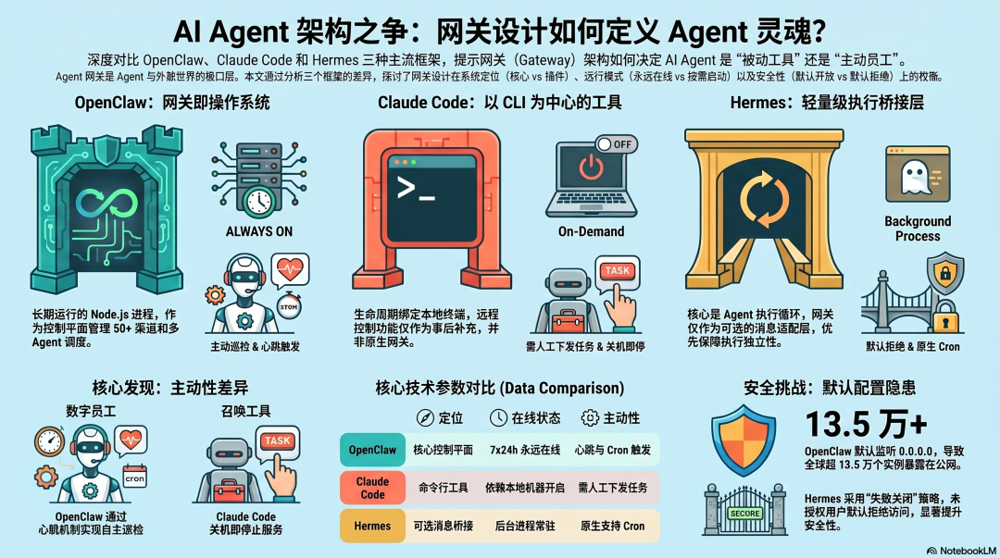
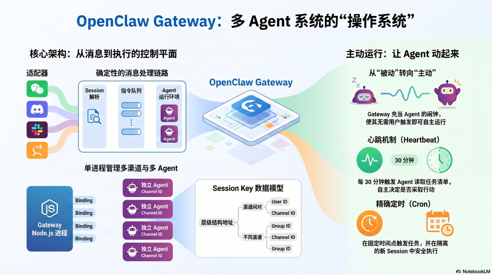
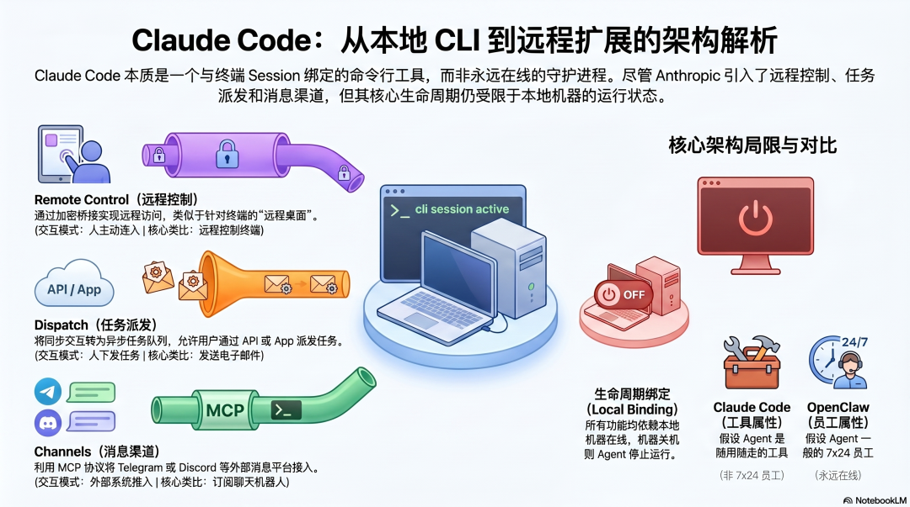
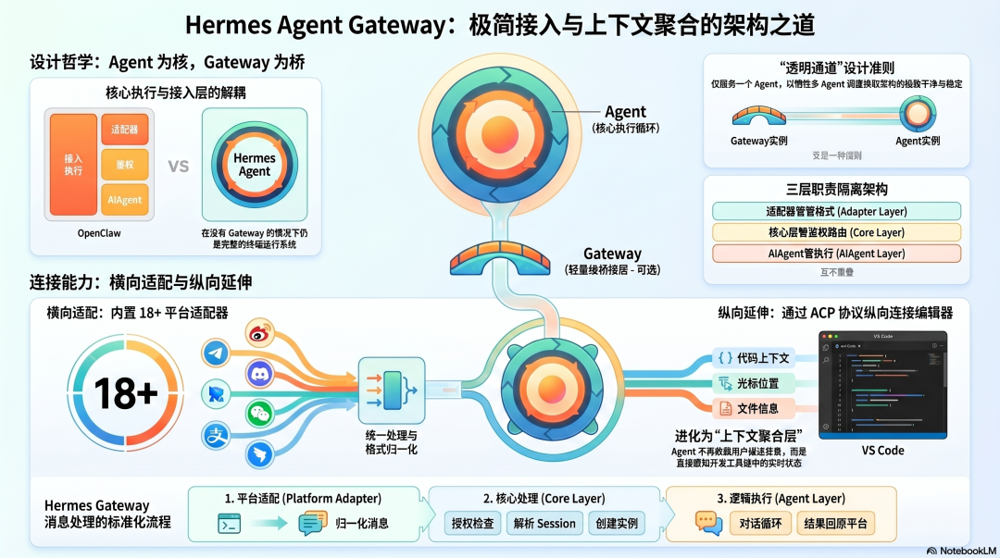
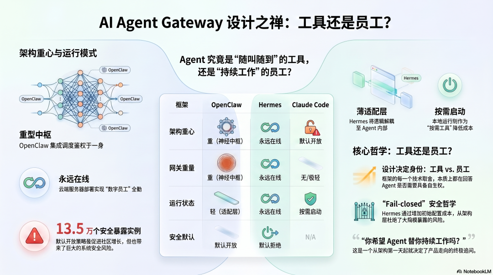

# AI Agent 架构设计（八）：Gateway 架构设计（OpenClaw、Claude Code、Hermes Agent 对比）

> 原文链接：https://mp.weixin.qq.com/s/7EKnLSF7oM7u5sqc_0FKTg
> 文章时间：2026年4月20日 10:10

## 重点内容与核心观点

文章从 Gateway 角度比较 OpenClaw、Claude Code 和 Hermes Agent 的架构哲学。核心观点是，Gateway 决定 Agent 是“被动响应工具”还是“持续运行的数字员工”：OpenClaw 把 Gateway 做成多渠道、多 Agent、心跳和 Cron 的控制平面；Claude Code 起点是本地 CLI，后续才补充远程控制和异步任务能力；Hermes 则把 Gateway 做成轻量桥接层，核心仍是 AIAgent 执行循环。

作者：AllenTang / 架构师带你玩转AI



> **系列**：AI Agent 架构设计（八）：Gateway 架构设计
> **目标**：理解 Gateway 的本质，以及三个框架对"Agent 和世界的入口"的根本不同设计
> **适合**：对 Agent 底层设计感兴趣，想真正理解"为什么这样设计"的读者
> **预计阅读**：15 分钟

Gateway 的设计哲学决定了 Agent 是什么


一个 Agent，等你发消息才动，还是自己盯着事情在转？

这个问题不是功能问题，是架构问题。而架构的答案，藏在 Gateway 的设计里。

**Gateway 是 Agent 和外部世界之间的入口层。** 消息从哪里来、怎么进来、谁有权发消息、路由到哪个 Agent——这些决定了 Agent 的工作模式。

设计成"有人发消息才启动"，Agent 就是被动响应工具。设计成"永远在线、主动监听、定时触发"，Agent 就是主动运行的数字员工。

三个框架在这个问题上给出了完全不同的答案：

- OpenClaw：Gateway 是核心产品，是整个系统的操作系统，永远在线，管理一切

- Claude Code：没有传统 Gateway，CLI 工具加上后来补充的远程控制层

- **Hermes：轻量消息桥接层，核心是 Agent 执行循环，Gateway 只负责把消息送进来**

## OpenClaw：Gateway 即操作系统



### 永远在线的控制平面

OpenClaw 的 Gateway 是一个长期运行的 Node.js 进程，默认监听 18789 端口，提供 WebSocket 和 HTTP 两种接口。

它做的事情远不只是"转发消息"：

``` 外部消息（WhatsApp / Telegram / Slack / Discord …）        ↓Channel Bridge（各平台适配器，50+ 渠道）        ↓Session Resolution（根据 dmScope 规则确定 session key）        ↓Command Queue（串行化，防止工具竞争）        ↓Agent Runtime（LLM 推理 + 工具执行）        ↓结果流回原渠道 ```

这是一个完整的控制平面。路由不是语言模型决定的，是 Gateway 的配置决定的——确定性、可预测、人可以完全控制。

### 多渠道、多 Agent：一个进程管理一切

OpenClaw Gateway 的核心架构能力是： **单进程同时管理多个渠道和多个 Agent**。

不同的渠道（WhatsApp 账号 A、Telegram 群组 B、Slack 工作区 C）可以通过 bindings 路由到不同的 Agent，每个 Agent 有独立的 workspace、sessions、auth profiles：

``` bindings: [  { match: { channel: "slack", teamId: "T123" }, agentId: "work" },  { match: { channel: "telegram", peer: { kind: "group" } }, agentId: "community" },  { match: { channel: "whatsapp" }, agentId: "personal" }] ```

三个渠道，三个独立 Agent，一个 Gateway 进程，配置文件控制路由。

**这是 OpenClaw 最重要的架构洞察：Gateway 不只是消息入口，它是多 Agent 系统的调度中心。**

Session key 是整个系统的数据模型——`agent:main:channel:peer` 这样的层级结构，给了每个对话唯一地址，也天然实现了上下文隔离：Slack DM 和 Telegram 群组不共享 session 历史。

### 心跳与 Cron：让 Agent 主动起来

Gateway 里还有两个机制，把 Agent 从"被动响应"变成"主动运行"。

**心跳（Heartbeat）**：定时触发（默认 30 分钟），Agent 读取 HEARTBEAT.md 的任务清单，自主决定是否需要行动。没有需要处理的事情，Gateway 静默丢弃结果，不打扰用户。

**Cron**：精确定时任务，在固定时间点触发，每次在隔离的新 session 里执行。

这两个机制让 Gateway 从"消息转发器"变成了"Agent 的闹钟"——不需要用户触发，Agent 自己就在跑。

## Claude Code：没有 Gateway，直到它需要一个



### 本质是 CLI，不是守护进程

Claude Code 的核心设计不是 Gateway，是命令行工具。你打开终端，运行 `claude`，开始对话，关掉终端，结束。

没有永远在线的进程，没有监听端口，没有消息路由层。Agent 的生命周期和你的终端 session 完全绑定。

这个设计和 OpenClaw 的哲学完全相反： **Claude Code 假设 Agent 是你工作时用的工具，不是替你工作的员工。**

### 三种远程控制层：事后补充的 Gateway 能力

随着用户需求增长，Anthropic 在 2026 年 Q1 陆续补充了三种远程控制机制：

**Remote Control（远程控制）**： 通过 Anthropic 的服务器在本地 session 和远程设备之间建立加密桥接。你的手机或另一台电脑可以连接到正在运行的 Claude Code session，就像远程桌面控制终端。

关键限制：本地机器和终端必须保持开启。Claude Code 不在后台运行，你走了它也停了。

**Dispatch（任务派发）**： 把 Claude Code 从"实时对话工具"变成"异步任务工作者"。通过 API 或手机 App 发一个任务，Claude Code 接收、执行、返回结果，不需要人盯着。

这是架构上最重要的转变——从同步交互变成异步任务队列。但它仍然不是"永远在线"：机器得开着，Desktop App 得运行着。

**Channels（消息渠道）**： 通过 MCP 协议把 Telegram、Discord 等消息平台接入 Claude Code session。你在 Telegram 发消息，Claude Code 处理，结果回到 Telegram。

架构上，Channels 是一个 MCP 服务器——和 Claude Code 连接外部工具走的是同一套协议，不是专门的 Gateway 层。

### 三者的核心区别

``` Remote Control：人主动连进去，像远程控制终端Dispatch：人发任务，Agent 异步完成，像发邮件Channels：外部系统推消息进来，像订阅机器人 ```

**这三种机制的共同局限：都依赖本地机器在线。** 你的电脑关机，一切停止。这是 Claude Code Gateway 能力和 OpenClaw 之间最根本的差距——OpenClaw 可以部署在 VPS 上 7×24 运行，Claude Code 的生命周期绑定在你的本地机器上。

## Hermes Agent：Gateway 是轻量桥接层，核心是执行循环



### 设计优先级的颠倒

Hermes Agent 的架构有一个和 OpenClaw 完全相反的优先级： **AIAgent 执行循环是核心，Gateway 是可选的接入方式。**

你可以完全不用 Gateway，直接在终端里运行 Hermes，这是完整的 Agent 系统。Gateway 只是额外给了你"通过消息 App 接入"这个选项，不是系统的控制平面。

OpenClaw 没有 Gateway 就不存在，Hermes 没有 Gateway 仍然完整。这个区别决定了 Gateway 在两个框架里完全不同的地位——也决定了它被设计得有多复杂。

**18 个平台适配器，统一会话路由**

既然 Gateway 只是桥接层，它的架构就被设计得尽可能干净。

Hermes Gateway 是一个后台进程，内置 18 个平台适配器（Telegram、Discord、Slack、WhatsApp、Signal、Email、WeChat、DingTalk……），统一处理消息进出。消息进来的路径是：

``` 平台消息    ↓Platform Adapter（归一化消息格式）    ↓授权检查 → 解析 session key → 创建 AIAgent 实例    ↓AIAgent.run_conversation()    ↓结果推回原平台 ```

三层职责不重叠：适配器只管格式转换，核心层只管鉴权和路由，AIAgent 只管执行。正因为 Gateway 不承担调度逻辑，这个架构才能在平台数量从 6 个增长到 18 个的过程中保持稳定——加新平台只需要加一个适配器，不动其他任何东西。

**单 Agent 的边界，和向编辑器的延伸**

Hermes Gateway 不承担调度逻辑，这种干净的架构也有它的代价：一个 Gateway 实例只服务一个 Agent。

需要工作 Agent 和个人 Agent 分开？启动两个 Gateway 实例。OpenClaw 可以用一个进程通过 bindings 调度多个 Agent，Hermes 做不到——这是"透明通道"和"调度中心"两种设计在实际使用中最直接的差异。

但 Hermes Gateway 有一个 OpenClaw 没有的延伸方向： **通过 ACP（Agent Communication Protocol）接入代码编辑器。**

VS Code 可以通过 ACP 向 Hermes 注册 MCP 服务器，把编辑器里的上下文——当前打开的文件、光标位置、选中的代码——实时传给 Agent。Agent 不需要用户描述"我在看哪个文件"，直接就知道了。

这让 Hermes 的接入层有了两个方向：横向接各种消息渠道，纵向接开发工具链。Gateway 从"消息桥接层"悄悄变成了"上下文聚合层"——这个方向比增加平台适配器更有意思，也是 Hermes 和其他框架最不一样的地方之一。

### 三种 Gateway  设计的核心取舍



**取舍一：Gateway 是核心还是入口**

OpenClaw 把 Gateway 做成整个系统的神经中枢——所有路由、鉴权、会话管理、多 Agent 调度都在里面。Hermes 把 Gateway 做成薄薄的适配层，真正的逻辑在 AIAgent 里。Claude Code 干脆一开始没有 Gateway，用户需要时再接上。

Gateway 越重，系统越集中，配置越复杂，但能力越强。Gateway 越轻，系统越分散，Agent 核心逻辑越独立，越容易测试和替换。

**取舍二：永远在线还是按需启动**

OpenClaw 和 Hermes Agent 都设计为部署在服务器上永远运行——Agent 是数字员工，不上班的时候也得在岗。Claude Code 依赖本地机器，机器关了 Agent 也关了——Agent 是工具，不用的时候不需要在线。

永远在线的代价是运营成本（VPS）和安全暴露面。按需启动的代价是失去主动性——无法定时执行，无法在你离开时继续工作。

**取舍三：默认开放还是默认拒绝**

这是最直接影响安全性的设计选择。OpenClaw 的历史证明了默认开放在快速增长的社区里意味着什么——13.5 万暴露实例。Hermes 的 fail-closed 默认值把这个风险从架构层面挡住了，代价是初始配置更麻烦一步。

Gateway 的设计哲学，终究是对一个问题的回答： **你希望 Agent 是你召唤的工具，还是替你持续工作的员工？** 三个框架对这个问题的答案，从一开始就分道扬镳了。

---
