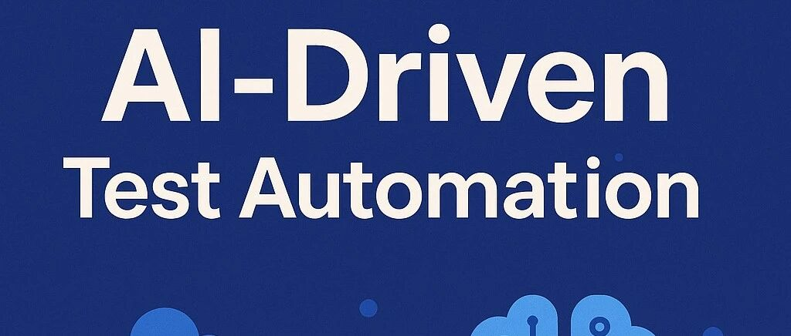

# AI驱动UI自动化测试框架调研

> 原文链接：https://mp.weixin.qq.com/s/sdQPZ310dH6GJoBGPenCHQ
> 文章时间：2025年4月30日 21:00

## 重点内容与核心观点

随着应用复杂度增加，手动测试变得费时且易出错，而自动化测试可提高效率和可靠性。如何借助大模型和一些自动化测试框架进行自动化测试，是一个研发团队很重要的诉求。

# AI驱动UI自动化测试框架调研

Original黑夜路人黑夜路人
黑夜路人技术

_2025年4月30日 21:00_

在小说阅读器读本章

去阅读

在小说阅读器中沉浸阅读

随着应用复杂度增加，手动测试变得费时且易出错，而自动化测试可提高效率和可靠性。如何借助大模型和一些自动化测试框架进行自动化测试，是一个研发团队很重要的诉求。

目前主流的自动化测试框架很多，Midscene.js结合Playwright提供AI驱动的测试生成和分析；Airtest专注于跨平台测试，特别适合游戏和多平台应用；Maestro针对移动应用提供低代码的测试创建方案；Testim则利用AI智能定位器减少测试维护工作。

### Testim - 自动化测试平台（For Web）

官网：https://app.testim.io

介绍：Testim是一个自动化测试平台，允许用户创建稳定的端到端功能软件测试，支持编码、无代码或两者结合的方式。该产品于2014年推出，是第一个基于AI的功能测试自动化解决方案。 Testim.io是一个借助人工智能提高测试效率的自动化测试平台，特别适合需要快速创建和维护稳定测试的开发团队，可以帮助企业加速发布高质量应用程序。

详细特点：

1. 1. 主要功能

   - AI驱动的自动化测试：使用人工智能加速测试创建、减少维护工作，并帮助更快地发布高质量应用程序。
   - 智能定位器：AI驱动的智能定位器能理解您的应用程序，识别元素，并自动修复以保持测试工作，即使应用程序发生变化也能继续正常运行。
   - 快速创建测试：帮助您快速创作精心设计、由AI稳定的测试，最大限度地减少维护工作。您还可以快速排除故障，有效确定工作优先级，控制测试变更，组织复杂性，并高效地发展团队和项目。
   - 多种测试支持：支持Web、移动应用和Salesforce应用程序的测试，提供低代码和无代码选项。
   - 可重用组件：Testim通过"分组"和"参数化"确保可重用性，允许用户将相关步骤组合成一个可重用组件。

3. 2. 核心优势

   - 加速测试创作：无需编码即可更轻松、更快速地构建高质量测试。
   - 减少维护：AI驱动的智能定位器找到更多元素，让您的测试在应用程序变化时保持工作。
   - 强大的故障诊断工具：使用突出显示的屏幕截图、控制台日志、网络日志和故障建议诊断失败的测试。
   - 与常用工具集成：能够与CI/CD流程集成，在代码检入时运行测试，为生产版本运行端到端测试，或安排完整的回归套件。

5. 3. 适用场景

   - 帮助敏捷开发团队快速高效地测试面向客户的移动和网络应用程序；
   - 简化移动应用程序测试的设备和应用程序管理；
   - 提供全面的测试自动化平台。

7. 4. 产品截图

### Midscene.js + Playwright 自动化UI测试框架 （For Web）

官网：https://midscenejs.com/zh/integrate-with-playwright.html

介绍：字节开源的midscenejs，Ai 驱动的自动化UI方案

核心特点

01. 1. 强大的端到端测试能力

    - 支持 Chromium、Firefox、WebKit 多浏览器测试
    - 内置 智能等待机制，减少时序问题
    - 可模拟 用户交互（点击、输入、拖拽等）

03. 2. 视觉回归测试（Visual Testing）

    - 自动截图比对，检测UI变化
    - 支持 动态内容处理（如时间戳、随机数据）
    - 可设置 视觉差异阈值，提高测试灵活性

05. 3. AI 增强测试（结合 OpenAI API）

    - 智能生成测试用例（基于自然语言描述）
    - 自动分析测试结果，提供优化建议
    - 动态数据生成（如模拟用户输入）

07. 4. 灵活的配置与集成

    - 支持 环境变量管理（如 OPENAI\_API\_KEY）
    - 可嵌入 CI/CD 流程（GitHub Actions、Jenkins等）
    - 提供 并行测试，提升执行效率

09. 5. 高级应用场景

    - 无障碍测试（a11y）：自动检测可访问性问题
    - 响应式测试：验证不同屏幕尺寸下的UI表现
    - 多语言测试：检查国际化内容渲染

11. 6. 适用场景

    - ✅ Web 应用自动化测试（功能 + UI）
    - ✅ 爬虫与数据抓取（Playwright 的浏览器自动化能力）
    - ✅ AI 驱动的测试优化（自动生成用例、分析缺陷）

13. 7. 产品截图

### Maestro - 移动端自动化测试方案（For APP）

官网：https://www.maestro.dev

介绍：Maestro 是一个面向移动端和网页应用的端到端测试平台，主打简单易用、强大且可靠，适用于任何开发框架。Maestro通过自动化、AI和云端协作，将传统复杂的测试流程简化为“所见即所得”的操作，同时保持专业级的覆盖率和可靠性。

核心特点

01. 1. 全平台覆盖

    - 支持测试移动端（iOS/Android）和网页应用，无论团队使用何种开发框架。

03. 2. 低门槛测试创建

    - Maestro Studio：通过可视化交互（如点击、滑动）自动生成测试命令，无需手动编写复杂代码。
    - 元素检查器：直接定位UI元素，避免猜测选择器（如XPath/CSS Selector）。

05. 3. AI辅助测试（MaestroGPT）

    - 内置AI助手，可自动生成测试命令或解答Maestro相关问题，降低学习成本。

07. 4. 企业级测试执行

    - 云端并行测试：在Maestro的云基础设施上并行运行测试，提升速度和可靠性。
    - 早期问题捕捉：在开发周期早期发现缺陷，避免影响终端用户。

09. 5. 现代化测试理念

    - 解决“开发速度快但质量管控滞后”的痛点，平衡开发效率与质量保障。

11. 6. 无缝协作

    - 测试脚本易维护，适合团队协作，避免传统测试工具常见的“脚本脆弱性”问题。

13. 7. 适用场景

    - 需要快速回归测试的敏捷团队。
    - 非测试专家（如开发者、产品经理）参与测试流程。
    - 多框架项目（如React Native、Flutter、原生应用混合开发）。

15. 8. 产品截图

### Airtest - 跨平台的自动化测试框架 （For APP）

官网：https://airtest.netease.com

介绍：Airtest Project 是一个跨平台的自动化测试框架，低门槛的自动化测试解决方案，主要用于游戏和应用的自动化测试。

核心特点

01. 1. 自动化测试

    - 支持\*\*一键录制和回放\*\*测试脚本，简化测试流程。
    - 提供完整的测试报告，便于分析和调试。

03. 2. 多平台支持

    - Android原生应用：通过图像识别和UI层级分析实现自动化测试，即插即用。
    - Unity游戏：专为游戏测试优化，支持图像识别和UI操作。
    - Windows应用：跨平台兼容，一次编写脚本可多平台运行。
    - iOS原生应用：通过Poco框架访问UI元素属性，精确定位控件。
    - Web应用：基于Chrome DevTools协议，支持录制并生成Selenium脚本，精准操作网页元素。

05. 3. 技术特点

    - 图像识别：不依赖控件层级，直接通过图像匹配操作界面。
    - UI层级分析：通过Poco框架解析UI结构，支持基于控件的自动化操作。
    - 跨平台兼容性：同一套脚本可适配Android、iOS、Windows和Web。
    - 低代码工具：提供录制功能，降低编写脚本的门槛。

07. 4. 产品优势

    - 易用性：录制回放功能简化脚本创建。
    - 灵活性：结合图像识别和UI分析，适应不同技术栈的应用。
    - 全流程支持：从脚本生成到报告查看，覆盖测试全生命周期。

09. 5. 适用场景

    - 游戏开发中的功能测试、回归测试。
    - 移动应用（Android/iOS）的UI自动化测试。
    - Windows桌面应用的自动化操作。
    - Web应用的自动化测试（类似Selenium但支持录制）。

11. 6. 产品截图

* * *

【欢迎关注】

**黑夜路人技术**

【黑夜路人技术】是“黑夜路人”的互联网技术分享账号，主要包括人工智能、AI大模型技术，互联网架构设计、高性能网络服务、服务端开发技术（Golang/Python/Rust/PHP/C&CPP）等技术交流

93篇原创内容

公众号

，

预览时标签不可点

**微信扫一扫赞赏作者**Like the Author

Close

**0人付费**

更多

Loading...

Loading...

Close

更多

Name cleared

**微信扫一扫赞赏作者**

Like the AuthorOther Amount

赞赏后展示我的头像

作品

暂无作品

Like the Author

Other Amount

¥

最低赞赏 ¥0

OK

Back

**Other Amount**

更多

赞赏金额

¥

最低赞赏 ¥0

1

2

3

4

5

6

7

8

9

0

.

AI · 目录

#AI

上一篇AI辅助编程IDE和编程大模型排序推荐下一篇AI大模型时代，程序员简单生存指南

Close

更多

搜索「」网络结果

Close

**调整当前正文文字大小**

更多

100%

​

Comment

暂无留言

1 comment(s)

已无更多数据

Send Message

写留言:

Scan to Follow

继续滑动看下一个

轻触阅读原文

黑夜路人技术

向上滑动看下一个

当前内容可能存在未经审核的第三方商业营销信息，请确认是否继续访问。

继续访问Cancel

[微信公众平台广告规范指引](javacript:;)

Got It

Scan with Weixin to

use this Mini Program

CancelAllow

CancelAllow

CancelAllow

×分析

微信扫一扫可打开此内容，

使用完整服务

黑夜路人技术

已关注

Like

Share

Popular

Comment

: ，，，，，，，，，，，，.VideoMini ProgramLike，轻点两下取消赞Wow，轻点两下取消在看ShareCommentFavorite听过

可在「公众号 \> 右上角  \> 划线」找到划线过的内容

OK

,

,

选择留言身份

该账号因违规无法跳转

**Comment**

暂无留言

1 comment(s)

已无更多数据

Send Message

写留言:

Close

更多

Close

**AI**

Details

更多

Loading...

关闭

## 确认提交投诉

你可以补充投诉原因（选填）

确定

wxa-pcopensdk
