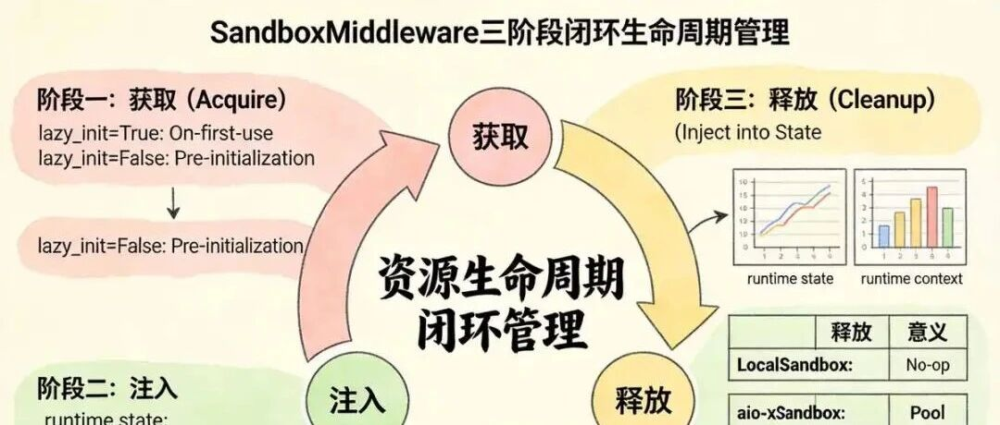

# Harness 顶级架构：DeerFlow 2.0 沙盒 Sandbox 架构设计、源码深度解析（史上最深 、价值 逆天）

> 原文链接：https://mp.weixin.qq.com/s/DyKv0rmmmSrk-Ao6wUvoeA
> 文章时间：2026年5月6日 21:46

## 重点内容与核心观点

Harness 顶级架构：DeerFlow 2.0 沙盒 Sandbox 架构设计、源码深度解析（史上最深 、价值 逆天）



# Harness 顶级架构：DeerFlow 2.0 沙盒 Sandbox 架构设计、源码深度解析（史上最深 、价值 逆天）

Original45岁老架构师45岁老架构师
技术自由圈

_2026年5月6日 21:46_

在小说阅读器读本章

去阅读

在小说阅读器中沉浸阅读

FSAC未来超级架构师

架构师总动员

实现架构转型，再无中年危机


**技术自由圈**

疯狂创客圈（技术自由架构圈）：一个 技术狂人、技术大神、高性能 发烧友 圈子。圈内一大波顶级高手、架构师、发烧友已经实现技术自由；另外一大波卷王，正在狠狠卷，奔向技术自由

399篇原创内容

公众号

，

# 本文 的 原文 地址

## 尼恩说在前面

在45岁老架构师尼恩的 **读者交流群**（50+人）里，最近不少小伙伴拿到了阿里、滴滴、极兔、有赞、希音、百度、字节、网易、美团这些一线大厂的面试入场券，恭喜各位！前两天就有个小伙伴面腾讯，   问到 **“ 听说过Harness Agent 吗？你们怎么实现  Harness Agent 的？ ”** 的场景题 ，小伙伴没有一点概念，导致面试挂了。小伙伴  没有看过系统化的 答案， **回答也不全面** ，so，   面试官不满意  ， 面试挂了。小伙伴找尼恩复盘， 求助尼恩。通过这个 文章， 这里  尼恩给大家做一下   系统化、体系化的梳理，写一个系列的文章组成  尼恩编著   《Harness 架构与源码  学习圣经》  深入剖析 Harness AI 平台级 架构的  架构思维与 核心源码，使得大家可以充分展示一下大家雄厚的 “技术肌肉”， **让面试官爱到 “不能自已、口水直流”**。' fill='%23FFFFFF'%3E%3Crect x='249' y='126' width='1' height='1'%3E%3C/rect%3E%3C/g%3E%3C/g%3E%3C/svg%3E)同时，也一并把这个题目以及参考答案，收入咱们的 《 [尼恩Java面试宝典PDF](https://mp.weixin.qq.com/s?__biz=MzkxNzIyMTM1NQ==&mid=2247497474&idx=1&sn=54a7b194a72162e9f13695443eabe186&scene=21#wechat_redirect)》V176版本，供后面的小伙伴参考，提升大家的 3高 架构、设计、开发水平。

## 尼恩编著   《Harness 架构与源码  学习圣经》

**第一章： 什么是 Harness架构？2026年AI核心范式解析 ： Harness架构与Agent工程化**具体文章：  [54k+Star 爆火！AI  框架 新王者 Harness Agent 来了！尼恩 来一次Harness穿透式解读](https://mp.weixin.qq.com/s?__biz=MzkxNzIyMTM1NQ==&mid=2247506624&idx=1&sn=971fc1704672cfe09e6ecef35bd83ecd&scene=21#wechat_redirect)**第二章：  Harness架构 与 LangChain、LangGraph 三者联动 的底层逻辑**具体文章：  [Harness架构 与 LangChain、LangGraph 三者联动 的底层逻辑](https://mp.weixin.qq.com/s?__biz=MzkxNzIyMTM1NQ==&mid=2247506648&idx=1&sn=f5f76be83df2475b80f2917016e56dd8&scene=21#wechat_redirect)**第三章： DeerFlow 源码 14层Middleware 源码解析 ，又一个 “洋葱责任链模式” 架构思维 的 经典案例**具体文章： [DeerFlow 源码 14层Middleware 源码解析 ，又一个 “洋葱责任链模式” 架构思维 的 经典案例](https://mp.weixin.qq.com/s?__biz=MzkxNzIyMTM1NQ==&mid=2247506655&idx=1&sn=aca3e53c02c1b8f079cac151ee3d2861&scene=21#wechat_redirect)**第四章： LangChain 超底层 四大设计模式 Design Patterns ，架构师 的 必备 内功，毒打面试官**具体文章： [LangChain 超底层 四大设计模式 Design Patterns ，架构师 的 必备 内功，毒打面试官](https://mp.weixin.qq.com/s?__biz=MzkxNzIyMTM1NQ==&mid=2247506655&idx=1&sn=aca3e53c02c1b8f079cac151ee3d2861&scene=21#wechat_redirect)**第五章：Harness宏观架构：基于 PPAF 思维 & REPL 思维，完成 Lead-Agent和Sub-Agent深度拆解**具体文章： [第五章：Harness宏观架构：基于 PPAF 思维 & REPL 思维，完成 Lead-Agent和Sub-Agent深度拆解](https://mp.weixin.qq.com/s?__biz=MzkxNzIyMTM1NQ==&mid=2247506671&idx=1&sn=70a7f4bb276400e96371e24ebfe58a53&scene=21#wechat_redirect)**第六章：Harness宏观架构：DeerFlow 2.0 断点续跑机制 架构设计与实现**具体文章： [Harness宏观架构：DeerFlow 2.0 断点续跑机制 架构设计与实现](https://mp.weixin.qq.com/s?__biz=MzkxNzIyMTM1NQ==&mid=2247506691&idx=1&sn=5eb2d90418b00dc5fd8c4554f1b31937&scene=21#wechat_redirect)**第七章：  Harness 平台实战： 用 DeerFlow 构建 一个企业自己的 Manus 平台（ 企业长任务智能体平台）**具体文章： [Harness 平台实战： 用 DeerFlow 构建 一个企业自己的 Manus 平台（ 企业长任务智能体平台）](https://mp.weixin.qq.com/s?__biz=MzkxNzIyMTM1NQ==&mid=2247506698&idx=1&sn=52d12b43c61fb332261c56ec46421589&scene=21#wechat_redirect)**第八章：  Harness 超牛逼的 三级记忆架构 上下文+历史分层+事实列表 ！ 落地价值 逆天！！**具体文章： \[Harness 超牛逼的 三级记忆架构 上下文+历史分层+事实列表 ！ 落地价值 逆天！！\](https://mp.weixin.qq.com/s/q8O-DjZPvksUHavG5sidZQ**第九章：  Harness 顶级架构：DeerFlow 2.0 沙盒 Sandbox 架构设计、Sandbox 源码深度解析（史上最深 、价值 逆天）**本文**第9章：  深度解析字节跳动DeerFlow 2.0：基于LangGraph的生产级Super Agent驾驭层实现**具体文章： 尼恩还在写， 本周发布**第10章：Harness架构 ：  Lead Agent 与 Sub-Agent 配合机制与使用决策指南**具体文章： 尼恩还在写， 本周发布**第11章： 基于 PPAF 思维，完成 与 Harness 工程化的 Lead-Agent 和 Sub-Agent 深度拆解.**具体文章： 尼恩还在写， 本周发布**第12章：Harness架构 核心一：断点续跑机制  的 架构设计  与底层源码分析 .**具体文章： 尼恩还在写， 本周发布**第13章：Harness架构 核心二： XXX**具体文章： 尼恩还在写，后续发布估计有 10章以上，具体请关注技术自由圈。

# DeerFlow 2.0 Sandbox模块：架构设计与源码深度解析

DeerFlow 2.0 作为字节跳动开源的生产级 Super Agent 框架 & Harness  平台级框架，其核心定位是打造一套可执行的“超级智能体运行底座”，重点解决长时程复杂任务处理、代理协作、受控执行环境等核心痛点。其中， **Sandbox（沙箱）模块** 是  DeerFlow 2.0  核心基石，更是DeerFlow 2.0区别于其他AI智能体框架的关键特性.**Sandbox（沙箱）模块**  实现了  安全、隔离、可复现   命令执行的 核心能力。相较于AutoGen、CrewAI等框架需依赖外部沙箱，DeerFlow 2.0原生集成沙箱环境，支持Docker容器级隔离，可直接承载命令执行、文件管理、长任务运行等核心操作，为智能体提供接近真实计算环境的执行空间。

# 一、痛点：为何Sandbox是Super Agent的核心能力？

DeerFlow 2.0的核心目标，就是让智能体从“对话式响应”升级为“任务式交付”，而Sandbox模块正是实现这一目标的核心支撑。在DeerFlow 2.0诞生之前，多数AI智能体框架存在三大核心痛点，而Sandbox模块的设计正是针对性解决这些问题：

- **安全风险不可控**：传统智能体直接在宿主机执行命令、运行代码，一旦出现恶意指令（如rm -rf /）或代码漏洞，会直接破坏宿主机系统，而Sandbox通过隔离机制，将风险限制在沙箱内部，保障宿主机安全。
- **环境一致性差**：不同开发者、不同部署环境（开发、测试、生产）的系统配置存在差异，导致智能体执行结果不可复现，Sandbox提供标准化的执行环境，确保无论在何种部署环境下，智能体的执行结果一致。
- **资源开销过大**：频繁创建、销毁沙箱会占用大量CPU、内存资源，尤其在长时程任务（小时级）场景下，会严重影响任务执行效率，Sandbox的复用机制的可有效降低资源开销，提升任务执行流畅度。

DeerFlow 2.0 Sandbox模块的设计围绕“安全、统一、高效、可扩展”四大核心目标展开，每个目标都对应明确的工程化诉求，具体如下：

- **强隔离性**：  执行命令、运行代码的需要 “隔离容器”。 防止恶意代码、错误操作污染宿主机系统，避免文件泄露、系统崩溃、权限滥用等安全风险，这也是生产级框架的必备能力。
- **接口统一性**：屏蔽底层执行环境的差异，为上层Agent、工具函数提供一致的操作接口。让开发者无需关心底层实现，只需调用统一接口即可完成文件读写、命令执行等操作，降低开发成本。
- **资源高效复用**：如果每次工具调用都创建、销毁沙箱， 这样带来巨大的性能开销。  Sandbox 支持会话级别的沙箱复用，确保同一任务流程中，智能体的上下文（文件状态、环境变量、命令执行记录）保持连续，同时减少资源浪费。
- **可扩展性**：采用抽象化设计，支持开发者快速接入新的沙箱实现（如Kubernetes Pod、云厂商Serverless容器、远程虚拟机等），无需修改上层业务逻辑，适配不同场景下的执行需求。

DeerFlow 2.0的Sandbox模块并非简单的“命令执行器”，而是一套完整的“受控执行环境”。DeerFlow 2.0的 Sandbox 结合记忆（Memory）、子代理（Sub-Agents）、技能（Skills）系统，共同支撑长时程复杂任务的完成，这也是其区别于其他框架沙箱功能的核心优势。

# 二、Sandbox 整体架构：三层抽象 与 DIP-SRP架构思维

DeerFlow 2.0的Sandbox模块采用经典的 **三层抽象架构**，从顶层到底层依次为：

- SandboxMiddleware（中间件层）
- SandboxProvider（工厂层）
- Sandbox（接口层）。

三层抽象架构 架构的设计，深度践行了 **依赖倒置原则** 与 **单一职责原则** 两大核心架构思维。**依赖倒置原则** 与 **单一职责原则**  ，  实现了“接口与实现解耦、组件职责清晰”的设计目标，为模块的可维护性、可扩展性提供了坚实支撑。

## 2.1 核心架构思维解析

在深入分析三层架构之前，先明确两大核心架构思维的内涵 。' fill='%23FFFFFF'%3E%3Crect x='249' y='126' width='1' height='1'%3E%3C/rect%3E%3C/g%3E%3C/g%3E%3C/svg%3E)

### 2.1.1 依赖倒置原则（DIP）

依赖倒置原则的核心是“依赖抽象，而非具体实现”。

- 即上层模块不依赖底层模块的具体实现，而是依赖底层模块的抽象接口；
- 抽象接口不依赖具体实现，具体实现依赖抽象接口。

这一原则在Sandbox模块中贯穿始终，具体落地表现为：

- 上层的SandboxMiddleware（中间件）不依赖具体的Sandbox实现（如本地沙箱、Docker沙箱），而是依赖Sandbox抽象接口定义的方法（execute\_command、read\_file等）。
- SandboxProvider（工厂）不依赖具体的Sandbox实现类，而是依赖Sandbox抽象基类，通过配置动态加载具体实现，实现“配置即切换”。
- 开发者新增沙箱实现时，只需继承Sandbox抽象基类、实现抽象方法，无需修改上层的Middleware、Provider代码，完美实现了解耦。

这种设计的核心价值的是“解耦与扩展”。无论是切换底层沙箱实现，还是新增沙箱类型，都不会影响上层业务逻辑，这也是DeerFlow 2.0能够快速适配不同部署环境的关键。

### 2.1.2 单一职责原则（SRP）

单一职责原则的核心是“一个组件只做一件事，只承担一种职责”，避免组件职责过重导致的可维护性下降。Sandbox模块的三层架构，每一层都严格遵循这一原则，具体分工如下：

- SandboxMiddleware：只负责与LangGraph Agent生命周期绑定，管理沙箱的创建、复用与销毁，不参与沙箱的具体实现与实例管理。
- SandboxProvider：只负责沙箱实例的创建、获取、释放与全局生命周期管理，不参与沙箱的具体操作（如命令执行、文件读写）。
- Sandbox：只负责定义沙箱的核心操作接口，以及具体实现接口（如本地沙箱实现文件读写、Docker沙箱实现命令执行），不参与沙箱的生命周期管理。
- 辅助模块（search.py）：只负责提供文件搜索（glob、grep）相关的工具函数，不参与沙箱的生命周期与核心操作。

职责清晰的分层设计，使得每个组件的代码量可控、逻辑清晰，后续维护、迭代时，只需关注对应组件的职责范围，避免牵一发而动全身，大幅提升了模块的可维护性。

> _尼恩提示：原文3w字以上， 超过平台限制， 此处省略 1000字，具体请参考  免费pdf。__完整版本，请参考 尼恩 免费百度网盘 免费pdf ，_ _点赞收藏本文后_ _，截图 找尼恩获取_

## 2.2 三层抽象架构详细解析

Sandbox模块的三层架构层层递进、相互配合，形成了一套完整的沙箱管理与执行体系。' fill='%23FFFFFF'%3E%3Crect x='249' y='126' width='1' height='1'%3E%3C/rect%3E%3C/g%3E%3C/g%3E%3C/svg%3E)

### 2.2.1 上层抽象 SandboxMiddleware： Sandbox 生命周期 管理

SandboxMiddleware  核心职责是“按需初始化沙箱、复用沙箱、释放沙箱”，确保沙箱与Agent的生命周期协同，同时优化资源占用。SandboxMiddleware是连接沙箱模块与LangGraph Agent的核心桥梁。SandboxMiddleware  它基于LangChain的AgentMiddleware抽象类实现。SandboxMiddleware    通过重写before\_agent（Agent执行前）和after\_agent（Agent执行后）两个钩子方法，将沙箱的生命周期  管理逻辑，无缝融入Agent的执行流程中。

#### 架构亮点1：懒加载（Lazy Initialization）+ 饿加载 （eager Initialization） 机制

源码中最具代表性的设计之一是支持两种初始化模式。这一设计充分考虑了不同场景下的性能需求，是“资源高效复用”目标的具体落地：

- **懒加载（默认lazy\_init=True）**：沙箱不会在Agent启动时立即创建，而是延迟到第一次工具调用时才进行初始化。
- **饿加载（lazy\_init=False）**：在Agent第一次执行前（before\_agent钩子中）就获取沙箱，适合需要在Agent逻辑中提前准备环境的场景（如提前创建工作目录、导入依赖包）。

懒加载（默认lazy\_init=True）模式的核心优势，是“避免资源浪费”。

> _尼恩提示：原文3w字以上， 超过平台限制， 此处省略 1000字，具体请参考  免费pdf。__完整版本，请参考 尼恩 免费百度网盘 免费pdf ，_ _点赞收藏本文后_ _，截图 找尼恩获取_

#### 架构亮点2：线程级沙箱复用与释放策略

为了进一步优化资源开销，DeerFlow 2.0设计了“线程级别的沙箱复用”机制。这也是结合长时程任务需求的关键设计。DeerFlow 2.0支持小时级的长时程任务处理，同一任务流程中可能包含多次Agent调用，沙箱复用能确保任务上下文的连续性，同时避免频繁创建销毁沙箱的开销。

### 2.2.2 中层抽象 SandboxProvider ： 沙箱实例的“工厂与管理者”

SandboxProvider是沙箱实例的核心管理组件，采用“抽象基类+单例模式+配置驱动”的设计。核心职责是“统一管理沙箱实例的生命周期”，包括沙箱的创建（acquire）、获取（get）、释放（release），以及全局单例的维护。SandboxProvider  也是   依赖倒置原则的核心落地载体。通过抽象基类定义 SandboxProvider   接口，具体实现类（如本地沙箱Provider、Docker沙箱Provider）实现接口，上层组件只需依赖抽象接口即可。

> _尼恩提示：原文3w字以上， 超过平台限制， 此处省略 1000字，具体请参考  免费pdf。__完整版本，请参考 尼恩 免费百度网盘 免费pdf ，_ _点赞收藏本文后_ _，截图 找尼恩获取_

### 2.2.3 下层抽象 Sandbox ：沙箱操作的统一“接口契约”

Sandbox是整个模块的最底层抽象，作为所有沙箱实现的“接口契约”。底层抽象 Sandbox 定义了智能体在沙箱内可执行的所有核心操作，包括命令执行、文件读写、目录管理、文件搜索等。所有上层组件（上层抽象 Middleware、中层抽象 Provider）都依赖这个抽象接口，具体实现类则遵循接口契约，确保操作的统一性。

## 三：上层抽象 SandboxMiddleware ：Sandbox 获取、注入、释放的 生命周期 三个阶段 闭环管理

' fill='%23FFFFFF'%3E%3Crect x='249' y='126' width='1' height='1'%3E%3C/rect%3E%3C/g%3E%3C/g%3E%3C/svg%3E)SandboxMiddleware 对 Sandbox 生命周期的管理，并不是零散的操作，而是拆分成了三个清晰、连贯的阶段：

- 获取（Acquire）
- 注入（Inject into State）
- 释放（Cleanup）。

三个阶段 形成一个完整的闭环，不遗漏任何一个环节，确保 Sandbox 资源的高效利用、不泄漏，这也是企业级落地的核心保障。

### 阶段一：获取（Acquire）

获取阶段的核心作用，是根据配置的初始化模式，获取或创建 Sandbox 实例，确保 Agent 能够正常使用 Sandbox 工具。获取阶段的逻辑，主要由 两个方法共同实现

- `ensure_sandbox_initialized` 函数
- `SandboxMiddleware` 的 `before_agent` 方法

具体分为两种情况：**(1) 默认模式（`lazy_init=True`）：`before_agent` 阶段啥也不做，Sandbox 的获取推迟到 Agent 第一次调用沙箱工具时。 当 Agent 第一次调用 bash、ls 等工具时，`ensure_sandbox_initialized` 函数会检查是否有已有的 Sandbox 实例，有则复用，没有则创建新的实例，实现“按需获取”，节省资源。****(2) 即时初始化模式（`lazy_init=False`）：`before_agent` 阶段会立即执行获取逻辑。  检查 state 中是否存在 Sandbox 实例，如果不存在，就通过 `provider.acquire(thread_id)` 申请一个新的 Sandbox 实例，提前完成初始化，适合需要频繁使用 Sandbox 的场景，避免多次初始化带来的性能损耗。**

### 阶段二：注入（Inject into State）

注入阶段的核心作用，是将获取到的 Sandbox 实例信息（主要是 `sandbox_id`）写入 runtime 的指定位置，供后续工具调用复用，同时确保 Sandbox 实例在整个 Agent 会话中能够被正常访问。获取到的 `sandbox_id` 会写入两个地方，各司其职、互不冲突：**(1) `runtime.state[“sandbox“] = {“sandbox_id“: sandbox_id}`：用于 Sandbox 实例的持久化。`runtime.state` 是 Agent 会话的全局状态，能够跨工具调用、跨 turn （会话轮次）持久化，确保同一个 Agent 会话中，多次工具调用能够共享同一个 Sandbox 实例，避免重复创建。即使 Agent 会话中断后重新恢复，也能通过 `runtime.state` 中的 `sandbox_id` 复用已有的 Sandbox 实例。****(2) `runtime.context[“sandbox_id“]`：用于 Sandbox 实例的快速引用。`runtime.context` 是当前工具调用的上下文，访问速度更快，在释放阶段（Cleanup），可以直接从 `runtime.context` 中获取 `sandbox_id`，无需从 `runtime.state` 中层层获取，提升资源释放的效率。**

### 阶段三：释放（Cleanup）

释放阶段的核心作用，是在 Agent 执行完成后，统一归还 Sandbox 资源，避免资源泄漏。这一阶段主要由 `SandboxMiddleware` 的 `after_agent` 方法实现。具体逻辑是：`after_agent` 方法会检查 `runtime.state` 和 `runtime.context` 中是否存在 `sandbox_id`，如果存在，就调用 `provider.release(sandbox_id)` 方法，归还 Sandbox 资源。这里再次强调：不同的 Sandbox 实现，“释放”的语义完全不同，并不是简单的“销毁实例”：

- 对于 LocalSandbox：`release` 方法基本是空操作，因为 LocalSandbox 是进程级别的单例，复用性强，不需要销毁实例，释放时只做一些简单的内存清理，避免资源占用。
- 对于 aio-sandbox：`release` 方法是将 Docker 容器放回“热池”（warm pool），下次有新的任务需要 Sandbox 实例时，直接从热池中复用容器，不用重新启动容器，提升任务响应速度，节省容器启动时间和资源。
- 对于 K8s 模式：`release` 方法是将 Pod 标记为“可复用”状态，或者根据配置自动伸缩，释放多余的 Pod 资源，确保 K8s 集群的资源高效利用。

需要注意的是，真正的资源回收（比如销毁 Docker 容器、删除 K8s Pod），并不会在 `after_agent` 阶段执行，而是发生在应用关闭时，由 `shutdown_sandbox_provider()` 函数统一处理。该函数会调用 Provider 的 `shutdown()` 方法，释放所有托管的 Sandbox 资源，彻底避免资源泄漏。

## 四： 中层抽象   sandbox\_provider  与 Sandbox的实例

在整套沙箱架构里， **Box 代表一次独立的沙箱运行实例**。不管底层是本地进程、Docker 容器、还是 K8s Pod，上层都统一抽象为 Box。每一次 Agent 工具调用、代码执行、脚本运行、文件操作，都会分配一个独立 Box：

- Box拥有独立运行环境、独立工作目录
- Box 相互环境隔离、互不污染文件与进程
- Box 支持生命周期管理：创建、复用、销毁、空闲回收
- 上层 Agent 只操作 Box 抽象，不关心底层是进程、容器还是 Pod

简单理解：Provider 是 **环境类型管理器**，Box 是 **单次任务的独立执行舱**。Sandbox Provider 是整个沙箱体系的 **底层环境提供者**，统一抽象了命令执行、代码运行、文件操作的能力。对外提供完全一致的调用接口，内部屏蔽本地进程、Docker 容器、K8s 集群三种底层差异，业务层无需感知底层部署形态，仅通过配置即可无缝切换运行环境。' fill='%23FFFFFF'%3E%3Crect x='249' y='126' width='1' height='1'%3E%3C/rect%3E%3C/g%3E%3C/g%3E%3C/svg%3E)整个体系包含三类标准 Provider：**1\. LocalSandbox 本地原生提供者**这是最轻量化、零依赖的沙箱实现。不依赖 Docker、不依赖 K8s，直接在宿主机创建子进程执行任务指令，和宿主机共享进程、文件、网络与权限。优势是毫秒级启动、无任何中间件部署成本，适合开发调试；短板是完全无环境隔离、无资源限制、无安全边界，一旦执行恶意脚本或高危命令，会直接污染甚至破坏宿主机， **仅限定用于个人本地开发调试，禁止线上生产、禁止多租户、禁止承接不可信任务**。**2\. aio-sandbox 本地容器提供者**基于 Docker 容器实现的单机级沙箱 Provider。依托 Linux Namespace、Cgroups 做进程、网络、文件系统资源隔离，仅固定挂载指定工作目录，严格限制越权访问宿主机其他路径与隐私配置。支持容器热池复用、空闲自动回收，兼顾启动性能与单机安全隔离；部署只需要宿主机安装 Docker，无需集群运维复杂度，适合单机生产、内网服务、CI/CD 流水线、单租户业务场景，是 **开发到生产过渡的最优中间形态**。**3\. aio-sandbox K8s 远程集群提供者**基于 Kubernetes 构建的企业级集群沙箱 Provider。以 K8s Pod 为最小隔离单元，天然具备命名空间隔离、资源配额限制、网络策略管控、RBAC 权限隔离能力，支持多租户命名空间划分、租户级数据与访问隔离。依托集群原生能力实现故障自愈、弹性扩缩容、节点调度、存储 PV/PVC 统一挂载，安全等级、可用性、并发扩容能力拉满；代价是部署依赖完整 K8s 集群、镜像仓库、网络插件与存储驱动，运维复杂度更高，专门适配 **公网生产、多租户平台、高并发大流量、企业级高可用架构**。sandbox\_provider  与 Sandbox的 整体架构设计模式 ，核心采用 **接口抽象 \+ 策略模式 \+ 工厂模式** 组合设计，是典型的经典工程化架构。**（1）统一接口抽象**定义顶层标准 SandboxProvider 接口，约束创建 Box、执行命令、文件读写、生命周期管理等通用行为，三种底层实现都遵循同一套接口规范。**（2）策略模式**LocalSandbox、本地容器、K8s 集群三种实现，作为三种可替换的策略实现。上层业务、Agent、技能编排完全面向接口编程，业务逻辑不需要修改一行代码，就能切换不同沙箱运行策略。**（3）工厂模式**通过配置文件指定当前使用的 Provider 类型，由工厂统一实例化对应沙箱实现，屏蔽底层创建细节。实现了 **配置驱动、一键切换、开发 / 测试 / 生产三套环境无缝迁移**。

> _尼恩提示：原文3w字以上， 超过平台限制， 此处省略 1000字，具体请参考  免费pdf。__完整版本，请参考 尼恩 免费百度网盘 免费pdf ，_ _点赞收藏本文后_ _，截图 找尼恩获取_

## 4.2 LocalSandboxProvider：单例模式的极简实现

`LocalSandbox` 是 Sandbox 抽象接口的最轻量、最简洁的实现方案。LocalSandbox  核心设计理念是“无侵入式本地执行”。LocalSandbox 无需依赖 Docker 或任何容器运行时环境，无需额外部署任何中间组件，直接在宿主机的系统环境中执行 Agent  命令。LocalSandbox 零  部署成本、零环境配置负担。LocalSandbox 是本地开发调试、小规模测试场景的首选方案，也是开发者快速验证 Agent 工具调用逻辑的最佳载体。' fill='%23FFFFFF'%3E%3Crect x='249' y='126' width='1' height='1'%3E%3C/rect%3E%3C/g%3E%3C/g%3E%3C/svg%3E)LocalSandbox 通过 `LocalSandboxProvider` 提供实例.LocalSandbox 核心设计是全局单例模式.全局单例 ,  能  确保所有线程、所有 Agent 调用共享同一个 Sandbox 实例，避免重复创建实例带来的资源浪费，同时简化实例管理逻辑。

## 4.3  路径映射：虚拟路径与物理路径的精准对齐

LocalSandbox 的核心工程挑战，本质上是解决“Agent 虚拟环境”与“宿主机物理环境”的路径不一致问题。在 Agent 的设计逻辑中，其所有工具调用、文件操作都是基于 虚拟路径（如 `/mnt/skills/`），而  /mnt/skills/ 等  这些虚拟路径，  在宿主机上并不存在。若Agent  直接执行相关命令，必然会出现路径不存在、文件无法找到等错误。因此，LocalSandbox 的核心功能之一，就是实现  **虚拟路径与 物理路径的双向精准映射，让 Agent 无需感知宿主机环境细节**，即可正常执行命令。其构造函数通过接收 `path_mappings` 字典参数，提前定义 **虚拟路径与物理路径的映射规则**，为后续路径解析提供基础，核心实现代码如下：

```

class LocalSandbox(Sandbox):
    def init(self, id: str, path_mappings: dict[str, str] | None = None):
        super().init(id)
        # 初始化路径映射字典，若未传入则为空字典，避免后续解析报错
        self.path_mappings = path_mappings or {}
        # 可选：提前对路径进行标准化处理，确保映射规则的一致性
        self.path_mappings = {self._normalize_path(k): self._normalize_path(v)
                             for k, v in self.path_mappings.items()}
```

尼恩特别说明：

> 上述代码中 的 `_normalize_path`方法 ，用于对 路径进行标准化处理。比如统一 分隔符（将 Windows 下的 `\` 转换为 `/`）、移除 末尾的冗余斜杠，避免  格式不统一导致的映射失败，这也是   不可或缺的细节处理。

路径解析的核心的策略是“最长前缀匹配”，其目的是： 确保  **更具体的映射规则**  =》 **更优先生效**，避免出现路径映射错位的问题。例如，若同时配置了

- `/mnt/skills/` → `~/projects/skills/`
- `/mnt/skills/python/` → `~/projects/python_skills/`，

当 Agent 访问 `/mnt/skills/python/test.py` 时，应：

- 优先匹配更具体的`/mnt/skills/python/` 规则
- 而非更宽泛的 `/mnt/skills/`，否则会导致文件路径解析错误。

## 4.4  双向路径转换：保障 Agent 上下文一致性

LocalSandbox  需要实现正向解析 + 反向解析：

- 正向解析 ：  “虚拟路径 → 物理路径” （供命令执行时使用，确保命令能在宿主机正确找到目标文件或目录），
- 反向解析 ：  “物理路径 → 虚拟路径” 。

这一点是保障 Agent 上下文一致性的关键，也是容易被忽略的工程细节。核心原因在于：

- 命令执行后的输出结果中，往往会包含宿主机的物理路径（如 `~/projects/skills/test.py`）。
- 命令执行后的输出结果  ，  如 `ls` 命令的目录列表、`cat` 命令的文件路径、错误信息中的路径提示等， 这些路径， Agent  不认识
- Agent 只认识预设的虚拟路径（如 `/mnt/skills/test.py`）
- 命令执行后的 ， 若直接将包含物理路径的输出返回给 Agent，会导致 Agent 上下文错乱，无法识别路径含义，进而影响后续的工具调用逻辑（如无法基于输出路径继续执行文件修改、删除等操作）。

> _尼恩提示：原文3w字以上， 超过平台限制， 此处省略 1000字，具体请参考  免费pdf。__完整版本，请参考 尼恩 免费百度网盘 免费pdf ，_ _点赞收藏本文后_ _，截图 找尼恩获取_

## 4.8  AioSandboxProvider    提供者 进行 容器化沙盒  的管理

`AioSandboxProvider` 是 DeerFlow 框架中最复杂的 SandboxProvider 实现。AioSandboxProvider  核心职责，  并非简单的实例创建与释放 容器化沙盒 ，而是对容器的完整生命周期进行全流程管理。容器的完整生命周期 管理，包括  从容器的创建、复用、热池缓存，到空闲销毁、异常回收。每一步都经过精心设计，兼顾执行效率与系统资源利用率，适配企业级部署的高要求。' fill='%23FFFFFF'%3E%3Crect x='249' y='126' width='1' height='1'%3E%3C/rect%3E%3C/g%3E%3C/g%3E%3C/svg%3E)

#### 确定性 ID 生成：跨进程复用的核心基础

在多进程、多线程部署场景中，如何实现 Sandbox 实例的跨进程复用，是提升资源利用率的关键。AioSandboxProvider 通过“确定性 ID 生成”策略，确保同一个 `thread_id`（Agent 线程 ID）始终映射到同一个 `sandbox_id`（容器 ID），其核心实现如下：

```

import hashlib
class AioSandboxProvider(SandboxProvider):
    @staticmethod
    def _deterministic_sandbox_id(thread_id: str) -> str:
        """通过thread_id生成确定性的sandbox_id，确保跨进程复用"""
        # 1. 将thread_id转换为字节流，用于哈希计算
        thread_id_bytes = thread_id.encode("utf-8")
        # 2. 使用SHA256哈希算法计算哈希值，确保唯一性
        hash_value = hashlib.sha256(thread_id_bytes).hexdigest()
        # 3. 截取前8位哈希值作为sandbox_id，兼顾唯一性与简洁性
        return hash_value[:8]
```

这种设计的核心价值在于：多个进程无需共享状态，即可通过同一个 `thread_id` 独立推导出同一个 `sandbox_id`，进而复用同一个容器。例如，Agent 跨进程重启后，只要 `thread_id` 不变，就能找到之前创建的容器，继续使用容器内的文件与环境，避免重复创建容器带来的资源浪费与时间消耗，大幅提升资源利用率。

#### 三层获取策略：兼顾速度与资源复用

AioSandboxProvider 的`_acquire_internal` 方法（核心获取逻辑）采用“三层递进”的获取策略，按优先级从快到慢获取 Sandbox 实例，最大化提升获取效率，同时实现资源的高效复用。三层策略具体如下：**(1) 内存缓存（最快）：进程内维护一个 `_sandboxes` 字典，存储当前进程已创建并正在使用的 Sandbox 实例。**当 Agent 调用 `acquire` 方法时，首先检查内存缓存，若能命中对应的 `sandbox_id`，则直接返回实例，无需任何外部交互，实现毫秒级获取。**(2) 热池复用（次快）：当 Agent 执行完毕后，`release` 方法并不会立即销毁容器，而是将其放入 `_warm_pool` 热池中。**若后续有 Agent （同一线程或其他线程）需要获取 Sandbox，且内存缓存未命中，则从热池中直接取回容器，无需容器冷启动（容器冷启动通常需要 5-10 秒），大幅节省启动时间。**(3) 后端发现/创建（最慢）：若内存缓存和热池均未命中，则通过文件锁实现序列化操作，先尝试发现其他进程已创建的容器（通过 `sandbox_id` 匹配），避免重复创建；若未发现，则调用 aio-sandbox API 新建容器，完成初始化后返回实例。**补充说明：文件锁的作用是避免多进程同时创建同一个 `sandbox_id` 对应的容器——当多个进程同时尝试创建同一个容器时，文件锁会确保只有一个进程能执行创建操作，其他进程则等待创建完成后，直接复用该容器，进一步提升资源复用率。

#### 热池（Warm Pool）设计：提升容器复用效率

热池（Warm Pool）是 AioSandboxProvider 提升性能的核心设计之一，其核心思想是“容器复用、延迟销毁”——当 Agent 执行完毕后，容器不被立即销毁，而是被放入热池，供后续 Agent 复用，避免频繁创建/销毁容器带来的性能开销（容器创建需要消耗 CPU、内存资源，且耗时较长）。

#### 空闲超时：自动回收闲置资源

为了进一步优化资源利用率，AioSandboxProvider 内部启动了一个后台守护线程，专门负责检查容器的空闲状态，对超过 `idle_timeout`（默认 600 秒，即 10 分钟）未活动的容器，自动执行销毁操作，避免闲置容器长期占用 CPU、内存等系统资源，实现资源的动态回收。

## 4.9  sandbox\_config.yaml 配置详解：一键切换部署模式

DeerFlow 框架的核心优势之一是“配置驱动部署”，通过 `sandbox_config.yaml` 配置文件，即可实现 Sandbox 实现方案的一键切换，无需修改任何 Agent 业务代码。这种设计让开发者可以根据不同的环境（本地开发、单机部署、生产集群），灵活选择对应的 Sandbox 方案，大幅降低部署成本与维护成本。

## 4.10： sandbox\_provider  性能优化 ：  lazy 初始化、 单例模式

不仅 Sandbox 是延迟初始化，`sandbox_provider` 本身也采用 **lazy（延迟）初始化** 模式。这是为了避坑、提升效率，也是企业级架构的常规操作。`get_sandbox_provider()` 函数维护了一个全局的 `_default_sandbox_provider` 单例，逻辑非常清晰：

- 首次调用时，从 `config.yaml` 的 `sandbox.use` 字段读取类路径字符串（例如 `src.sandbox.local:LocalSandboxProvider`），通过反射机制动态实例化 Provider 并缓存；
- 后续调用直接返回缓存的单例，避免重复实例化。

**问题1： 为什么要使用 lazy 初始化？**核心目的是 **避坑**：Python 模块导入阶段，`config.yaml` 可能尚未加载完成。如果在模块级别直接实例化 Provider，会直接触 **“配置缺失”错误。延迟到第一次实际使用时** 再初始化，可以确保配置已完全就绪，避免启动报错。**问题2： 为什么要使用单例？**因为 Provider 管理的是 **共享资源**，例如：

- aio-sandbox 的容器池
- K8s 的集群连接

如果存在多个实例，会导致 **资源泄漏、状态不一致**。单例模式能确保资源统一管理、状态不混乱。围绕这个单例，DeerFlow 还提供了三个辅助函数，完美适配测试与扩展场景，设计考虑周全：

- `reset_sandbox_provider()`：清除缓存但不执行资源清理，供测试用例在不同 Provider 之间切换，不污染测试环境；
- `shutdown_sandbox_provider()`：执行正式资源清理，调用 Provider 的 `shutdown()` 方法，释放所有托管资源（如销毁容器、断开 K8s 连接）；
- `set_sandbox_provider()`：支持依赖注入，允许测试代码直接替换 Provider 实现，无需依赖配置文件解析，大幅提升测试效率。

## 五：下层抽象 Sandbox ：沙箱操作的统一“接口契约”

Agent 能力的天花板，本质就是它能操作多大的世界。如果 Agent 不能操作文件、不能执行命令，再强的推理能力都是空中楼阁，无法落地到实际业务场景中。无论是数据处理、代码执行，还是文件生成、环境调试，Agent 都需要一个可操作、可交互的“虚拟空间”，才能将推理转化为实际动作。DeerFlow 深谙这一核心痛点，直接为每个 Agent 配备了一台  Sandbox  “虚拟机”  。这台Sandbox   虚拟计算机不仅自带完整的文件系统、可直接执行的 Bash 命令环境，还内置了五个标准化工具，彻底打破 Agent 的操作边界，让其能够自由操控计算环境。DeerFlow 的 Sandbox 抽象层，核心价值可以概括为： **统一抽象、屏蔽差异、全场景适配**。

- 使用 `/mnt/user-data` 虚拟路径，统一不同环境下的文件系统访问，Agent 无需关心底层真实路径；
- 使用 `Sandbox` 抽象基类，统一命令执行与文件操作接口，上层工具无需适配多种底层实现；
- 使用五个标准化工具，统一 Agent 与计算环境的交互方式，避免重复造轮子。

Local、aio-sandbox、K8s 三种实现，覆盖 **从本地开发到生产部署** 的全场景。' fill='%23FFFFFF'%3E%3Crect x='249' y='126' width='1' height='1'%3E%3C/rect%3E%3C/g%3E%3C/g%3E%3C/svg%3E)Sandbox 抽象层 抽象层看似简洁，却真正解决了三大核心痛点 ：

- Agent 运行环境不一致
- 资源管理混乱
- 扩展困难

是 DeerFlow 能够稳定落地生产环境的关键支撑。

## 5.1 /mnt/user-data：虚拟文件系统的起点，统一所有环境

在多环境部署场景中，文件路径的不一致是开发者最头疼的问题之一就是 三套路径:

- 本地调试用一套路径
- 容器测试用另一套路径
- 生产部署又换一套路径。

三套路径，不仅会导致 Agent 工具代码频繁修改，还容易出现路径错误、文件找不到等问题。为了解决这一痛点，DeerFlow 给所有 Sandbox 环境，定死了一个统一的 **虚拟路径前缀**。所有环境、所有 Agent 都遵循这一规范：

```

VIRTUAL_PATH_PREFIX = "/mnt/user-data"
```

这个命名绝不是拍脑袋决定的，而是深度沿用了容器化环境的行业惯例，兼顾了专业性和易用性。

- 在 Linux 系统中，`/mnt/` 本身就是挂载  外部存储设备的，这个是一个标准目录。
- 在 Linux 系统中， 无论是运维人员挂载 U 盘、网络共享磁盘，还是开发者挂载外部存储卷，都会默认将其挂载到 `/mnt/` 目录下。
- 在 Linux 系统中，这种行业惯例早已深入人心，懂运维、懂开发的技术人员一看这个路径，就能瞬间明白其用途，无需额外的文档说明，极大降低了团队的沟通成本和上手难度。

在此基础上，DeerFlow 基于实际业务场景的需求，将 `/mnt/user-data` 进一步拆分为三个功能明确的子目录：

| **虚拟路径** | **用途** | **读写权限** |
| --- | --- | --- |
| `/mnt/user-data/uploads/` | 专门用于存储用户上传的原始文件，包括数据集、配置文件、待处理的文档等 | 只读（核心目的是防止 Agent 误改、误删用户原始文件，避免数据丢失或损坏） |
| `/mnt/user-data/workspace/` | Agent 的核心工作目录，用于存放 Agent 执行任务过程中产生的临时文件、中间结果、临时脚本等 | 读写（Agent 可自由创建、修改、删除目录内的文件，满足任务执行过程中的各类操作需求） |
| `/mnt/user-data/outputs/` | Agent 任务执行完成后，存放最终输出结果的目录，包括生成的报告、处理后的文件、执行日志等 | 读写（支持 Agent 写入结果文件，也支持后续读取结果进行二次处理或展示） |

uploads + workspace + outputs，   每个子目录各司其职、边界清晰，避免了不同类型文件的混乱存储，也为权限管控提供了便利。

> 这里需要重点注意一个关键差异：不同的 Sandbox 实现，对 `/mnt/user-data` 路径的处理方式完全不同，这也是 Sandbox 抽象层需要解决的核心问题之一。

除了上述三个核心子目录外，DeerFlow 还额外设置了一个特殊的 skills 挂载目录，路径为 `/mnt/skills/`，专门用于存放自定义的 Agent 技能脚本。skills 技能脚本， 可以根据业务需求按需加载。通过 skills 技能脚本 ， 无需修改 Agent 核心代码，极大提升了 Agent 的扩展性，让开发者可以根据不同的任务场景，快速扩展 Agent 的能力范围。

> _尼恩提示：原文3w字以上， 超过平台限制， 此处省略 1000字，具体请参考  免费pdf。__完整版本，请参考 尼恩 免费百度网盘 免费pdf ，_ _点赞收藏本文后_ _，截图 找尼恩获取_

### 5.1.2 /mnt/ 的命名 哲学，IT界命名潜规则

很多开发者在设计架构时，会忽略命名的重要性，觉得“只要功能能用，叫什么名字都行”。但在 Sandbox 抽象层的设计中，`/mnt/` 这个看似简单的路径前缀，背后藏着对 LLM 认知模型的深刻理解，绝不是随便起的，而是经过深思熟虑的设计，目的是对齐 LLM 的内在知识结构，减少 Agent 的操作混乱，让 Agent 更“聪明”地执行任务。我们先回顾一下 Linux 系统的路径惯例：在 Linux 中，`/mnt/` 是传统的外部文件系统挂载点，这是行业内公认的规范——无论是系统管理员挂载 U 盘、移动硬盘，还是开发者挂载网络共享存储、外部卷，都会默认将其挂载到 `/mnt/` 目录下。这个惯例已经存在了很多年，大量的 Linux 教程、运维文档、Stack Overflow 回答、开源项目代码中，都在反复强化一个语义：`/mnt/` 意味着“外部的、持久的、共享的存储”，这种语义已经深深嵌入到 LLM 的训练数据中，成为 LLM 认知体系的一部分。DeerFlow 正是利用了这个语义锚点，将虚拟路径前缀定为 `/mnt/user-data`。这样， 当 Agent 看到 `/mnt/user-data/workspace/` 这个路径时，LLM 会自然地将其理解成“一块挂载进来的外部硬盘”。从默认语义来看：

- /mnt/user-data 它是持久的，不会随着 Sandbox 实例的退出而消失；
- 是共享的（用户可以访问上传文件，Agent 可以访问用户上传的资源）
- 是“真实的”（不是临时缓存，需要认真对待）。

这种默认语义，会驱动 Agent 表现出恰当的行为：

- 比如，Agent 会认真对待写入 `/mnt/user-data/outputs/` 目录的文件，不会随意覆盖已有文件；
- 会将临时数据存放在其他临时目录，而不是 `/mnt/user-data` 下；
- 会谨慎处理 `/mnt/user-data/uploads/` 目录的只读文件，不会尝试修改。

这些行为都能减少 Agent 的乱操作，提升任务执行的准确性，避免不必要的错误。其实， 这一 /mnt/ 的命名 哲学，IT界命名潜规则 ，比如  Claude 的 Mount drive 也是这个 命名潜规则 。在 Claude 的设计中，Agent 会将 `/mnt/` 路径当成自己的“外挂硬盘”，清晰地区分临时存储和持久存储。也有其他 Agent 框架 使用 `/workspace/`   作为根目录，功能上虽然与 `/mnt/` 等价，但缺少了与 LLM 内在知识结构的对齐，Agent 很容易出现操作混乱。  比如， Agent 将临时数据存放在持久目录，或者误删用户上传的只读文件。在这里提醒大家：命名不是小事，尤其是在 Agent 架构设计中，路径命名本质上是 Prompt Engineering 在文件系统层面的延伸。一个符合行业惯例、对齐 LLM 认知的命名，能让 Agent 少走很多弯路，减少不必要的错误，这也是 DeerFlow 能够落地到生产环境的细节优势之一。

## 5.2 五个沙箱工具：覆盖 Agent 交互核心需求，不冗余、不缺漏

Agent 与 Sandbox 环境的交互，本质上就是文件操作和命令执行两种核心场景。如果让开发者为每个 Agent 都重复封装这些交互逻辑，不仅会增加开发成本，还会导致代码冗余、风格不统一，后续维护难度极大。DeerFlow 基于这一痛点，直接封装了五个标准化的沙箱工具，将 Agent 与计算环境交互的核心场景全部覆盖，开发者无需重复造轮子，直接调用即可，极大提升了开发效率。更重要的是，这五个工具都遵循统一的设计模式，接口规范、逻辑清晰，上手成本极低，无论是新开发者还是老开发者，都能快速掌握使用方法。' fill='%23FFFFFF'%3E%3Crect x='249' y='126' width='1' height='1'%3E%3C/rect%3E%3C/g%3E%3C/g%3E%3C/svg%3E)

## 5.3 延迟初始化：ensure\_sandbox\_initialized，不浪费资源

在实际业务场景中，并不是所有的 Agent 调用都需要用到 Sandbox 环境。比如有些 Agent 只负责文本推理、语义理解，不需要操作文件、执行命令，这种情况下，提前创建 Sandbox 实例纯属浪费系统资源。还有，如何 强制创建 sandbox，在高并发场景中，大量无用的 Sandbox 实例会占用大量的内存、CPU 资源，导致系统性能下降，甚至出现资源耗尽的情况。为了解决这一问题，DeerFlow 采用了Sandbox 延迟初始化策略。Sandbox 延迟初始化 ， 核心逻辑就是“按需创建、按需分配”。

- 只有在 Agent 第一次使用沙箱工具（如 bash、ls）时，才会创建 Sandbox 实例
- 对于不需要 Sandbox 的 Agent，不会创建任何实例，最大限度地节省系统资源，务实且高效。

而实现这一策略的核心函数，就是 `ensure_sandbox_initialized`，具体代码如下：

```

def ensure_sandbox_initialized(runtime: ToolRuntime | None = None) -> Sandbox:
    if runtime is None:
        raise SandboxRuntimeError("Tool runtime not available")
    # 检查是否已有 sandbox，有则直接复用
    sandbox_state = runtime.state.get("sandbox")
    if sandbox_state is not None:
        sandbox_id = sandbox_state.get("sandbox_id")
        if sandbox_id is not None:
            sandbox = get_sandbox_provider().get(sandbox_id)
            if sandbox is not None:
                runtime.context["sandbox_id"] = sandbox_id
                return sandbox
    # 没有则延迟获取：从 provider 申请新 sandbox
    thread_id = runtime.context.get("thread_id")
    if thread_id is None:
        raise SandboxRuntimeError("Thread ID not available")
    provider = get_sandbox_provider()
    sandbox_id = provider.acquire(thread_id)
    runtime.state["sandbox"] = {"sandbox_id": sandbox_id}
    sandbox = provider.get(sandbox_id)
    if sandbox is None:
        raise SandboxNotFoundError("Sandbox not found after acquisition", sandbox_id=sandbox_id)
    runtime.context["sandbox_id"] = sandbox_id
    return sandbox
```

这段代码的关键逻辑非常简单，我们可以拆解为两个核心步骤，兼顾了资源复用和异常处理：

- 第一步，先检查缓存，查看当前 runtime 的 state 中是否已经存在 Sandbox 实例的信息，如果存在，就通过 `sandbox_id` 从 provider 中获取已有的 Sandbox 实例，直接复用，避免重复创建；
- 第二步，如果没有找到已有的 Sandbox 实例，就进行延迟创建。  先获取当前线程的 `thread_id`（每个线程对应一个独立的 Sandbox 实例，避免线程间的资源冲突），然后通过 `provider.acquire(thread_id)` 申请一个新的 Sandbox 实例，将 `sandbox_id` 写入 `runtime.state` 中，供后续工具调用复用，同时返回新创建的 Sandbox 实例。

此外，代码中还加入了完善的异常处理：

- 如果 runtime 为 None，会抛出 `SandboxRuntimeError`，提示工具运行时不可用；、
- 如果 `thread_id` 为 None，也会抛出异常，因为 `thread_id` 是申请 Sandbox 实例的必要条件；
- 如果申请到 `sandbox_id` 后，无法获取到 Sandbox 实例，会抛出 `SandboxNotFoundError`，方便开发者定位问题。

这种设计既保证了资源的高效利用，又提升了代码的健壮性。

> _尼恩提示：原文3w字以上， 超过平台限制， 此处省略 1000字，具体请参考  免费pdf。__完整版本，请参考 尼恩 免费百度网盘 免费pdf ，_ _点赞收藏本文后_ _，截图 找尼恩获取_

# 六、架构设计亮点与工程化实践总结

DeerFlow 2.0 Sandbox模块的架构设计，充分体现了字节跳动在工程化方面的深厚积累，无论是抽象设计、安全防护，还是性能优化，都围绕“生产级可用”的目标展开，同时融入了依赖倒置、单一职责两大核心架构思维，为开发者提供了可复用、可扩展的沙箱解决方案。结合源码与官方资料，架构亮点与工程化实践总结如下：' fill='%23FFFFFF'%3E%3Crect x='249' y='126' width='1' height='1'%3E%3C/rect%3E%3C/g%3E%3C/g%3E%3C/svg%3E)

## 6.1 架构设计亮点

**(1) 依赖倒置原则的深度落地：通过Sandbox、SandboxProvider两个抽象基类，实现了接口与实现的完全解耦，上层组件不依赖具体实现，可灵活切换沙箱类型、新增沙箱实现，扩展性极强。****(2) 单一职责原则的严格遵循：三层架构的每一层、每个组件都有明确的职责，避免职责过重导致的可维护性下降，同时便于后续迭代与bug修复。****(3) 配置驱动的扩展方式：通过配置文件即可切换沙箱Provider实现，无需修改代码，适配开发、测试、生产等不同环境的需求，降低部署成本。****(4) 安全与性能的平衡：既通过隔离机制、权限控制、高危命令拦截等措施保障安全，又通过懒加载、沙箱复用、缓存等机制优化性能，兼顾安全性与高效性。****(5) 贴近智能体实际需求：接口设计充分考虑智能体的任务场景，涵盖命令执行、文件读写、搜索等核心操作，同时提供虚拟路径映射、忽略文件机制等细节优化，提升智能体的使用体验。**

## 6.2 工程化实践经验

DeerFlow 2.0 Sandbox模块的工程化实践，为开发者设计类似的沙箱模块提供了宝贵的参考经验：**(1) 抽象先行，接口定契约：在开发核心模块时，先定义抽象接口，明确组件职责与交互方式，再实现具体逻辑，避免后期修改导致的大面积重构。****(2) 注重可扩展性与可维护性：采用单例模式、配置驱动、预留扩展接口等设计，确保模块能够适应不同场景的需求，同时降低后续维护成本。****(3) 安全防护层层递进：从接口层、中间层、实现层多维度构建安全防线，覆盖输入校验、操作拦截、隔离机制等，确保模块的安全性。****(4) 性能优化贴合实际场景：针对长时程任务、高并发等场景，设计懒加载、复用、缓存等优化机制，避免过度优化，确保性能优化的实用性。****(5) 完善的生命周期管理：提供单例重置、优雅关闭、自定义注入等工具，覆盖开发、测试、生产全场景的生命周期管理需求，避免资源泄漏。**

## 6.3、总结与展望

DeerFlow 2.0的Sandbox模块，通过一套分层抽象的架构、两大核心架构思维的落地，以及丰富的工程化优化，优雅地解决了AI智能体执行环境的安全、统一、高效、可扩展问题。它不仅是DeerFlow 2.0实现“Super Agent运行底座”的核心支撑，更是开源社区中生产级沙箱模块的优秀范例，相较于其他AI智能体框架，DeerFlow 2.0的Sandbox模块原生集成、安全可控、接口统一，能够直接支撑小时级长时程任务的执行，助力智能体从“会回答”升级为“能交付”。从源码设计来看，Sandbox模块充分体现了字节跳动“工程化优先”的理念：接口驱动开发确保解耦，配置化扩展提升易用性，安全与性能并重保障生产级可用，可观测性设计（日志记录）方便线上问题排查。对于AI智能体开发者而言，无论是复用Sandbox模块的核心能力，还是借鉴其架构设计思路，都能大幅提升开发效率，降低安全风险。

## 下面的案例， 通过 尼恩 三高架构 +尼恩 AI架构 +尼恩 架构陪跑，  实现 P7 升级

[小伙赶在32岁 末班车，拿到 京东P7（60w），  撬开P8（年薪100W）通道， 逆天改命了！！！](https://mp.weixin.qq.com/s?__biz=MzIxMzYwODY3OQ==&mid=2247487192&idx=1&sn=284141b9a55954d371207c667e3a2443&scene=21#wechat_redirect)

[逆袭 100万 P8。37岁 空窗6个月，靠 Java+AI双栖架构， 2个月上岸 100w年薪到手，职业重生+逆天改命！](https://mp.weixin.qq.com/s?__biz=MzIxMzYwODY3OQ==&mid=2247487170&idx=1&sn=239470e9b38c511261839c9d6bb39f5e&scene=21#wechat_redirect)

[一飞冲天， 逆 首席： 37 岁  借力 Java+AI 逆袭  首席架构  ， 年薪80W+太香了](https://mp.weixin.qq.com/s?__biz=MzIxMzYwODY3OQ==&mid=2247487126&idx=1&sn=9016db06543f328a42cd37eadfceffee&scene=21#wechat_redirect)

[31岁 /专科 升架构成功， 收10个offer 变 offer 皇帝 ！！  下一步，直冲100W](https://mp.weixin.qq.com/s?__biz=MzIxMzYwODY3OQ==&mid=2247487047&idx=1&sn=0397145548d8c1e76ee900c7e5920f4d&scene=21#wechat_redirect)

[奇迹 :   一年 涨2倍，   年薪 60W 梦想实现  。 接下来，开启 40岁之前的 年薪  200W 梦想](https://mp.weixin.qq.com/s?__biz=MzIxMzYwODY3OQ==&mid=2247487014&idx=1&sn=5d1359a7adc7c9e46e6374597bb03138&scene=21#wechat_redirect)

[28岁/6年/被裁1年，收 3 大厂offer ， 成 大厂 皇后 。2本学历 51W 年薪，惊天 逆涨，涨薪2倍](https://mp.weixin.qq.com/s?__biz=MzIxMzYwODY3OQ==&mid=2247486987&idx=1&sn=ff977f450dd242446f228d3a6585e258&scene=21#wechat_redirect)，大厂皇后

[涨薪传奇： 18k->38K , 单月暴20K，32岁小伙伴 2个月时间年薪 翻1.5倍 ，一步登天+逆天改命](https://mp.weixin.qq.com/s?__biz=MzIxMzYwODY3OQ==&mid=2247486960&idx=1&sn=f57253a448694c32e834207381c42284&scene=21#wechat_redirect)

[低学历 传奇：29岁6年专套本，受够了外包，狠卷3个月逆袭大厂 涨 1倍， 逆天改命](https://mp.weixin.qq.com/s?__biz=MzIxMzYwODY3OQ==&mid=2247486945&idx=1&sn=f6ff6231ccf3585624161c2ef1f50fdf&scene=21#wechat_redirect)

[极速上岸： 被裁 后， 8天 拿下 京东，狠涨 一倍 年薪48W， 小伙伴 就是 做对了一件事](https://mp.weixin.qq.com/s?__biz=MzIxMzYwODY3OQ==&mid=2247486913&idx=1&sn=edd6774e9d17c39327e8dcb95fdd68d9&scene=21#wechat_redirect)

[外包+二本 进 美团： 26岁小2本 一步登天， 进了顶奢大厂（ 美团） ， 太爽了](https://mp.weixin.qq.com/s?__biz=MzIxMzYwODY3OQ==&mid=2247486904&idx=1&sn=e7c878f99ed101ebfbd1d80ec0e07401&scene=21#wechat_redirect)

[超牛的Java+Al 双栖架构： 34岁无路可走，一个月翻盘，拿 3个架构offer，靠  Java+Al   逆天改命！！！](https://mp.weixin.qq.com/s?__biz=MzIxMzYwODY3OQ==&mid=2247486848&idx=1&sn=ff43d058271b0801f84aba3f3d957855&scene=21#wechat_redirect)java+AI 逆袭2： [：3年 程序媛 被裁， 25W-》40W 上岸， 逆涨60%。 Java+AI 太神了， 架构小白 2个月逆天改命](https://mp.weixin.qq.com/s?__biz=MzIxMzYwODY3OQ==&mid=2247486858&idx=1&sn=9cd122c18d166433b43d0952d3a7a7a8&scene=21#wechat_redirect)

[Java+AI逆袭3 ： 36岁/失业7个月/彻底绝望 。狠卷 3个月 Java+AI ，终于逆风翻盘，顺利 上岸](https://mp.weixin.qq.com/s?__biz=MzIxMzYwODY3OQ==&mid=2247486870&idx=1&sn=990a540a155cdb8254ebce6c75816882&scene=21#wechat_redirect)

[Java+AI逆袭 ： 闲了一年，41岁/失业12个月/彻底绝望 。狠卷 2个月 Java+AI ，终于逆风翻盘](https://mp.weixin.qq.com/s?__biz=MzIxMzYwODY3OQ==&mid=2247486880&idx=1&sn=a37033157c766ac5ae7c9195fe776693&scene=21#wechat_redirect)

[Java+AI逆袭5：1个月大涨2.5W，37岁 脱坑外包， 入了正编，GO+AI 要逆天了](https://mp.weixin.qq.com/s?__biz=MzIxMzYwODY3OQ==&mid=2247486885&idx=1&sn=4e26fbb093f45d437dedf14ea9b9e6c5&scene=21#wechat_redirect)

更多的逆天案例，请参见 职业救助站   公众号：

**职业救助站**

实现职业转型，极速上岸

' fill='%23FFFFFF'%3E%3Crect x='249' y='126' width='1' height='1'%3E%3C/rect%3E%3C/g%3E%3C/g%3E%3C/svg%3E)

关注 **职业救助站** 公众号，获取每天职业干货

助您实现 **职业转型、职业升级、极速上岸**

\-\-\-------------------------------

**技术自由圈**

实现架构转型，再无中年危机

' fill='%23FFFFFF'%3E%3Crect x='249' y='126' width='1' height='1'%3E%3C/rect%3E%3C/g%3E%3C/g%3E%3C/svg%3E)

关注 **技术自由圈** 公众号，获取每天技术千货

一起成为牛逼的 **未来超级架构师**

**几十篇架构笔记、5000页面试宝典、20个技术圣经**

**请加尼恩个人微信免费拿走**

**暗号，请在 公众号后台 发送消息：领电子书**

如有收获，请点击底部的"在看"和"赞"，谢谢

预览时标签不可点

Close

更多

Name cleared

**微信扫一扫赞赏作者**

Like the AuthorOther Amount

赞赏后展示我的头像

作品

暂无作品

Like the Author

Other Amount

¥

最低赞赏 ¥0

OK

Back

**Other Amount**

更多

赞赏金额

¥

最低赞赏 ¥0

1

2

3

4

5

6

7

8

9

0

.

Close

更多

搜索「」网络结果

Close

**调整当前正文文字大小**

更多

100%

​

Comment

暂无留言

1 comment(s)

已无更多数据

Send Message

写留言:

Scan to Follow

继续滑动看下一个

轻触阅读原文


技术自由圈

向上滑动看下一个

当前内容可能存在未经审核的第三方商业营销信息，请确认是否继续访问。

继续访问Cancel

[微信公众平台广告规范指引](javacript:;)

Got It

Scan with Weixin to

use this Mini Program

CancelAllow

CancelAllow

CancelAllow

×分析


微信扫一扫可打开此内容，

使用完整服务


技术自由圈

已关注

Like

Share

Popular

Comment

: ，，，，，，，，，，，，.VideoMini ProgramLike，轻点两下取消赞Wow，轻点两下取消在看ShareCommentFavorite听过

可在「公众号 \> 右上角  \> 划线」找到划线过的内容


OK

,

,

选择留言身份

该账号因违规无法跳转

**Comment**

暂无留言

1 comment(s)

已无更多数据

Send Message

写留言:

Close

更多

关闭

## 确认提交投诉

你可以补充投诉原因（选填）

确定

wxa-pcopensdk
