# HermesAgent源码解读

> 原文链接：https://mp.weixin.qq.com/s/0AZAs2vaKoiPh89X2XpQOA
> 文章时间：2026年4月10日 08:59

## 重点内容与核心观点

文章从 HermesAgent 与 OpenClaw、Claude Code 等工具的对比切入，重点分析 HermesAgent 如何在 ReAct 基础上增强自学习、技能生成、TUI 交互和执行闭环。核心观点是，下一阶段 Agent 的竞争不只是“会调用工具”，而是能否降低 Token 黑洞成本、沉淀成功案例、改进确定性任务的结果评估，并把应用创新从“替代干活”推进到“替代效果评价”。

HermesAgent迅速火爆， 凭什么？前有openclaw( [小龙虾OpenClaw四十问](https://mp.weixin.qq.com/s?__biz=MzIzMjU1NTg3Ng==&mid=2247492142&idx=1&sn=041933929f96b88a59c20f526577de66&scene=21#wechat_redirect)), Claudecode， 后有deerflow ( [DeerFlow2.0源码分析](https://mp.weixin.qq.com/s?__biz=MzIzMjU1NTg3Ng==&mid=2247492158&idx=1&sn=f3ed063b1323fef03a7e99f52f7a74b9&scene=21#wechat_redirect)), wukong的大厂跟进产品。 为啥HermesAgent能更胜一筹呢。

一. OpenClaw的确定性成果短板 - Token黑洞

从OpenClaw到HermesAgent，终于在ReAct上有所变化了。 从“ [OpenClaw架构粗解](https://mp.weixin.qq.com/s?__biz=MzIzMjU1NTg3Ng==&mid=2247492077&idx=1&sn=5c080b30e2cdd4ecdc51479baba606fe&scene=21#wechat_redirect)”上能看到传统ReAct的短板，重Planning轻Action。 OpenClaw通过动态加载上下文（SKILL+Momory），强执行力的CLI，两招搞定执行力。

\\* PI-Agent: Plan-Act-Observe \\* OpenClaw Agent: Lazy-Context(Skill+Memory)+Plan-Act-Observe+Heartbeat

对于半开放性问题， 小龙虾的效果很有启发性，已经展现出巨大的生产力。 但是对于确定性成果要求的任务， 小龙虾会陷入Token黑洞的高成本陷阱。

二. HermesAgent的确定性成果强化 - 自学习成功案例并推广Hermes Agent基本继承了OpenClaw的上下文机制， 但是增强了自学习能力， 从试错走向了学习。从而初步弱化Token黑洞的影响。  \\* Hermes Agent：Lazy-Context+ Plan-Act-Observe-Learn

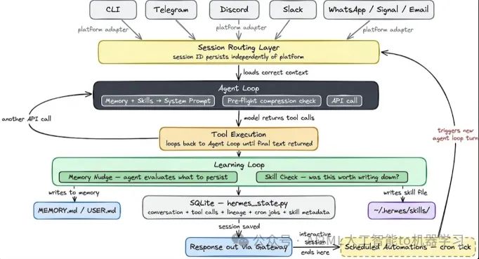

从下面更具体的架构来看，Hermes Agent增加了如下特性：1） 内嵌RL训练来强化SKill的生成能力。 2） ReAct + Self-Evolution(DSPy + GEPA)

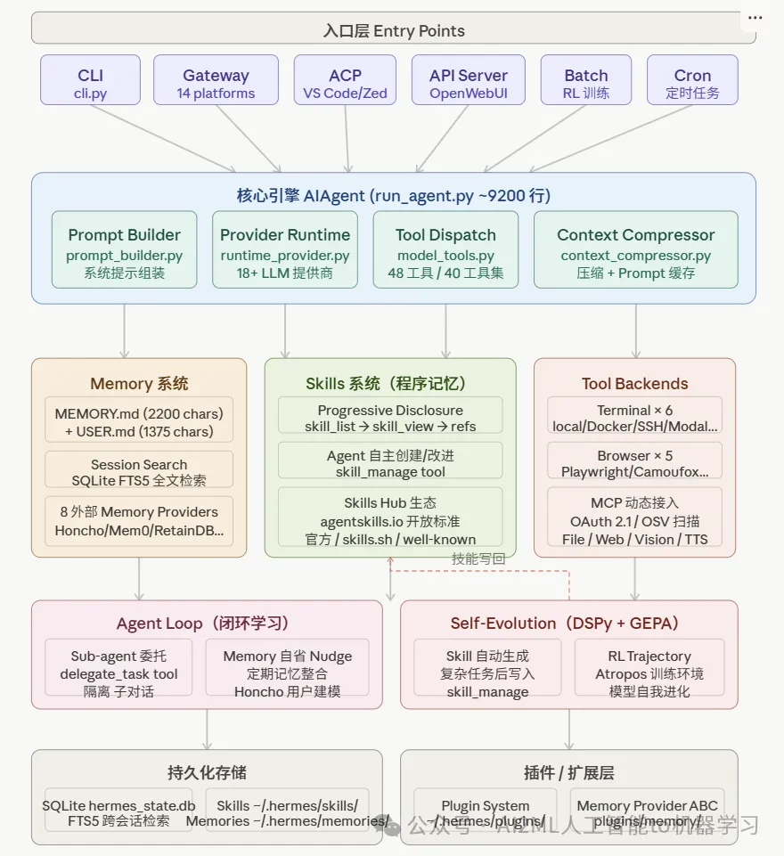

三. 四大核心进化算法协同工作

### 1\. Atropos (LLM RL Gym) 强化学习：Nous Research开发的Atropos库，是一个用于大语言模型异步强化学习的“环境微服务框架”。Atropos 利用LLM as Judge + DPO来实现RLAIF来实现自动化强化学习能力.

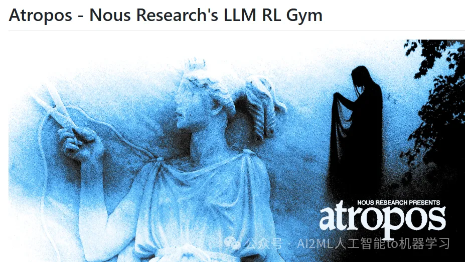

2\. DSPy（Declarative Self-improving Python）参数式进化： 通过DSPy实现从类似参数寻优的进化逻辑来优化大模型提示词。 3\. GEPA（Genetic-Pareto）反思进化提示词： 通过自举，过滤等反思模型来进化提示词工程。 4\. Darwinian Evolver 遗传进化代码：通过遗传算法实现代码优化。

当然， 有了这些进化能力， 那么让提示词更准， 工具调用更准，代码实现更准都有了基石。 

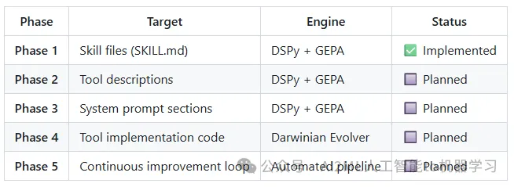

五. 成功经验学习，不贰过，省Token。

Memory搜索能力，可以通过Sqlite集成的FTS5 （BM25）来实现对成功案例的快速查找使用。 

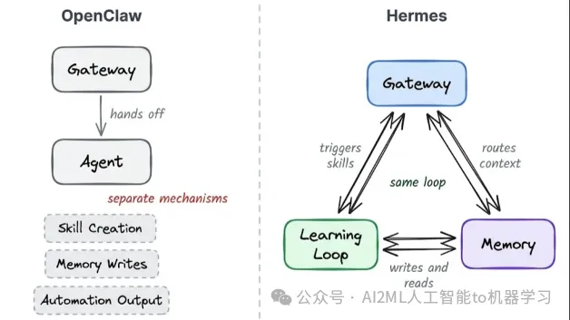

有了上诉能力之后， 主循环里面， 对Skills的再写和改进就是核心能力的最大改善了！

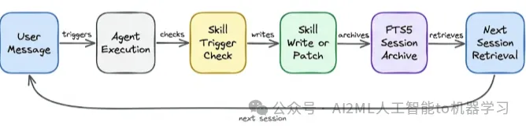

通过以上步骤， 可以快速将试错后的成功经验，学习进SKills，然后为下次试错减少大量的重复试错成本， 实现孔子说的不贰过！

六. 从能干活到能评价效果的应用范式

LLM as a judge有很多视角可以探索， 譬如一致性、改进幅度，稳定性等等。 

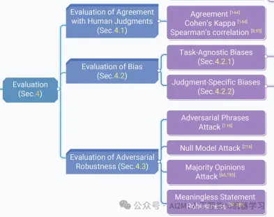

LLM as a judge也是有很多套路：1\. 对比打分2\. 规则打分3\. 多模型讨论共识4\. 案例细化解读性评价5\. 多步追问跟踪评价6\. 海量择优加速

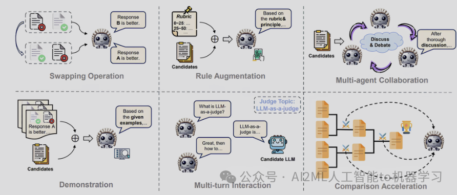

LLM as a judge的流程非常简单， 核心难点还是套路和评价维度。 

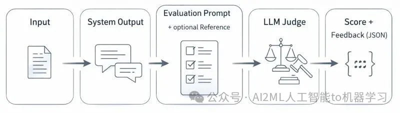

有了具体套路和维度结果，就可以使用GEPA来进行提示词优化， 进化出来最优的Skills。

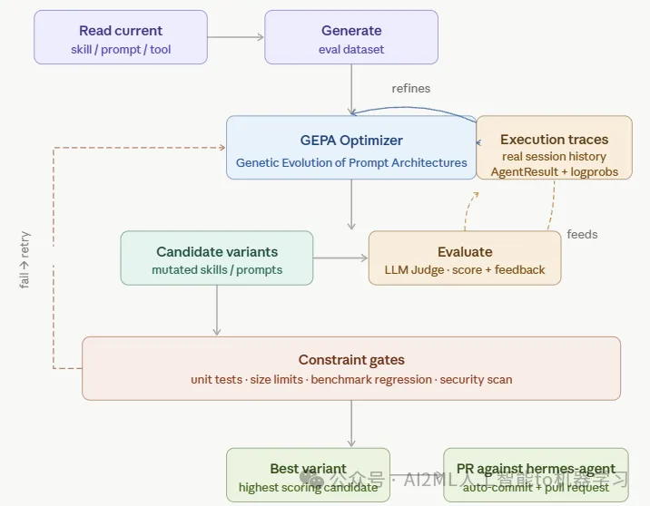

具体的进化流程代码关系如下：

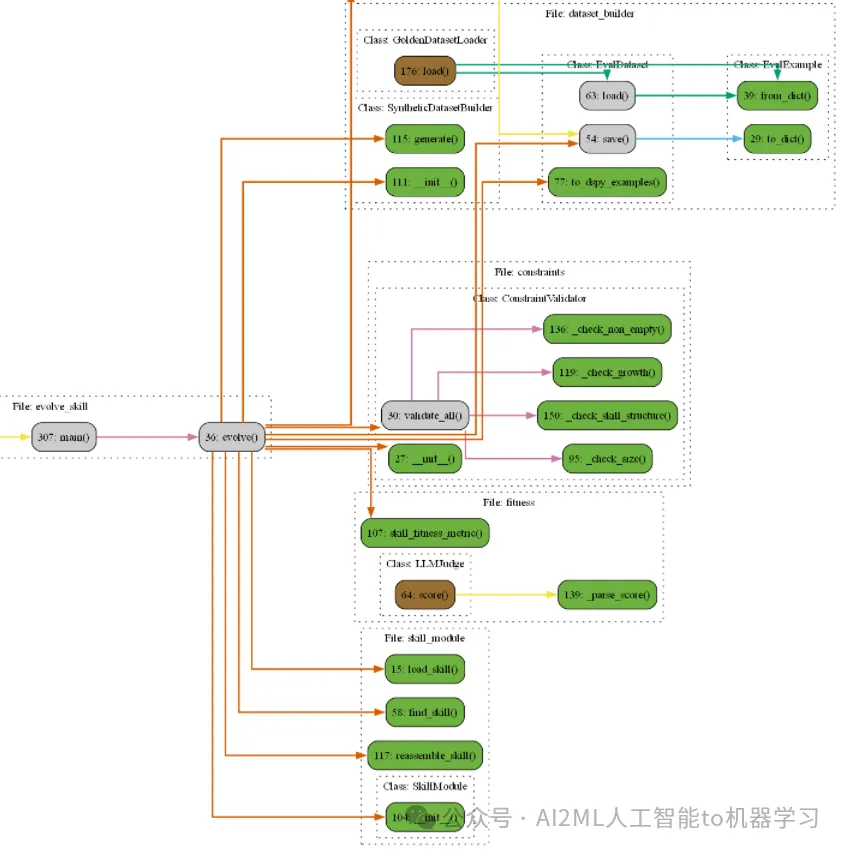

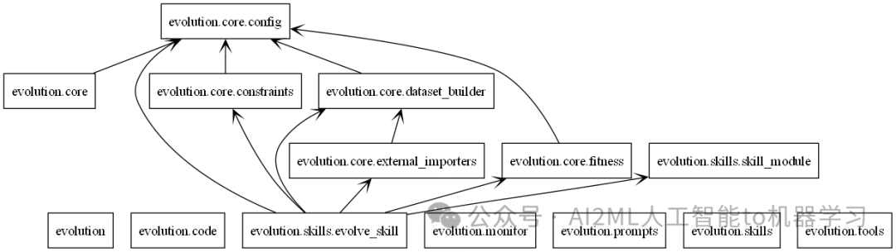

七. 智能体时代强化学习范式

Atropos 强化学习使用Gymnasium 强化学习框架，通过这个框架规范接口， 实现RL算法的标准化评测。

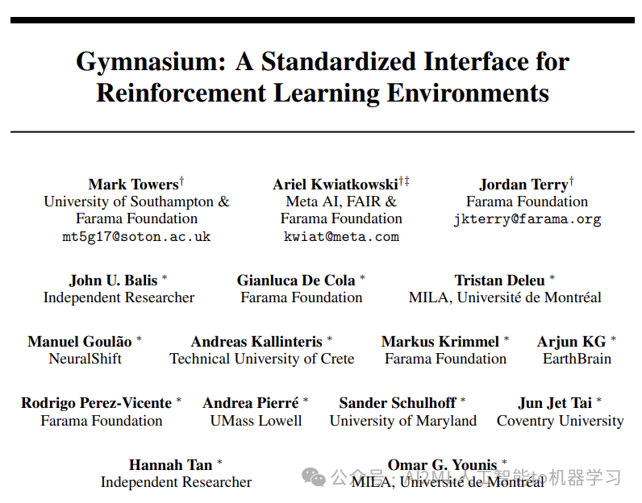

进而通过LLM as Judge实现效果评估，通过DPO算法实现模型训练， 进而实现RLAIF的流程。 

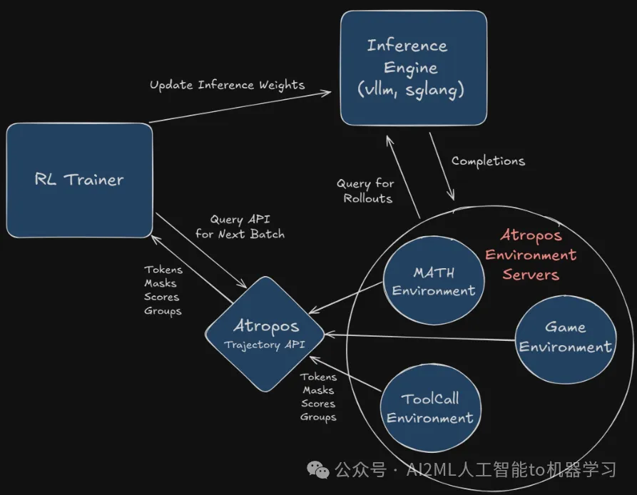

当然，这些基座模型也是千问或者LLama的20b以下的小模型。 但是，这些小模型的训练是随着Agent的工作在自主积累升级的。 对于准确率在20%左右的任务， 一定要开启这个自动化流程，可以把准确率做到60%左右。

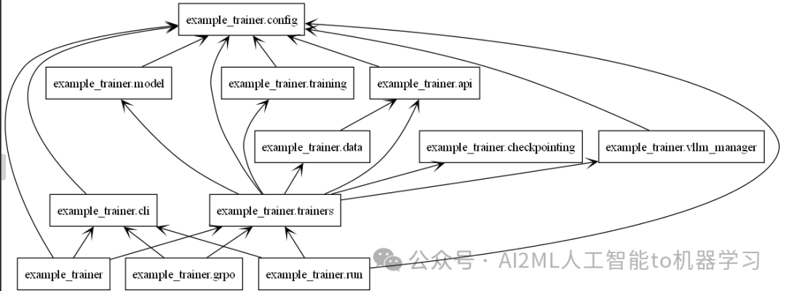

八. TUI交互再次伟大

TUI的使用让交互更简单高效。 

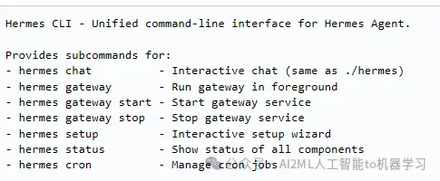

Hermes CLI 几乎打通了所有操作内容。 

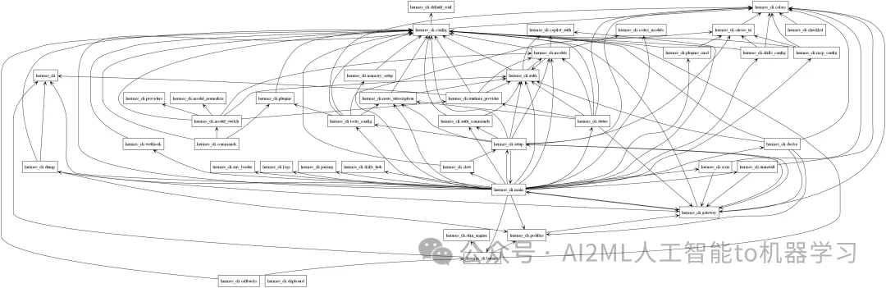

当然智能体只带价格审计也是非常需要的。

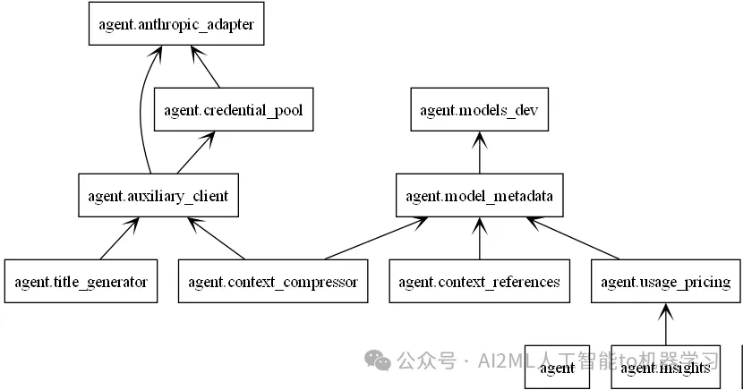

小结：

1\. 应用时代开启的山崩地裂 - 龙虾入口

在“ [Skills技术：大模型时代的第三次大妥协](https://mp.weixin.qq.com/s?__biz=MzIzMjU1NTg3Ng==&mid=2247491913&idx=1&sn=76aea44f162ce34b0851f50d3bd5b590&scene=21#wechat_redirect)”里面总结到， 每次技术的大妥协都会带来应用的极大爆发。 譬如RAG， MOE，现在是SKills。 RAG重塑了搜索和知识工程， MOE升华了OCR,PPT等办公， SKILLs启动了定制化应用。

2\. 个人企业应用的分道扬镳 - TUI交互

Claude Code 和 Open Code为代表的新型开发自动化平台在SKILLs + CLI + Memory的时代， 基本抛弃GUI入口， 因为Agent接管了CLI，因此高效的企业员工回归TUI入口。

3\. 大模型创新分化 - 规模化的成本短板 + 任务效果的评估短板

1）基础创新： 当前基础创新走出了规模化(Scaling Law)，推理(Reasonging)(CoT+RL), 进而走向了效率创新( [谷歌AI七剑下天山 - 第一剑TPU硬件](https://mp.weixin.qq.com/s?__biz=MzIzMjU1NTg3Ng==&mid=2247491812&idx=1&sn=b005b56a4ae29c758ee89c15ff0a0593&token=1011346234&lang=zh_CN&scene=21#wechat_redirect)),  未来基础创新就看哪家能走向Alpha-Zero时代了。 难得不是无中生有，难的是用得起的无中生有。 \\* 基础：规模化 -> 推理 --> 软硬一体效率 --\> 高性价比LLM-Alpha-Zero

2）应用创新： 龙虾的终端人力替代已经在不确定性的任务需求上爆发出极大的需求量。 但是在确定性任务还有巨大的空间。 需要把应用创新从替代干活 -->转向--> 替代评价效果再走一步。 真正能稳定地自动评价确定性任务的效果， 才有可能为人力替代打下扎实的基石。 \\* 应用：经验使用工具的劳力替代 --> 任务结果评价的脑力替代 --\> 确定性任务放心下发。

参考：https://mranand.substack.com/p/inside-hermes-agent-how-a-self-improving
