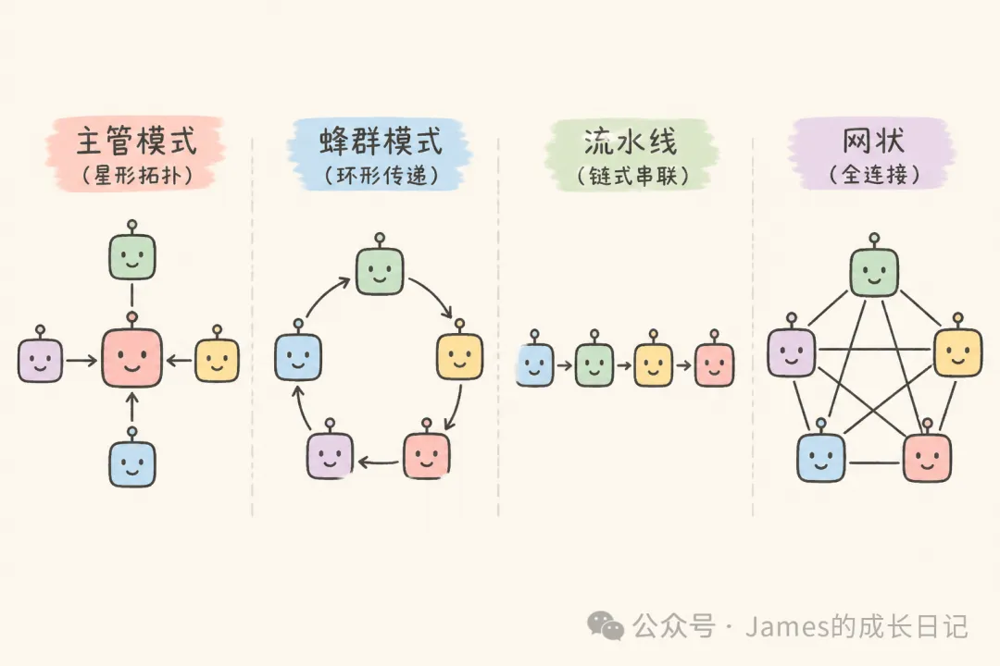
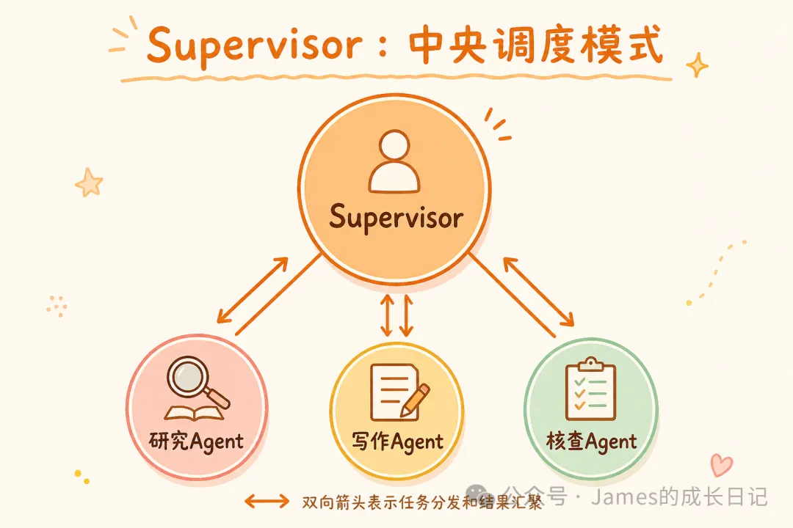
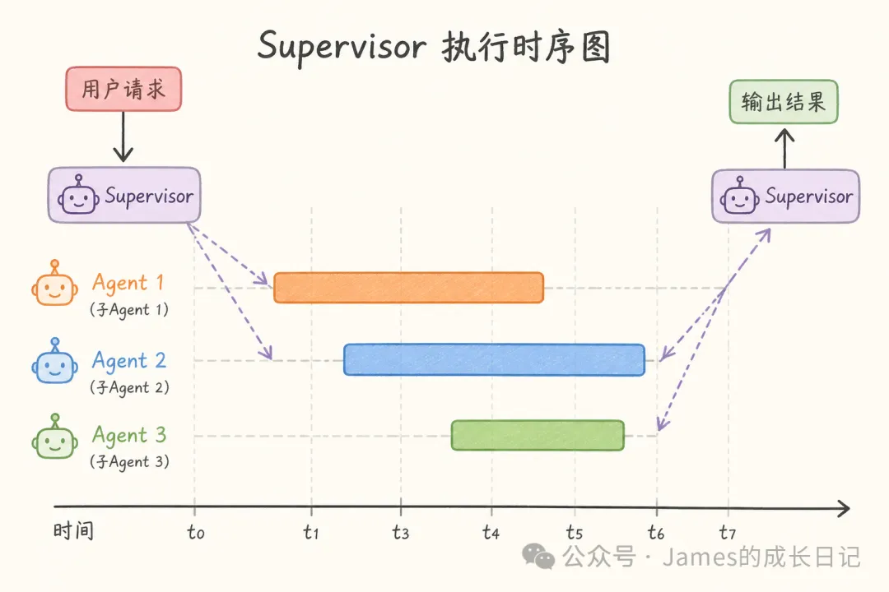
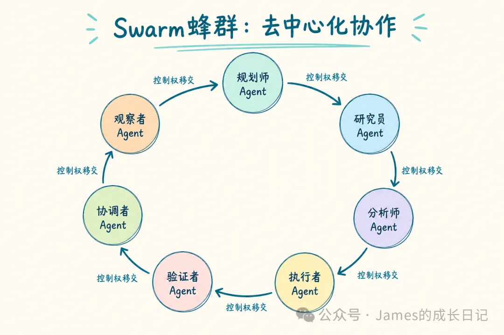
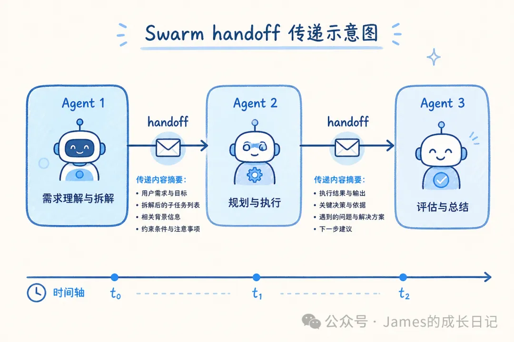
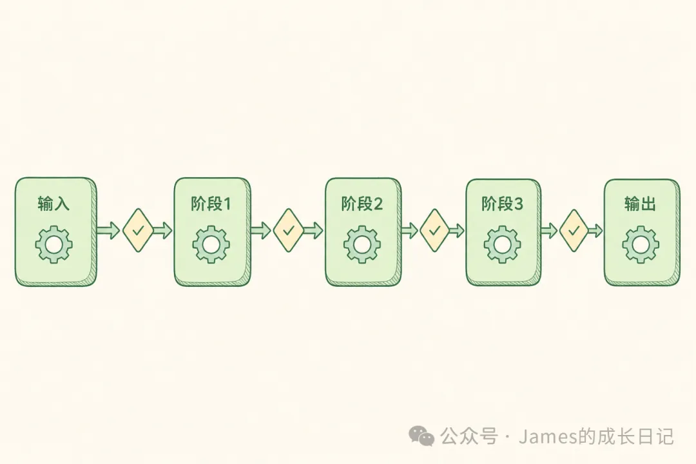
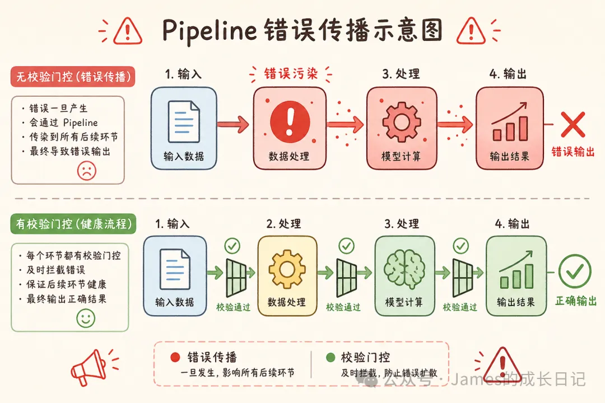
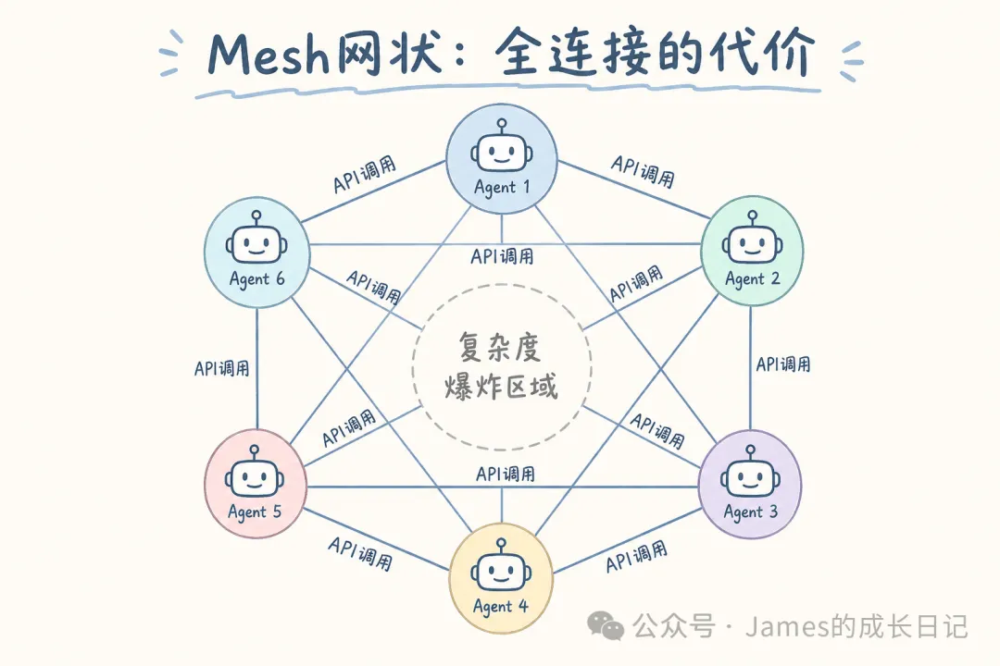
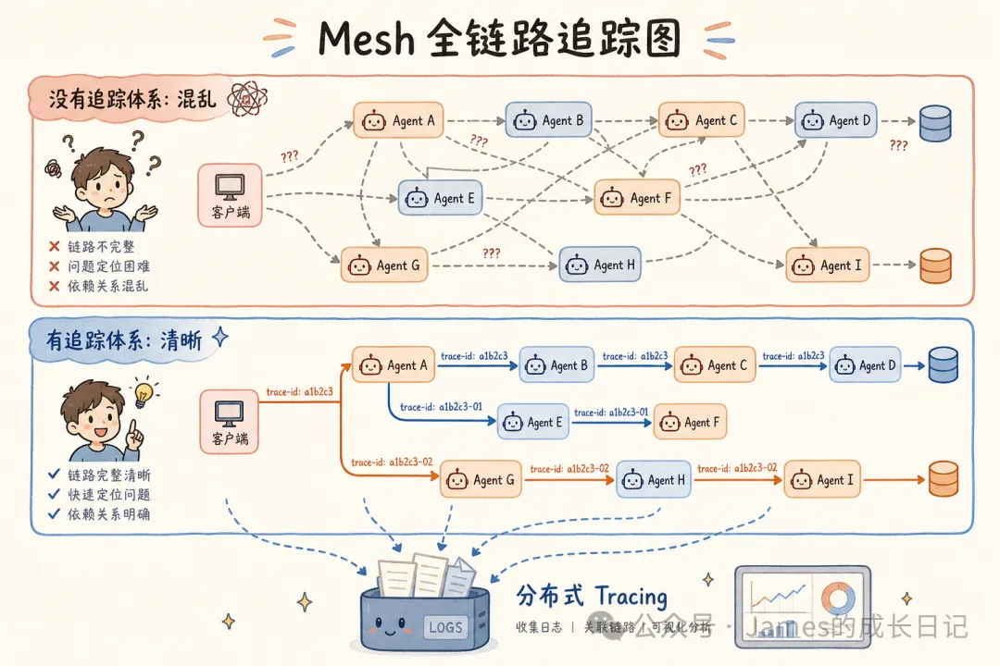
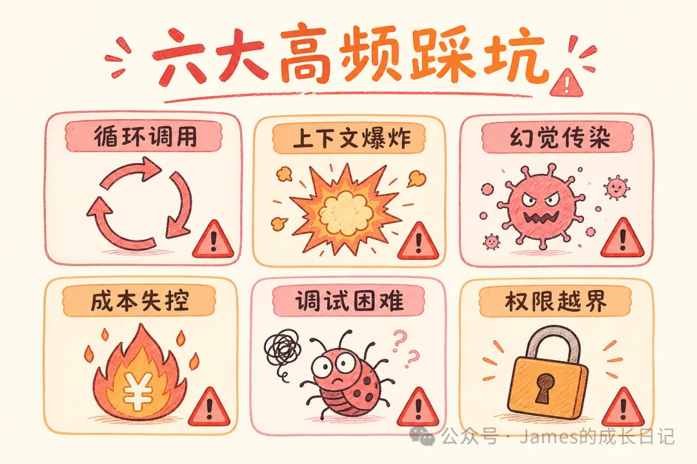

# Multi-Agent 的四种协作模式：Supervisor、Swarm、网状、流水线，怎么选？

> 原文链接：https://mp.weixin.qq.com/s/OBG19jVnqP_xa8_IjomC8Q
> 文章时间：2026年5月3日 23:06

## 重点内容与核心观点

文章系统比较了 Multi-Agent 的 4 种协作模式：Pipeline 适合线性确定流程，Supervisor 适合边界清晰且需要集中调度的任务，Swarm 适合对话走向不可预测的路由场景，Mesh 适合复杂动态协作但调试成本最高。核心观点是，Multi-Agent 选型应优先选择最简单可控的结构，只有在确实需要动态互联时才使用 Mesh，并且生产环境必须配套递归上限、完整性校验、Tracing 和成本监控。

大家好，我是James。

上一篇我们把 RAG、Memory、MCP 拼进了同一个 LangGraph，搭出了一个生产级 AI 助手的完整骨架。很多人看完留言说「能跑起来，但一旦任务复杂起来，这一个 Agent 就有点撑不住了」——没错，这正是今天要解决的问题。

你搭了一个 Agent，起初跑得挺好。后来需求升级了，调研+写作+事实核查全压在一个 Agent 上。结果上线后发现：系统提示词膨胀到 800 字，工具列表里有 15 个工具，Agent 开始选错工具、忘记自己设定的规则，偶尔一步出错后面全错。你在想，是不是我的 Prompt 写得不够好？

不是 Prompt 的问题。是单个 Agent 扛不住「又要调研、又要写作、又要核查」这种多角色任务的根本性矛盾。

解法是：多个 Agent 协作，每个只干一件事。

但协作本身是有结构的。乱搭一通不等于 Multi-Agent，是 Multi-Chaos。

这篇我把 Multi-Agent 的四种主流协作模式逐一拆透：Supervisor（主管模式）、Swarm（蜂群模式）、网状（Mesh）、流水线（Pipeline）。每种模式的原理、代码、优缺点、以及适合什么场景——读完你就知道自己该选哪个。

* * *

## 01 为什么单 Agent 会撞墙



先说清楚「为什么要多 Agent」，不然后面的架构选型没有判断基础。

单 Agent 的三个典型死法：

**第一死：上下文窗口污染**

一个 Agent 挂了 12 个工具，每个工具的描述就占几百个 token。任务执行到第 7 步，第 2 步的关键信息已经被挤出上下文或稀释掉了。Agent 开始「失忆」。

**第二死：角色混乱**

一个 Agent 被要求「调研 + 写代码 + 写总结」。系统提示词里三组指令互相抢占优先级。调研没完整就开始写代码，写代码时又用写作语气。结果三件事都干得不够好。

**第三死：故障扩散**

第 3 步出错，第 4 到 10 步全部污染，没有隔离层，没有独立校验。出了问题只能整条链路重跑。

Multi-Agent 的解法很直接： **每个 Agent 只干一件事，用清晰的接口对话，出错只影响一个节点**。

但协作方式不同，系统的灵活性、可控性、调试难度差别很大。下面逐一拆解。

* * *

## 02 Supervisor 模式：一个指挥，多个专家



**核心思想**：一个中央 Supervisor Agent 接收用户请求，决定派给哪个 Worker，收到结果后再决定下一步——直到任务完成。

数据流：User → Supervisor → Researcher/Writer/Fact-Checker → Supervisor → Final Answer。Workers 之间互相不认识，所有信息都经过 Supervisor，它是路由层也是汇聚层。

用 LangGraph TypeScript 实现：

```

import { ChatOpenAI } from "@langchain/openai";
import { createReactAgent } from "@langchain/langgraph/prebuilt";
import { createSupervisor } from "@langchain/langgraph-supervisor";
import { tool } from "@langchain/core/tools";
import { z } from "zod";

const model = new ChatOpenAI({ model: "gpt-4o-mini", temperature: 0 });

const searchWeb = tool(
  async ({ query }: { query: string }) => `Search results for: ${query}`,
  {
    name: "search_web",
    description: "Search the web for information",
    schema: z.object({ query: z.string() }),
  }
);

const writeReport = tool(
  async ({ content }: { content: string }) => `# Report\n\n${content}`,
  {
    name: "write_report",
    description: "Format findings into a structured report",
    schema: z.object({ content: z.string() }),
  }
);

// 每个 Worker 只有自己需要的工具，prompt 精简聚焦
const researchAgent = createReactAgent({
  llm: model,
  tools: [searchWeb],
  name: "researcher",
  prompt: "You are a research specialist. Search for information and return factual summaries.",
});

const writerAgent = createReactAgent({
  llm: model,
  tools: [writeReport],
  name: "writer",
  prompt: "You are a writing specialist. Format research findings into clear reports.",
});

// Supervisor 绑定所有 Worker，统一调度
const supervisorGraph = await createSupervisor({
  llm: model,
  agents: [researchAgent, writerAgent],
  prompt:
    "You are a team supervisor. Delegate research to researcher first, then writing to writer.",
}).compile();

const result = await supervisorGraph.invoke({
  messages: [{ role: "user", content: "Research LangGraph and write a report." }],
});
console.log(result.messages.at(-1)?.content);
```



Supervisor 的优势在于 **可控性强**：路由逻辑集中在一处，哪个 Worker 出错一眼就能追到。代价是 Supervisor 本身容易成为瓶颈——如果任务分解出了问题，下游每个 Worker 都拿到错误的指令。

**适合的场景**：客服工单路由、内容生成流水线、代码审查工作流——子任务边界清晰、需要中央协调的场景。

* * *

## 03 Swarm 模式：没有指挥，Agent 互相传球



Swarm 的逻辑完全不同： **没有中央 Supervisor，Agent 之间直接 handoff（交接）**。

Agent A 做完自己的部分，判断「下一步应该由 B 来做」，就把控制权连同上下文一起传给 B。流程从这些 handoff 里「生长」出来，不是预先规划好的——User → Triage → Billing（账单问题） 或 Tech（技术问题） → Final Answer。

TypeScript 实现：

```

import { createSwarm, createHandoffTool } from "@langchain/langgraph-swarm";
import { createReactAgent } from "@langchain/langgraph/prebuilt";

const triageAgent = createReactAgent({
  llm: model,
  tools: [\
    createHandoffTool({\
      agentName: "billing_agent",\
      description: "Transfer to billing for payment issues",\
    }),\
    createHandoffTool({\
      agentName: "tech_agent",\
      description: "Transfer to tech support for technical issues",\
    }),\
  ],
  name: "triage_agent",
  prompt: `You are a triage agent.
- Billing/payment issues → handoff to billing_agent
- Technical problems → handoff to tech_agent
- General questions → handle directly`,
});

const billingAgent = createReactAgent({
  llm: model,
  tools: [createHandoffTool({ agentName: "triage_agent", description: "Return to triage" })],
  name: "billing_agent",
  prompt: "You are a billing specialist. Return to triage if off-topic.",
});

const techAgent = createReactAgent({
  llm: model,
  tools: [createHandoffTool({ agentName: "triage_agent", description: "Return to triage" })],
  name: "tech_agent",
  prompt: "You are a technical support specialist. Return to triage if off-topic.",
});

// 生产必须设递归上限，防 handoff 死循环！
const swarm = createSwarm({
  agents: [triageAgent, billingAgent, techAgent],
  defaultActiveAgent: "triage_agent",
}).compile({ recursionLimit: 25 });

const result = await swarm.invoke({
  messages: [{ role: "user", content: "My payment failed but system shows it succeeded." }],
});
```



核心是 `createHandoffTool`——Agent 通过调用它来转交控制权，上下文一起传递不会断。

**最大的坑**：无限循环。Agent A 认为该转给 B，B 觉得该回给 A，来回互踢。`recursionLimit: 25` 是生产必须加的保险丝。

**适合的场景**：对话流向不可预测的客服系统、路由场景——「我不知道用户下一步会问什么」的情况。

* * *

## 04 流水线模式：线性流水，每步只管下一步



流水线是四种里 **最简单也最容易预测** 的。Agent 串成一条链：Raw Data → Extractor → Enricher → Analyzer → Reporter → Output。每个节点只看上游的输出，没有反向通信，没有跳步。

```

import { StateGraph, START, END } from "@langchain/langgraph";

interface PipelineState {
  rawText: string;
  extractedEntities: string[];
  enrichedData: Record<string, unknown>[];
  analysis: string;
  finalReport: string;
}

async function extractorNode(state: PipelineState): Promise<Partial<PipelineState>> {
  const response = await model.invoke([\
    { role: "system", content: "Extract key entities. Return as JSON array." },\
    { role: "user", content: state.rawText },\
  ]);
  const entities = JSON.parse(response.content as string);
  return { extractedEntities: entities };
}

async function enricherNode(state: PipelineState): Promise<Partial<PipelineState>> {
  // ⚠️ 上游输出完整性校验，这是防错误传播的关键
  if (!state.extractedEntities.length) {
    throw new Error("Extraction failed: no entities. Pipeline stopped.");
  }
  const enriched = state.extractedEntities.map((entity) => ({
    entity,
    context: `Enriched data for: ${entity}`,
  }));
  return { enrichedData: enriched };
}

async function analyzerNode(state: PipelineState): Promise<Partial<PipelineState>> {
  const response = await model.invoke([\
    { role: "system", content: "Analyze patterns and identify key insights." },\
    { role: "user", content: JSON.stringify(state.enrichedData) },\
  ]);
  return { analysis: response.content as string };
}

async function reporterNode(state: PipelineState): Promise<Partial<PipelineState>> {
  const response = await model.invoke([\
    { role: "system", content: "Generate a human-readable report." },\
    { role: "user", content: state.analysis },\
  ]);
  return { finalReport: response.content as string };
}

const pipeline = new StateGraph<PipelineState>({ channels: { /* ... */ } })
  .addNode("extractor", extractorNode)
  .addNode("enricher", enricherNode)
  .addNode("analyzer", analyzerNode)
  .addNode("reporter", reporterNode)
  .addEdge(START, "extractor")
  .addEdge("extractor", "enricher")
  .addEdge("enricher", "analyzer")
  .addEdge("analyzer", "reporter")
  .addEdge("reporter", END)
  .compile();
```



流水线的 **最大问题是错误传播**：第一步出了错，后面步骤全部受污染，但 Agent 不知道上游数据有问题。所以每个节点间必须加完整性校验——就像 `enricherNode` 开头那段一样，上游空了就直接抛错停流水线，不要让问题悄悄流过去。

**适合的场景**：ETL 数据处理、文档批量加工、「第 N 步输出就是第 N+1 步输入」的确定性流程。

* * *

## 05 网状模式（Mesh）：任意互联，最自由也最难驾驭



网状是四种里 **最灵活也最难控制** 的。任何 Agent 都能在任何时刻调用任何其他 Agent，没有预设的顺序——Research ↔ Writer ↔ Fact-Checker ↔ Summarizer，谁在任何时候都可以呼叫谁。

LangGraph 里通过 `Command` 对象实现动态路由：

```

import { Command, StateGraph, MessagesState, START, END } from "@langchain/langgraph";

async function researchNode(state: MessagesState): Promise<Command> {
  const response = await model.invoke([\
    {\
      role: "system",\
      content: `You are a research agent.\
After research, decide who handles next.\
Reply with: NEXT: writer_agent | NEXT: fact_checker | NEXT: END`,\
    },\
    ...state.messages,\
  ]);

  const content = response.content as string;
  const match = content.match(/NEXT:\s*(\w+)/);
  const goto = match?.[1] ?? END;

  return new Command({
    update: { messages: [response] },
    goto: goto === "END" ? END : goto,
  });
}

async function writerNode(state: MessagesState): Promise<Command> {
  const response = await model.invoke([\
    {\
      role: "system",\
      content: `You are a writer. Write based on research.\
After writing, route as needed: NEXT: fact_checker | NEXT: summarizer | NEXT: END`,\
    },\
    ...state.messages,\
  ]);

  const content = response.content as string;
  const match = content.match(/NEXT:\s*(\w+)/);
  const goto = match?.[1] ?? END;

  return new Command({
    update: { messages: [response] },
    goto: goto === "END" ? END : goto,
  });
}

// Mesh 必须设递归上限，动态路由可能形成环
const meshGraph = new StateGraph(MessagesState)
  .addNode("research_agent", researchNode, { ends: ["writer_agent", "fact_checker", END] })
  .addNode("writer_agent", writerNode, { ends: ["fact_checker", "summarizer", END] })
  .addEdge(START, "research_agent")
  .compile({ recursionLimit: 50 });
```



网状的 **真实优势** 是处理「任务中途需要动态决策」的场景——写到一半发现需要补充调研，调研完发现需要核查，核查完再返回写作。没有预设的顺序，能适应动态需求。

**但代价是**：调试极度痛苦。执行路径不可预测，12 次 LLM 调用里找 bug 就像读一本少了好几章的悬疑小说。生产环境必须接好 LangSmith Tracing，这是基础设施，不是可选项。

**适合的场景**：复杂的创意协作、研究任务、「执行过程中才知道下一步要什么」的动态任务。

* * *

## 06 四种模式横向对比

| 模式 | 控制方式 | 可预测性 | 调试难度 | 典型适合场景 |
| --- | --- | --- | --- | --- |
| Supervisor | 中央路由 | ★★★★★ | ★★☆☆☆（低） | 任务边界清晰，需统一调度 |
| Swarm | 点对点 handoff | ★★★☆☆ | ★★★☆☆（中） | 对话流向不定，路由场景 |
| Pipeline | 线性串行 | ★★★★★ | ★☆☆☆☆（最低） | ETL、确定性数据加工 |
| Mesh | 全连接动态 | ★★☆☆☆ | ★★★★★（最高） | 复杂创意任务，动态协作 |

**选型决策思路**：先看任务是不是线性的——是就用 Pipeline，最简单，不引入不必要复杂度。任务有分支但分支可预测，选 Supervisor，好维护好追问题。任务流向由用户驱动、对话走向不可预测，选 Swarm。只有在「真的需要任意 Agent 之间动态协作」时，才用 Mesh——并且做好完善的 Tracing 基础设施。

* * *

## 07 常见坑



**坑 1：Supervisor 成为新的单体 Agent**

所有任务都经过 Supervisor，Supervisor 的 prompt 越写越长，最终它本身成了新的单体 Agent。解法：Supervisor 只做路由决策，不做业务处理。Supervisor prompt 超过 300 字，说明业务逻辑放错地方了。

**坑 2：Swarm 的 handoff 死循环**

Agent A 认为该 B 处理，B 觉得该回给 A，来回互踢。生产环境必须设 `recursionLimit: 25`，另外给每个 Agent 明确的「我不处理什么」指令。

**坑 3：Pipeline 的「部分成功」假象**

研究 Agent 返回了 5 个字段里的 4 个，下游 Agent 基于不完整数据生成了看起来合理的输出，校验通过，上线，然后那个缺失字段引发故障。解法：每个 Pipeline 节点校验输出完整性，不只是格式，还要校验关键字段是否都存在。

**坑 4：成本爆炸没感觉**

一次 Supervisor 调用 + 三次 Worker 调用 = 至少四次 LLM 请求。加上重试可能是十次。解法：Supervisor 用强模型，Worker 用便宜模型；按 Agent 打 tag 追踪 token 消耗，月账单超标前就能预警。

**坑 5：Mesh 里没有 Tracing**

12 次 LLM 调用，4 个 Agent，没有关联 ID，出了问题无从定位。任何 Multi-Agent 系统上生产前，先把 LangSmith Tracing 接好——这是基础设施，不是可选项。

* * *

## 总结

**Supervisor 是默认起点**：控制权集中，路由逻辑清晰，出问题好追，大多数场景优先考虑。

**Swarm 适合对话不可预测的路由场景**：handoff 是核心机制，但必须设递归上限防死循环。

**Pipeline 是最简单的选择**：线性任务不要引入多余复杂度，每个节点加完整性校验防错误传播。

**Mesh 最灵活也最危险**：动态协作强，但调试代价高，没有完善 Tracing 不建议上生产。

**成本随模式复杂度倍增**：Supervisor 用强模型，Worker 用弱模型；按 Agent 追踪成本，上生产前先做压测。

下一篇进入 Multi-Agent 系列第二篇，专门拆解 **LangGraph Swarm**：Agent 之间到底是怎么互相移交控制权的，`createHandoffTool` 底层做了什么，以及生产级踩坑实录。

* * *

关注我，James 的成长日记，持续分享干货，帮你在 AI 时代少走弯路。
