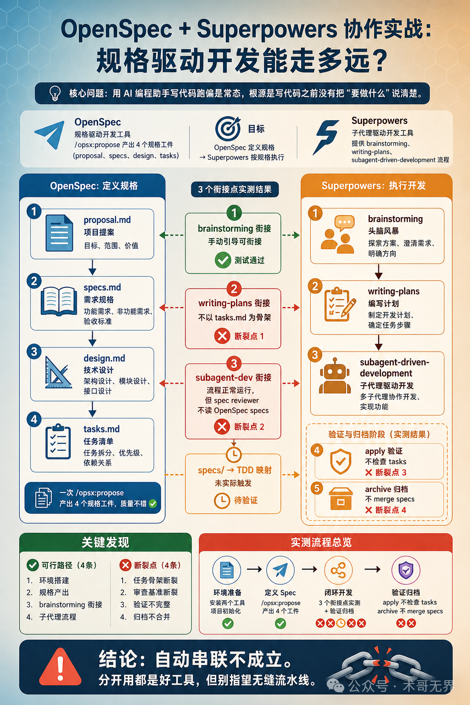
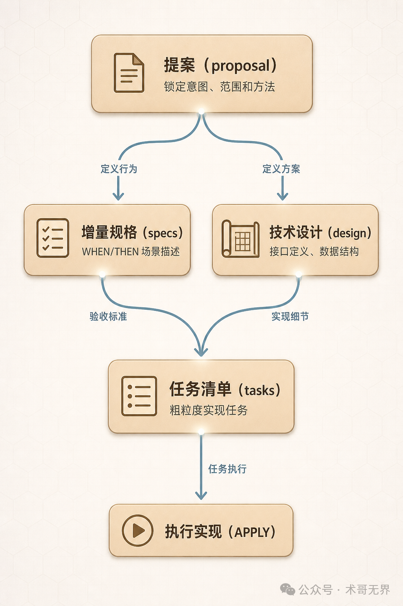
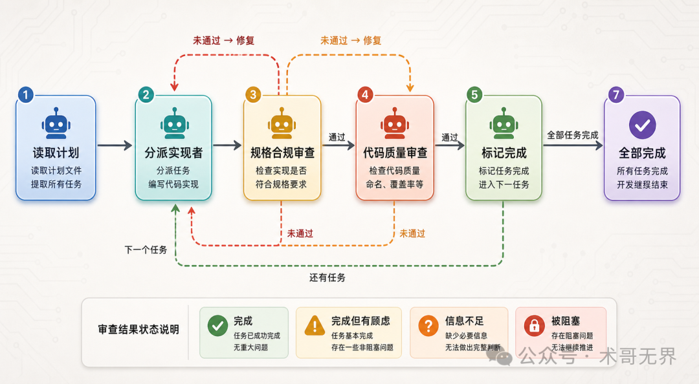
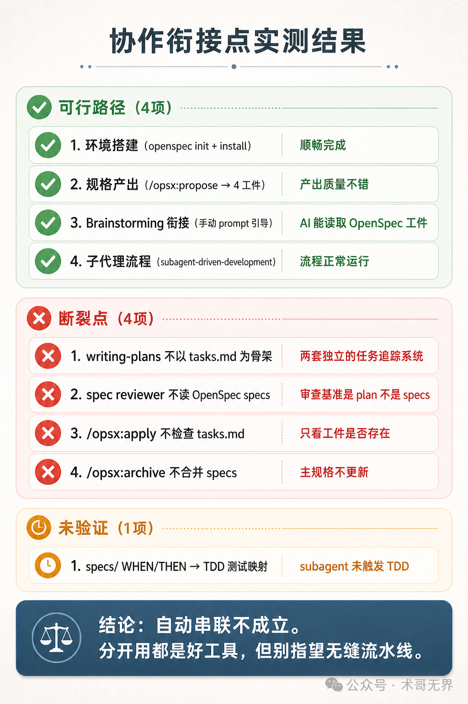

# OpenSpec + Superpowers 协作实战：3 个衔接点断了 2 个，无缝串联翻车了（实战版）

> 原文链接：https://mp.weixin.qq.com/s/ZKzfA-GJz4aU1-tmV7J5gw
> 文章时间：2026年5月3日 22:46

## 重点内容与核心观点

文章通过实测验证 OpenSpec 与 Superpowers 是否能无缝串联。结论是：OpenSpec 的 propose 阶段能稳定产出 proposal、specs、design、tasks，Superpowers 的 brainstorming 可以在手动引导下参考这些工件，但 writing-plans 会重新组织任务结构，subagent 审查也默认只看 Superpowers 自己的 plan。核心观点是，两者可以互补，但不是自动集成；需要显式桥接、任务映射和审查基准设计。

Original运维有术运维有术
术哥无界

在小说阅读器读本章

去阅读

在小说阅读器中沉浸阅读

> 🚩 2026 年「术哥无界」系列实战文档 X 篇原创计划 第 _101_ 篇，AI 编程最佳实战「2026」系列第 _26_
>
> 大家好，欢迎来到 **术哥无界 \| ShugeX ｜ 运维有术**。
>
> 我是 **术哥**，一名专注于 AI 编程、AI 智能体、Agent Skills、MCP、云原生、AIOps、Milvus 向量数据库的 **技术实践者与开源布道者**！
>
> **Talk is cheap, let's explore。无界探索，有术而行。**

封面图：OpenSpec 与 Superpowers 协作流程全景

_图 1：OpenSpec 与 Superpowers 协作全景_

> **说明**：本文内容基于 OpenSpec（Fission-AI/OpenSpec）和 Superpowers（obra/superpowers）的源码分析及实际操作验证。文中涉及的命令输出、工具行为和衔接点测试结果均来自实测。 **文中的配置模板和参数建议仅供参考，实际效果请以你的业务数据和环境测试结果为准。** 如果有实际使用经验，欢迎在评论区分享交流。

用 AI 编程助手写代码，跑偏是常态。功能做了一半发现方向不对，测试全绿但业务逻辑是错的——这种事太多了。

问题不在 AI 本身。根源是 **写代码之前没有把"要做什么"说清楚**。

Superpowers 提供了子代理驱动开发和 TDD 流程，看起来很完整。但翻一遍源码就发现一个关键缺口：它的 spec reviewer 审查基准只是 plan 文件。plan 说"怎么做"，不说"为什么做"。没有事先定义的规格文件，spec reviewer 就像没有评分标准的裁判——能审，但审不准。

OpenSpec 产出的规格工件（proposal、specs、design、tasks）看起来能补上这个缺口。把规格喂给 Superpowers，让审查有据可依——思路是对的，但实测下来， **两个工具的自动串联并不成立**。三个核心衔接点里，两个验证失败，一个根本没触发。

这篇文章记录的是完整的实测过程：哪些跑通了，哪些断裂了，以及为什么。

## 1\. 环境准备

### 你需要装的东西

两个工具，各有依赖。

**Node.js 环境**（OpenSpec 依赖）：

```
# 检查 Node.js 版本，需要 >= 20.19.0
node --version
```

预期输出类似 `v20.19.0` 或更高。低于这个版本，先去 Node.js 官网下载 LTS 版本升级。

版本确认没问题后，全局安装 OpenSpec CLI：

```
# 全局安装 OpenSpec
npm install -g @fission-ai/openspec@latest
```

安装完验证一下：

```
# 验证 OpenSpec 是否安装成功
openspec --version

# 查看可用命令列表
openspec --help
```

✅ 看到版本号（实测 `1.3.1`）和命令列表，OpenSpec 就绪。

**Superpowers** 的安装方式取决于你用的 AI 编程工具。源码 README 列出了多个平台的支持。

**Claude Code 用户**：

```
# 在 Claude Code 对话中执行
/plugin install superpowers@claude-plugins-official
```

安装完成后， **必须执行 reload 才能生效**：

```
# 安装后必须执行 reload 才能生效
/reload-plugins
```

实测安装输出 `✓ Installed superpowers`，执行 reload 后 Superpowers 的 skill 才真正可用。

**OpenCode 用户**：

访问以下地址获取安装指令：

```
https://raw.githubusercontent.com/obra/superpowers/refs/heads/main/.opencode/INSTALL.md
```

其他平台（Cursor、Gemini CLI、OpenAI Codex）的安装方式可参考 Superpowers 的 GitHub README。不同平台的安装命令不同，但装完后 Superpowers 的 skill 功能是通用的。

### 项目初始化

在项目根目录执行：

```
# 进入项目目录
cd your-project

# 初始化 OpenSpec（--tools 指定你的 AI 编程工具）
openspec init --tools claude
# 或支持多工具：openspec init --tools claude,cursor
# 或全装：openspec init --tools all
```

裸跑 `openspec init`（不带 `--tools`）会报错 `Error: No tools detected and no --tools flag provided`。必须指定工具类型。

### 初始化后的目录结构

`openspec init` 执行后，项目里多出两个目录：

```
openspec/
├── specs/              # 主规格目录（Source of Truth），初始为空
├── changes/            # 变更提案目录
│   └── archive/        # 归档目录
└── config.yaml         # 项目配置（需手动创建，可选）

.claude/
├── commands/opsx/      # OpenSpec 的 4 个 slash command
│   ├── propose.md
│   ├── apply.md
│   ├── archive.md
│   └── ...
└── skills/             # OpenSpec 的 4 个 skill
    ├── openspec-propose/
    ├── openspec-apply-change/
    ├── openspec-archive-change/
    └── ...
```

几个要点：

- `specs/` 初始为空，主规格在归档后才会出现内容
- `changes/` 初始为空，执行 propose 后才生成变更目录
- `.claude/` 是 OpenSpec 在 Claude Code 中的运行载体：4 个 slash command 对应 propose、apply、archive 等操作，4 个 skill 提供对应的执行能力
- `config.yaml` 不会自动生成，需要手动创建（可选）

### 可选：配置技术栈

如果项目有特定的技术栈和规则，手动创建 `openspec/config.yaml`：

```
# openspec/config.yaml
schema: spec-driven
context: |
  Tech stack: TypeScript, React, Node.js
  Testing: Vitest for unit tests
rules:
  proposal:
    - Include rollback plan
```

`context` 字段告诉 AI 你的技术栈，`rules` 约束每个工件的产出格式。实测中，`rules` 里配置 `specs: - Use Given/When/Then format for scenarios` 并未被 AI 遵循——实际产出的场景格式是 WHEN/THEN（没有 GIVEN）。如果你希望产出更结构化的场景描述，可以在 propose 时通过对话引导，但别指望 config.yaml 的 rules 来强制。

⏱️ 环境准备大约 5-10 分钟。

## 2\. 第一步：定义 Spec

这一步实测完全可行。`/opsx:propose` 一次性产出 proposal.md、specs/、design.md、tasks.md 四个工件。

### 执行 propose

在 AI 编程助手的对话窗口中执行：

```
/opsx:propose
```

执行后，AI 会问你想做什么类型的变更。你可以这样描述需求：

> 创建一个 Todo REST API。用 Express + TypeScript 实现，支持任务的增删改查（CRUD），数据存内存数组即可。每个任务有 id、title、completed 三个字段。

OpenSpec 会自动从描述中推断变更名（如 `todo-rest-api`），然后生成四个工件。

产出物：

- **proposal.md** — 锁定意图、范围和方法
- **specs/** — 增量规格，用 ADDED / MODIFIED / REMOVED 描述行为变更。里面的场景格式是 **WHEN/THEN**（不是 GIVEN/WHEN/THEN）
- **design.md** — 技术设计方案，包含接口定义、数据结构和 Open Questions
- **tasks.md** — 实现任务清单，粗粒度的任务列表

### 检查产出

```
# 查看当前所有活跃变更
openspec list

# 查看某个变更的 proposal 内容（输出 proposal.md 全文）
openspec show <change-name>

# 查看工件状态（JSON 格式，方便脚本处理）
openspec status --change <change-name> --json
```

`openspec show` 输出的是 proposal.md 的完整内容，不是所有工件的汇总。如果想查看全部工件状态，用 `openspec status --change <name> --json`。

### 验证规格格式

```
# 验证变更的规格格式是否合法
openspec validate <change-name>
```

实测输出 `Change 'todo-rest-api' is valid`。✅ 验证通过，4 个规格工件齐了。

### 工件之间的依赖关系

OpenSpec 的 4 个工件形成有向无环图（DAG）：

```
            proposal（根节点）
                │
    ┌───────────┴───────────┐
    ▼                       ▼
  specs                  design
    │                       │
    └───────────┬───────────┘
                ▼
              tasks
                │
                ▼
            APPLY 执行
```

proposal 是根节点，定义了意图；specs 和 design 都依赖 proposal，分别描述"系统应该怎么表现"和"技术上怎么实现"；tasks 同时依赖 specs 和 design，是最终的实现清单。

配图：OpenSpec 4 个工件依赖关系（proposal → specs + design → tasks）

_图 2：OpenSpec 工件依赖关系图（DAG）_

### 关于 specs/ 里的场景格式

这一步产出的 `specs/` 目录中，每个场景以 **WHEN/THEN** 格式描述业务行为。举个例子：

```
#### Scenario: 成功创建任务
- **WHEN** 客户端发送 POST /todos 请求，包含 `{ "title": "买牛奶" }`
- **THEN** 系统返回 201 状态码和任务对象
```

到这一步为止，OpenSpec 的活干完了。 **propose 阶段完全跑通，产出物质量不错。** 接下来看看把这套规格喂给 Superpowers 会发生什么。

## 3\. 第二步：Superpowers 闭环开发

这一步的目标：让 Superpowers 读取 OpenSpec 产出的工件，走完 brainstorming → writing-plans → subagent-driven-development 全流程。

实测下来， **brainstorming 阶段可以衔接，writing-plans 和 subagent 阶段和 OpenSpec 的工件之间出现了断裂。** 逐个看。

### 3.1 Brainstorming：手动引导可衔接（✅ 可行）

在 AI 编程助手对话中触发 Superpowers 的 brainstorming skill：

```
brainstorming
```

输入后，AI 会问你想讨论新项目还是重新设计。告诉它：

> 参考 openspec/changes/todo-rest-api/ 目录下的 proposal.md 和 specs/ 中的增量规格作为讨论基准，不要超出 proposal.md 定义的范围。

**这一步验证有效**——AI 确实读取了 OpenSpec 工件，并基于 design.md 中的 Open Questions 发起了苏格拉底式提问。比如：

> （Q1: 是否需要时间戳？）需要加时间戳
>
> （Q2: 是否需要错误处理中间件？）需要

但有一个细节要注意：brainstorming 的产出保存在 `docs/superpowers/specs/`（Superpowers 自己的目录），不是 OpenSpec 目录。两套目录是独立的，不会自动同步。

### 3.2 Writing Plans：不以 tasks.md 为骨架（❌ 断裂点 1）

brainstorming 完成后，触发 writing-plans：

```
writing-plans
```

输入后，AI 会自动生成实现计划，然后询问选择哪种执行方式。

**但这里出现了一个问题**：即使你在 prompt 中引导"以 openspec/changes//tasks.md 为任务骨架"，writing-plans 仍会自行组织任务结构。实测中，OpenSpec tasks.md 定义了 4 组 11 个子任务，而 writing-plans 自行生成了 7 个任务，结构和粒度完全不同。

这意味着你面对的是 **两套独立的任务追踪系统**：

| 追踪系统 | 位置 | 粒度 | 更新方式 |
| --- | --- | --- | --- |
| OpenSpec tasks.md | `openspec/changes/<name>/tasks.md` | 粗粒度（4 组 11 子任务） | propose 生成，手动更新 |
| Superpowers plan | `docs/superpowers/plans/` | 细粒度（7 个 Task，每个 2-4 Step） | writing-plans 生成 |

两套系统不会自动同步。如果你在意 OpenSpec tasks.md 的完成度，得手动对照检查。

### 3.3 Subagent-driven Development：流程正常，但审查基准不在 OpenSpec

这是 Superpowers 的核心机制。触发子代理驱动开发：

```
subagent-driven-development
```

输入后，流程全自动执行，无需额外交互。子代理的执行流程确实如源码描述：

1. 读取 plan，提取所有任务
2. 为每个任务分派 **实现者子代理**
3. 实现者完成 → 分派 **规格合规审查子代理**
4. 分派 **代码质量审查子代理**
5. 审查不通过 → 实现者修复 → 重新审查
6. 所有任务完成 → 分派 **最终代码审查子代理**

每个子代理完成后会报告状态：

| 状态 | 含义 | 你该做什么 |
| --- | --- | --- |
| DONE | 完成，审查通过 | 下一个任务 |
| DONE\_WITH\_CONCERNS | 完成但有顾虑 | 检查偏差点 |
| NEEDS\_CONTEXT | 信息不足 | 补充信息 |
| BLOCKED | 被阻塞 | 检查阻塞原因 |

源码中有几个关键约束，别跳过：

- **不要** 在 main/master 分支直接实现，用独立分支
- **不要** 跳过任何审查环节
- **不要** 在规格合规通过前启动代码质量审查
- 子代理不继承主会话上下文，控制器提供完整信息

配图：子代理驱动开发的完整审查流程

_图 3：子代理驱动开发审查流程_

### 3.4 三个衔接点的实测结果

串联的核心在三个地方。看看实测结果。

**衔接点 1：spec reviewer 审的是 plan，不是 OpenSpec specs（❌ 断裂）**

源码里 spec reviewer 的设计意图是对照规格审查实现。草稿原本写的是"spec reviewer 以 OpenSpec specs/ 为审查基准"——但实测中，spec reviewer 审查的是 writing-plans 生成的 plan 文件中的代码片段， **从未引用过 OpenSpec specs/ 中的 WHEN/THEN 场景**。

即使在 prompt 中引导 AI 参考 OpenSpec specs，spec reviewer 仍以 plan 为主。这意味着 OpenSpec 花大力气产出的场景描述，在审查环节没有被消费。

**衔接点 2：specs/ → TDD 映射未实际触发（⏳ 未验证）**

理论上，OpenSpec 的 WHEN/THEN 场景可以映射为 TDD 测试用例：

```
OpenSpec 场景：
- WHEN 客户端发送 POST /todos 请求，包含 `{ "title": "买牛奶" }`
- THEN 系统返回 201 状态码和任务对象

→ 理论上映射为：
test('创建任务返回 201', ...)
```

但实际执行中，subagent-driven-development 没有触发 TDD skill，这个映射没有发生。所以这只是一个理论上的可能路径，没有经过实际验证。

**衔接点 3：tasks.md → plan 的映射不成立（❌ 断裂）**

前面 3.2 节已经说了——writing-plans 有自己的任务组织逻辑，不会以 OpenSpec tasks.md 为骨架。plan 中每个步骤的验收标准也不是来自 OpenSpec specs/。

配图：协作衔接点实测结果汇总

_图 4：衔接点实测结果（4 可行 + 4 断裂 + 1 未验证）_

你在项目中用过类似的子代理开发方案吗？实测中遇到什么问题？评论区聊聊。

## 4\. 第三步：验证和归档

这一步的目标：检查实现成果，归档变更。

### 4.1 OpenSpec 侧验证

```
/opsx:apply
```

`/opsx:apply` 实际执行了 `openspec status --json`，看到 `isComplete: true`（含义是 **工件已创建**）就直接判定完成。它 **不会** 读 tasks.md、不会勾选 checkbox、不会对照任务清单检查每个子任务的完成情况。

所以 apply 通过只说明四个文件存在，不代表实现完整。如果你用了 Superpowers subagent，apply 会结合对话上下文判断（但这个判断不可靠）。 **tasks.md 的完成情况需要你手动检查。**

```
# 查看工件状态
openspec status --change <change-name> --json
```

### 4.2 Superpowers 侧验证

子代理开发完成后，确保触发了 `verification-before-completion` skill。这个 skill 的核心原则是 **证据先于断言**——没有实际运行测试的输出截图或日志，不能声称"测试通过"。

代码审查用 `requesting-code-review` skill 触发。这个审查检查代码质量、测试覆盖、命名规范等方面。

### 4.3 归档

验证通过后，直接归档：

```
# 归档已完成的变更
openspec archive <change-name>
```

或者在 AI 助手中执行 `/opsx:archive`。

`/opsx:archive` 实际只做了一件事：把 `changes/<change-name>/` 移动到 `changes/archive/`。 **增量规格不会自动合并到 `openspec/specs/` 主目录**——归档后 `openspec/specs/` 仍然是空的。如果你想更新主规格，需要手动操作。

另外，archive 也不会验证 tasks.md 的完成度。实测中，11 个 tasks.md 任务都未勾选，但 archive 仍然报告"All tasks complete"。

### 完整流程一图看懂

```
可行路径：
  openspec init --tools claude        → ✅ 环境搭建
  /opsx:propose → 4 工件              → ✅ 规格产出质量不错
  brainstorming（手动 prompt 引导）     → ✅ AI 能读取 OpenSpec 工件
  subagent-driven-development          → ✅ 子代理流程正常运行

断裂点：
  writing-plans 不以 tasks.md 为骨架   → ❌ 两套任务追踪系统
  spec reviewer 不读 OpenSpec specs    → ❌ 审查基准是 plan 不是 specs
  /opsx:apply 不检查 tasks.md         → ❌ 只看工件是否存在
  /opsx:archive 不 merge specs        → ❌ 主规格不更新

未验证：
  specs/ WHEN/THEN → TDD 测试映射     → ⏳ subagent 未触发 TDD
```

## 5\. 故障排除

### 坑 1：子代理审查死循环

**症状**：spec reviewer 和 code quality reviewer 都发现问题，实现者修复后重新提交，两阶段审查又发现问题。循环超过 3 轮还没结束。

**源码依据**：`subagent-driven-development/SKILL.md` 的 Red Flags 部分。

**根因**：规格不明确。审查者不知道"正确"的标准是什么，实现者也不知道该修到什么程度。

**解决步骤**：

1. 停下来，检查 spec reviewer 的审查基准。当前它审的是 plan 文件，如果你有更明确的规格（比如 OpenSpec specs/），需要手动引导
2. 确认场景描述是否足够具体——好的场景应该包含明确的操作动作（WHEN）和预期输出（THEN）
3. 审查循环超过 3 轮， **必须停下来**。回到规格把场景改具体，再重新执行

**判断技巧**：写完 WHEN/THEN 后问自己——给一个完全不了解项目的人看这段描述，他能直接写出正确的测试用例吗？不能，就改到能为止。

### 坑 2：两套追踪系统脱节

**症状**：OpenSpec tasks.md 的任务和 Superpowers plan 的任务对不上，apply 说完成了但 tasks.md 里一堆未勾选。

**根因**：两个工具各自维护任务清单，不会自动同步。

**解决步骤**：

1. writing-plans 执行后，手动对照 OpenSpec tasks.md 检查一遍
2. 如果 plan 里的任务和 tasks.md 差异较大，说明 AI 自行添加或跳过了任务
3. apply 声称的完成度不可靠，以你自己的检查为准

### 坑 3：子代理频繁报 NEEDS\_CONTEXT

**症状**：多个子代理返回 `NEEDS_CONTEXT` 或 `BLOCKED`，开发进度卡住。

**源码依据**：`implementer-prompt.md` 明确说明子代理不继承主会话上下文，控制器必须提供完整信息。

**根因**：传给子代理的上下文不够完整。

**解决步骤**：

1. 检查 design.md 是否包含足够的技术细节——接口定义、数据结构、错误处理策略、边界条件
2. 检查 specs/ 是否覆盖了正常路径和异常路径
3. 在 config.yaml 的 `context` 字段补充项目背景信息

更新配置后，刷新 Agent 指令：

```
# 刷新 Agent 指令，使配置生效
openspec update
```

## 总结

实测一圈下来，OpenSpec 和 Superpowers 各自都是好工具，但 **自动串联不成立**。

**可行的部分**：OpenSpec 的 propose 流程（环境搭建 → 规格产出）完整可靠，4 个工件质量不错。Superpowers 的子代理开发流程也能正常运行。brainstorming 阶段通过手动 prompt 引导，AI 确实能读取 OpenSpec 工件。

**断裂的部分**：writing-plans 不以 OpenSpec tasks.md 为骨架，spec reviewer 不读 OpenSpec specs，apply 不检查任务完成度，archive 不合并增量规格。四个断裂点叠加起来，意味着你心目中"OpenSpec 定义规格 → Superpowers 按规格执行"的流水线，实际上需要大量手动对齐。

**如果你只取各自独立的价值**：用 OpenSpec 做需求定义和规格产出，用 Superpowers 做子代理开发——分开用，都是趁手的工具。但别指望它们自动串联成一条无缝的规格驱动开发流水线。至少目前不行。

> **补充一句：** 本次实测用的是 MiniMax 2.7 模型， **整体效果不如 GLM 5.1**，但胜在性价比，日常凑合用没问题。算是买不到 GLM 时的一个平替方案。如果你也想试试，可以用这个链接购买，比官网直购便宜 10%：https://platform.minimaxi.com/subscribe/token-plan?code=8nzRbxE4m1&source=link

你身边有同事也在用 AI 编程助手做开发？转发给他们看看这个实测结果。关于 AI 工具协作，你踩过什么坑？评论区聊聊。

**好啦，谢谢你观看我的文章，如果喜欢可以点赞转发给需要的朋友，我们下一期再见！敬请期待！**

**扫码关注，获取更多 AI 工具的实战经验和最佳实践。不错过每一篇干货！**


