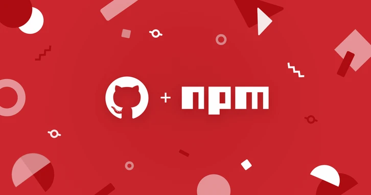

# npmx 进入 Alpha 阶段：一个由社区驱动的 npm 注册表浏览器替代品

> 原文链接：https://www.infoq.cn/article/H3UBOv3iPlJMAgtWFEMk
> 文章时间：未标注

## 重点内容与核心观点

文章介绍了 npmx 这个社区驱动的 npm 注册表浏览器替代品。它的核心价值在于补齐 npmjs.com 在搜索速度、依赖可见性、安装大小、模块格式、键盘导航等开发者体验上的不足；同时，它不替代官方 npm 注册表的发布和账户管理，而是以更快、更透明、更工程化的浏览界面提升包检索与评估效率。

作者：Daniel Curtis

- 平川

- 2026-05-06
北京

- 本文字数：1187 字

阅读完需：约 4 分钟

[npmx](https://npmx.dev/ "") （一个开源的 npm 注册表包浏览器）发布 Alpha 版本。与官方的 [npmjs.com](http://npmjs.com/ "") 界面相比，该浏览器速度更快、功能更丰富。该项目由 Nuxt 核心团队负责人 [Daniel Roe](https://github.com/danielroe "") 发起，自今年 1 月以来已经吸引了超过 250 名贡献者，并获得了 3000 个 GitHub 星标。

该项目源于一个 [Bluesky 讨论帖](https://bsky.app/profile/danielroe.dev/post/3md3cmrg56k2r "")，Roe 在其中问 JavaScript 社区，对 [npmjs.com](http://npmjs.com/ "") 有哪些不满。回复中提到了多个问题，包括：搜索速度慢；代码查看器中的浏览器历史记录无法正常工作；依赖关系可见性差；缺少安装大小和模块格式标识等元数据。该代码库上线后，24 小时内便收到了 49 个拉取请求。两周后，社区已提交了超过 [1000 个问题报告和拉取请求](https://github.com/npmx-dev/npmx.dev/issues/1000 "")。

npmx 引入了官方注册表界面中所没有的多项功能。其中包括：计算传递依赖项的总安装大小、显示 ESM 和 CJS 支持的模块格式徽章、过时依赖项警告、 [JSR](https://jsr.io/ "") 交叉引用、版本范围解析以及完整的键盘导航。其 URL 结构与 [npmjs.com](http://npmjs.com/ "") 兼容。也就是说，开发人员可以在任何包 URL 中将 npmjs.com 替换为 npmx.dev。此外，它还为 Chrome 和 Firefox 提供了一个 [浏览器扩展](https://github.com/iaverages/npmx-redirect "")，可以实现自动重定向。

社区反响总体积极，搜索性能尤其受到称赞。一位 [Hacker News](https://news.ycombinator.com/item?id=47010823 "") 用户对联想搜索的速度印象深刻：

> 联想搜索的速度确实令人印象深刻。我刚输入包名，结果在我按完键之前就出现了——这种响应速度通常只有原生应用才能做到。

他补充说：

> 我真心很好奇，究竟是哪些架构设计让你们达到了“快得不可思议”的境界，尤其是与 [npmjs.com](http://npmjs.com/ "") 的官方搜索相比。

还有人重点强调了作者页面加载速度快，有评论者指出：“点击作者链接后，其它软件包几乎瞬间就会显示出来。”

并非所有反馈都是积极的。有几位 Hacker News 用户对视觉设计提出了质疑，其中一位 [评论说](https://news.ycombinator.com/item?id=47010823 "")，npmx 的视觉层次结构显得非常扁平，而且难以理解……所有元素都是单色的，外观过于雷同。作者对此做了回应，并邀请该评论者参与改进：

> 感谢反馈！
>
> 我会仔细思考，并且非常珍视像这样富有见地的反馈。
>
> ……如果你愿意的话，非常欢迎你加入我们，一起让它变得更好！
>
> 该开源项目的地址是 [https://github.com/npmx-dev/npmx.dev](https://github.com/npmx-dev/npmx.dev "")

还有人质疑该项目是否真的有必要：

> 但是为什么？
>
> [npmjs.com](http://npmjs.com/ "") 并不慢，而且我也不需要经常访问它。
>
> 再说，在包的发布方面，npmjs.com 依然是权威平台，不是吗？所以我还是得用它。

该项目基于 [Nuxt 4](https://nuxt.com/ "")、 [Nitro](https://nitro.build/ "") 和 [UnoCSS](https://unocss.dev/ "") 构建，已经在 [GitHub](https://github.com/npmx-dev/npmx.dev "") 上发布，遵循 MIT 许可。 [贡献指南](https://contributing.npmx.dev/ "") 为有意参与贡献者提供了配置说明，而 [VS Code 扩展](https://github.com/npmx-dev/vscode-npmx "") 则可以在编辑器中直接显示悬停提示、版本补全和漏洞检测功能。

npmx 是一个由 Daniel Roe 创建并维护、同时得到全球贡献者社区支持的开源项目。该项目基于 Nuxt 4 构建，采用官方 npm 注册表中的数据，并添加了一个经过增强的浏览界面，注重速度、透明度和开发者体验。该项目与 npm 公司无关，也不替代官方注册表用于发布或账户管理。

**原文链接：**

[https://www.infoq.com/news/2026/04/npmx-browser-alpha/](https://www.infoq.com/news/2026/04/npmx-browser-alpha/ "")
