# 一文带你上手 AI Agent 编程

> 原文链接：https://juejin.cn/post/7529101019687567403
> 文章时间：2025-07-21

## 重点内容与核心观点

(https://juejin.cn/team/6984296204297306148/posts)

# 一文带你上手 AI Agent 编程

[](https://juejin.cn/team/6984296204297306148/posts)

[字节架构前端](https://juejin.cn/team/6984296204297306148/posts)

2025-07-21

9,030

阅读56分钟

关注


[字节架构前端](https://juejin.cn/user/1530175206729016/posts)
FE @字节跳动

许多 agent 教程比较偏概念的科普，看完了后还是不知道怎么编程，这里以能够上手编写一个 Agent 为目标，理解 LLM 的关键概念，掌握构建 Agent 的关键技术。

## LLM 基础

> Referrence:
>
> Andrej Karpathy: [www.youtube.com/watch?v=7xT…](https://link.juejin.cn/?target=https%3A%2F%2Fwww.youtube.com%2Fwatch%3Fv%3D7xTGNNLPyMI "https://www.youtube.com/watch?v=7xTGNNLPyMI")
>
> 3blue1brown: [www.youtube.com/watch?v=wjZ…](https://link.juejin.cn/?target=https%3A%2F%2Fwww.youtube.com%2Fwatch%3Fv%3DwjZofJX0v4M "https://www.youtube.com/watch?v=wjZofJX0v4M")

High level 的讲一下 LLM 的相关感性概念，目的是帮助对 agent 设计的理解。

### Machine Learning Background

机器学习是一种数据驱动的学问，模型可以通过数据不断更新自己的权重，通过计算，预测出某个输出。

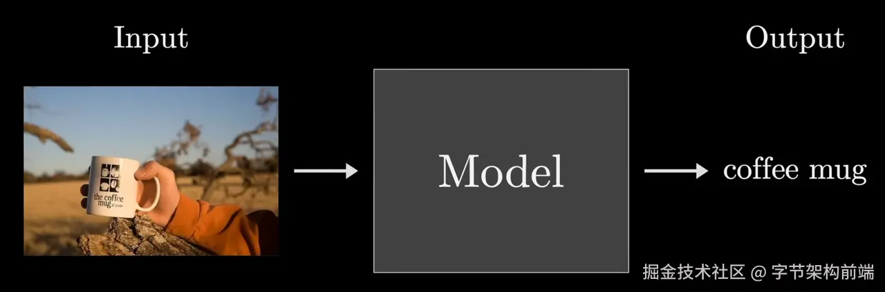

与一般结构化编程思维不同的是，机器学习并不指定具体的操作步骤，而是提供一个包含可调整参数的计算架构。通过大量的训练数据（在有监督学习中，这些数据包括输入和对应的输出；在无监督学习中，则只有输入），模型通过调整参数来学习输入与输出之间的关系或模式。

我们常说的 **参数、权重（weights）** 是什么呢，比如 deepseek r1 **671B**，llama3.2 **70B**， **权重** 是训练的时候获得，决定了模型的行为。

用 **线性模型** 举个简单的例子，权重是特征对应的系数（如 `y = w₁x₁ + w₂x₂ + b` 中的 `w₁, w₂` 和偏置 `b`） 找到这个数据的规律就是不断去修正所有的点到这条线的偏值最小的一处，回归到均值，能代表大多数数据的趋势。

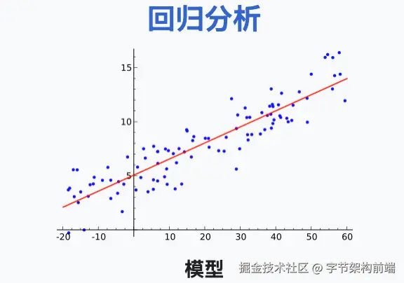

我们上面的回归模型参数很少，大模型有特别多的参数，简单理解为参数越多，他能学习到的模式越多。

但是也不是越多越好，如果数据集不足，或者模型结构不正确，或者训练时间过长，模型对某一方面的特征学习到更多的细节，可能过拟合，对当前数据集的拟合程度过深，泛化性差。大模型的训练拥有了非常多的数据，在数据多样性上非常足，越多的数据，越大的权重能力越强，这是 scaling law 的感性认知。

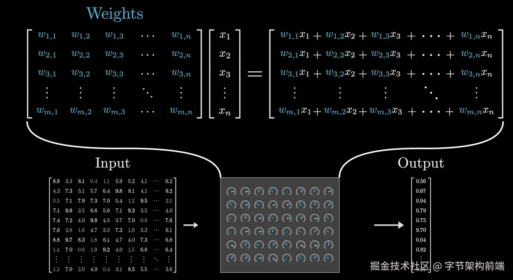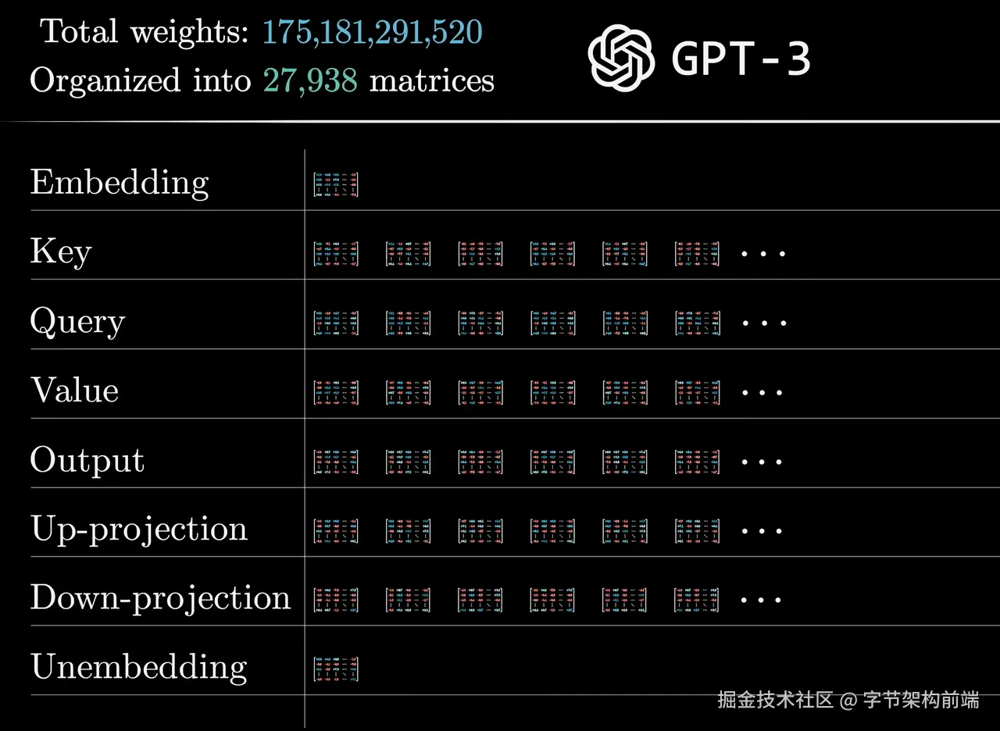

模型框架有不同作用的矩阵，每个矩阵有不同的参数，用于不同作用的任务，比如 Embedding， Attention 的 （Key、Query、Value、Output 层） 等，大模型训练的结果就有能代表模型权重参数的文件，比如 .ckpt 结尾的文件。

#### Prediction

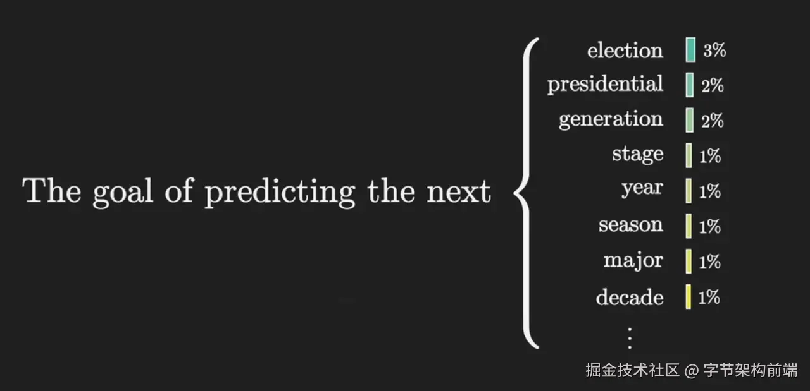

LLM 任务是对后续的语义输出做预测，LLM 会不断反复对句子的预测 token 的过程，直到遇到 EOF token 为止，为什么以token计费？就是一次token输出就是大模型一次运行调用算力的过程。

### Token

token 是大模型对单词处理的基本单位，每个 token 映射一个数字编码，token 的拆分原则遵循好的语义表达和计算效率，分词器 tokenizer 是运行分词算法的工具。

比如 “世界” 会是一个 token，分词器遇到“世界”这个词不会拆成两个 token。

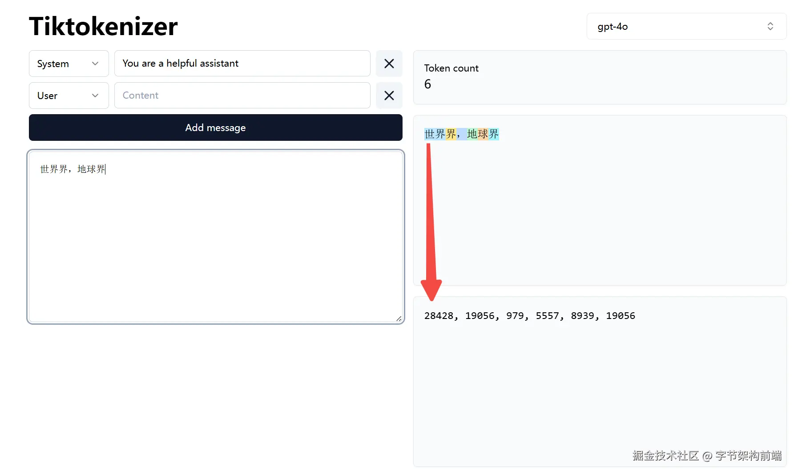

相比传统编码比如 bit 或者 ascll 码就是为了计算效率而生的，utf8 编码考虑了一定的兼容性，但是对应的字符映射都是保障了字符的完整性，没有保障语义性，这是这两者的不同。

我们期望是越少的 token ，更少的 sequences 长度，高效的表达语义，上下文宝贵。

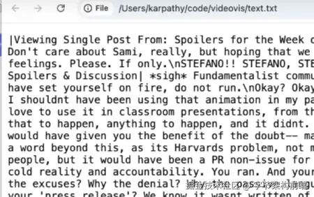

比如上面一段文本，转换为 ascll 码也会出现很多重复的模式，这种模式其实对应了一定的语义，这样在模型的token 划分上，就需要变成一个token。

单词到Token，一般是转换为一些Word、SubWord，或者汉字这种语言的单个字符，作为一个 token。

那每段话具体的表达是什么的？还是可以用这个网站 [tiktokenizer.vercel.app/](https://link.juejin.cn/?target=https%3A%2F%2Ftiktokenizer.vercel.app%2F "https://tiktokenizer.vercel.app/") 来看，上面有许多模型的tokenizer。

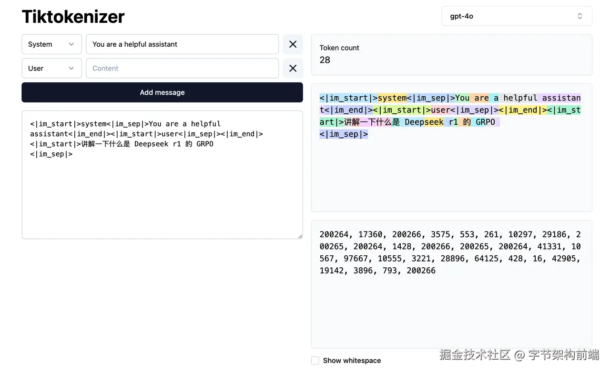

可以试试经典的 token 问题，我理解就是分词器把berry分出来了 然后后续的预测可能更多的参考两个 r 。

"How Many R's in 'Strawberry'"

[community.openai.com/t/incorrect…](https://link.juejin.cn/?target=https%3A%2F%2Fcommunity.openai.com%2Ft%2Fincorrect-count-of-r-characters-in-the-word-strawberry%2F829618%2F6 "https://community.openai.com/t/incorrect-count-of-r-characters-in-the-word-strawberry/829618/6")

Doubao1.5-vision-pro 甚至多模态（图片输入）和 COT prompt 也数不出来

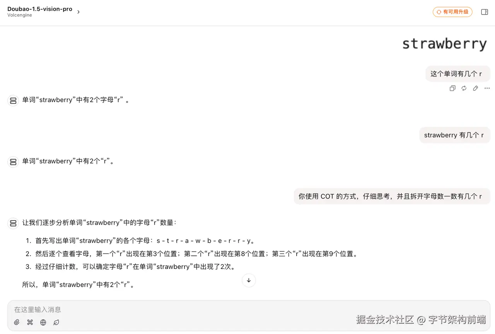

### Embedding

我们上一步会使用分词器把人类的单词文字划分成不同的 token，embedding 矩阵会处理不同的 token 表达为更高维度的向量。 使用向量可以在不同的维度表达不同的语义。

GPT3 的 embedding 矩阵有 50257 个 Tokens 输入。

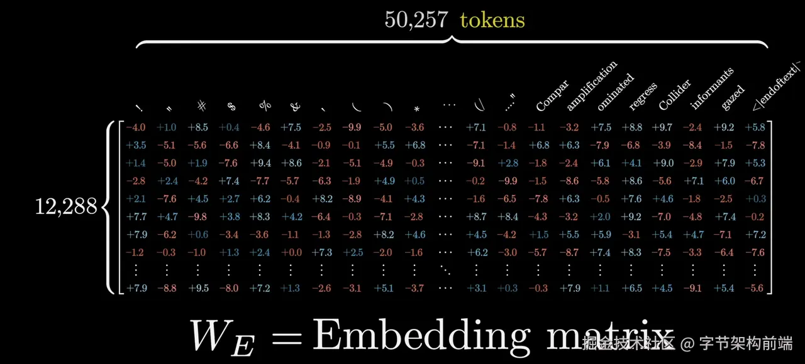


embedding 过程，就是将 token 进行多维化表达的过程，不同的 token 在不同的语义下面，会有不同的含义，比如猫和狗在是宠物的层面上是类似的，但是在处于动物种类的情况下是两种语义。这些不同含义和近似含义会处于在多维向量空间中比较相近的位置。

比如下面两张图的内容

1. Queue = king - man + woman ，表达的向量距离会比较接近。
2. Cat 和 Dog、Snake 在 动物的维度中比较接近。

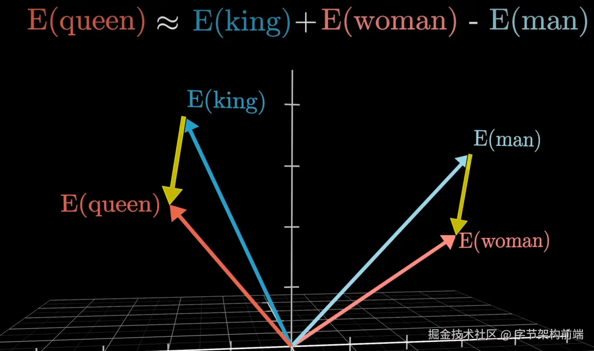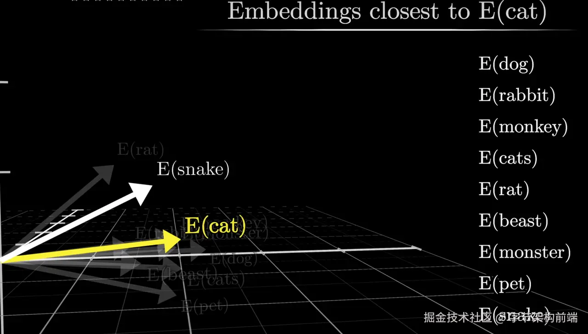

### Transformer

感性认知 transform 架构。

Transformer的核心结构是 **多头注意力层（Attention） + MLP层（Multilayer Perceptron）** 交替堆叠。上面认识到 Embeding 表达了 token 的多种含义，token 在不同的句子中会有不同的表达，transformer 像人阅读一样，你会注意到不同的地方，进行整体的思考。

attention 有几个特点：

1. **位置编码**：传统模型（如RNN）像逐字阅读的读者，容易遗忘开头内容。Transformer 则通过 **位置编码**，给每个词赋予「空间坐标」，类似荧光笔标注重点段落位置，能快速定位。
2. **自注意力层**： **哈利波特** 出现时，你会联想到「闪电伤疤」「霍格沃茨」等元素，无论这些词相隔多少页。Transformer 的 **自注意力层** 正是这种能力的数字化实现——每个词瞬间与全文所有词建立关联权重，形成动态关系网。
3. **多头注意力：头1**：关注语法结构（主谓宾）、 **头2**：提取情感倾向（褒义/贬义） **头3**：识别实体关系（人物-地点-事件）最终综合各视角的信息，形成全面理解。

Attention 机制可能会有缺点，自注意力层的多个头（如 8 头）会生成分散的特征表示。 **MLP** 的作用类似于「会议总结人」，通过全连接层融合不同注意力视角的信息。同时将 attention 的注意力筛选，比如：句子 _"The bank charged high interest rates."_ 中：

- 自注意力层可能同时关联 "bank" 与 "river" 和 "finance"
- MLP 根据上下文强化 "finance" 相关神经元的激活，抑制 "river" 信号。


感性认知：Transformer 是让预测注意到不同的领域知识和句子上下文，通过其架构设计（尤其是自注意力机制）提供了一种更有效的方式来表示、处理和理解序列数据中的复杂关系。

感性感知就到这里，真正理解相关概念需要阅读论文以及上手代码实践训练。我们从 agent 开发角度就理解到这里。

### Finetuning

我们上面几步可以得到一个预训练模型，大型语言模型(LLM)微调是指在预训练模型的基础上，通过额外的训练使模型适应特定任务或领域的过程。微调通常使用较少的数据集和较小的学习率来调整模型的权重，以避免破坏预训练阶段学到的通用知识。

比如我拥有一个 chatModel，我想在这个基础上加强他对 JSON 格式的输出，除了写提示词之外，更稳定的办法是通过微调，让模型内化 JSON 格式输出。但是风险是可能影响原始模型的权重，比如把 R1 做 微调，可能会影响 R1 的思考能力，让思考能力下降。但是也可以通过微调让 Qwen2.5B 拥有 DeepseekR1 的思考能力，对其进行 GRPO 的微调。

有一个微调框架可以去看看， [docs.unsloth.ai/](https://link.juejin.cn/?target=https%3A%2F%2Fdocs.unsloth.ai%2F "https://docs.unsloth.ai/") ，里面集成了许多微调算法。

总之，微调是一种通过影响模型权重来使得 token 预测符合结果的技术。根据权重影响的范围和方法的不同，一般有

1. Full Fine-tuning (全参数微调)

2. PEFT - （Parameter Efficient Fine-tuning）参数高效微调
1. LoRA （Low Rank Adaptation）
2. Prefix Tuning/ P Tuning
3. QLoRA
4. Adapter Tuning

一般 MaaS 厂商会提供微调的接口，用户准备好微调数据集即可。

### Prompt Engineer

> [www.promptingguide.ai/zh](https://link.juejin.cn/?target=https%3A%2F%2Fwww.promptingguide.ai%2Fzh "https://www.promptingguide.ai/zh")

我们如果没有条件进行微调，或者对应的任务没有达到需要微调的级别，我们一般直接对大模型进行 Prompt 。

在理解到上面的 LLM 相关的概念，我们可以理解到，由于本质上LLM输出的是 token 预测，写好输入有利于其预测对应的内容，即 **写好提示词** 是一个非常重要的事情。

有许多提示词相关的技术和名词

1. **Zero shot** （零样本提示），直接提问，使用大模型内化知识

```

 体验AI代码助手
 代码解读
复制代码

将文本分类为中性、负面或正面。
文本：我认为这次假期还可以。情感：

中性
```

2\. **Few-Shot** 少样本提示，提供一些样本输入输出，然后模型再输出

```

 体验AI代码助手
 代码解读
复制代码

 “whatpu”是坦桑尼亚的一种小型毛茸茸的动物。
一个使用whatpu这个词的句子的例子是：我们在非洲旅行时看到了这些非常可爱的whatpus。

“farduddle”是指快速跳上跳下。一个使用farduddle这个词的句子的例子是：

当我们赢得比赛时，我们都开始庆祝跳跃。
```

3\. **COT （chain of thought）** 思维链，我们可以让模型一步一步思考，不要立刻给出答案，可以结合 Few-shot 给他一些思考的例子。

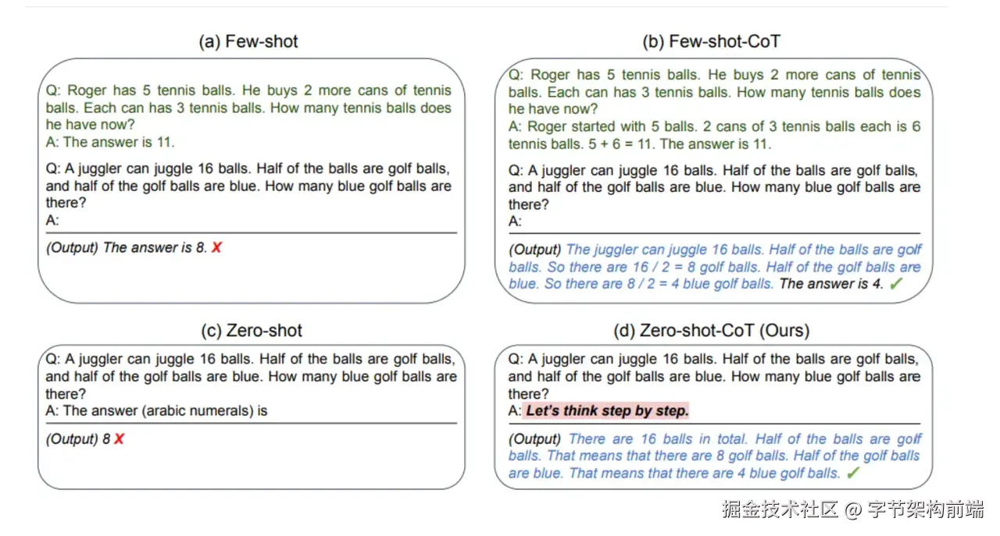

4. **RAG**

通过先检索一些相关内容，作为上下文给 AI 输入，这是现在的非常常见的简单知识库的做法。

```makefile

makefile
 体验AI代码助手
 代码解读
复制代码

Context: {用户问题检索到的知识库内容}
Query: 问题
```

5\. **ReAct**

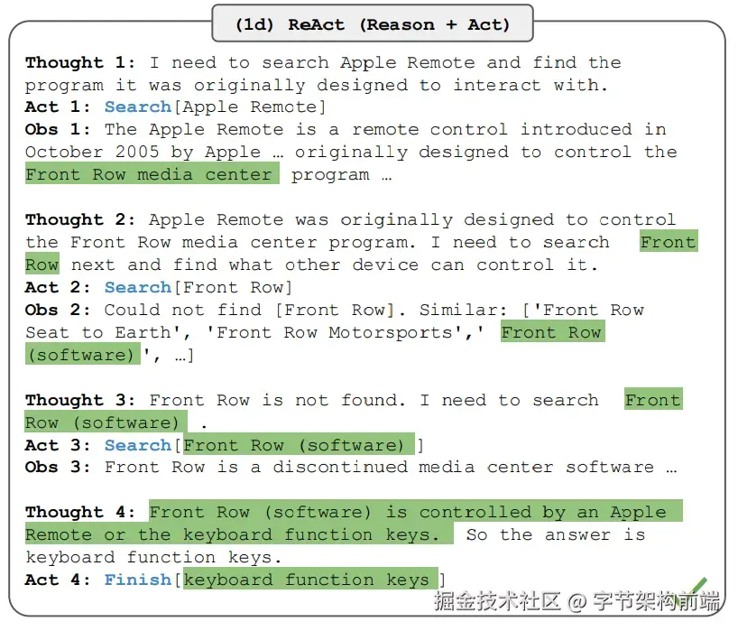

让模型思考下一步动作，然后软件做出下一步动作后，再让模型观测是否达到目标，这也是典型的 agent 的做法。

各种提示词技术都可以结合使用，最终效果按实际效果为主，受模型能力，上下文长度等影响。

各家厂商一般都会训练一个 指令模型，比如带 -Instruct 的型号，指令遵循模型就是那些能够按照"做什么"的指示来执行任务的AI模型，而不仅仅是预测下一个词或句子。这种模型对用户的 Prompt 的遵循会比较靠谱，一般 Agent 会使用这样的模型较多，能够获得更稳定的输出。

比如 Qwen 2.5 Coder 32B-Instruct，以及闭源模型 Claude 3.5/3.7 sonnet 。

### Special Token & Chat Template

我们经常会在开发 Agent 的代码中见到这样的语句模式

```css

css
 体验AI代码助手
 代码解读
复制代码

[    { role: "system", content: "You are a helpful assistant." },    {        role: "user",        content: "Write a haiku about recursion in programming.",    },]
```

涉及两个概念，Special Token 和 Chat Template

#### Special Token

有一些用于提高特别输出的 Token，并不是在自然语言语义中出现的。举例： <function\_call> 等。

Special Token 是自然语言处理（NLP）中用于结构化输入/输出或传递元信息的特殊标记。它们并非源自原始文本，而是由模型设计者定义，用于增强模型对任务的理解能力。

Special Token 是模型与任务之间的“ **协议标记**”，通过编码先验知识显著提升模型的结构化处理能力。其设计需平衡任务需求与计算效率，并在扩展时充分考虑数据量和模型架构的兼容性。

不同的模型有不同的 special token，模型通过训练，将遇到 special token 会内化相关的行为到 token 预测中。比如 chat 对话功能，指令遵循，tool call ，think 等等。

在框架里通常会帮你封装对话模版 chat-template ，里面就会涉及到 Special Token 的封装，比如下文面图片中， hugging face 的转换例子

> [huggingface.co/docs/transf…](https://link.juejin.cn/?target=https%3A%2F%2Fhuggingface.co%2Fdocs%2Ftransformers%2Fmain%2Fen%2Fchat_templating%23what-are-generation-prompts "https://huggingface.co/docs/transformers/main/en/chat_templating#what-are-generation-prompts")

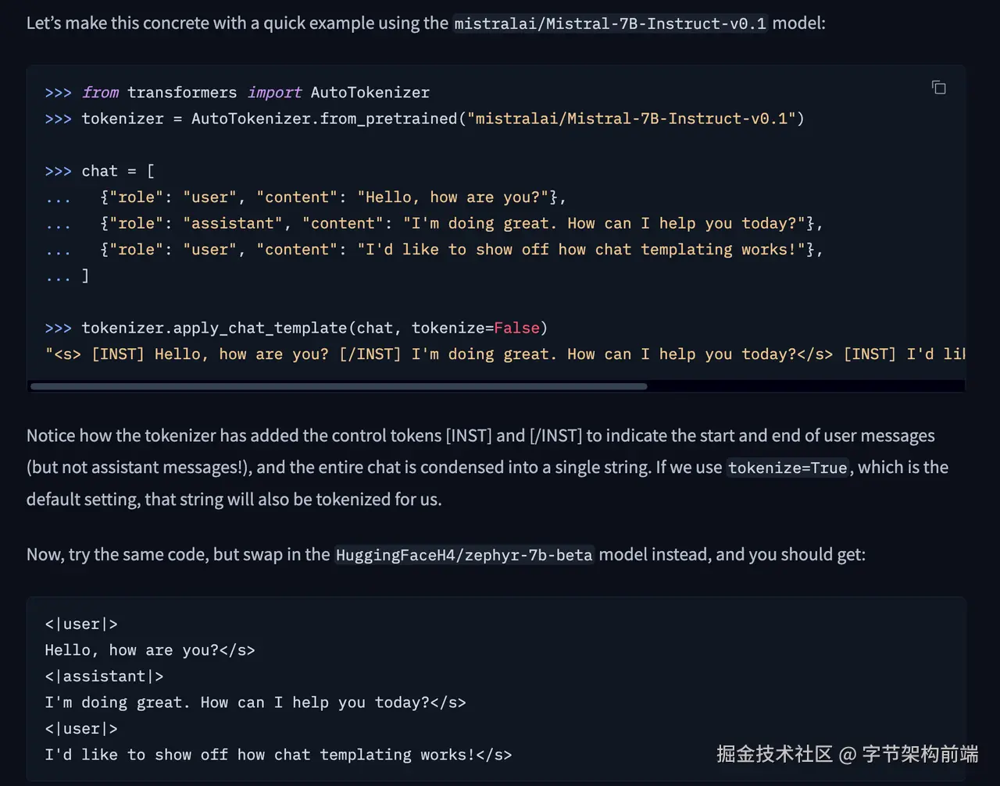

但是实际上对上层应用的开发者来讲，都是指定 role 和 content 对话模型进行调用的，本身不会感知 special token。一般这个封装在模型推理服务框架或推理引擎那一层上，比如 hugging face 的 Transformers 库、llama.cpp 都做了对 Chat Template 的封装。

#### Chat Template

大多数模型会在`tokenizer_config.json`中定义其 chat-template ，大多数 chat-template 使用 Jinja2 模板语法，允许条件逻辑和循环来处理各种对话格式。

比如上层开发者只感知这部分代码

```php

php
 体验AI代码助手
 代码解读
复制代码

import OpenAI from "openai";
const openai = new OpenAI();

const completion = await openai.chat.completions.create({
    model: "gpt-4o-mini",
    messages: [\
        { role: "system", content: "You are a helpful assistant." },\
        {\
            role: "user",\
            content: "Write a haiku about recursion in programming.",\
        },\
    ],
    store: true,
});

console.log(completion.choices[0].message);
```

给大模型权重之前， llama.cpp (ollama背后的推理引起) 或者 Transformers 库，会做 chat template 的转换后再推理

```sql

sql
 体验AI代码助手
 代码解读
复制代码

<|system|>
You are a helpful assistant.</s>
<|user|>
Write a haiku about recursion in programming.</s>
<|assistant|>
```

不同的模型和数据集可能使用不同的 chat-template 格式。比如 ChatML 或 HuggingFace 的模板可能有不同的结构。如果模板不匹配，模型可能无法正确解析输入，导致输出错误。因此， **在使用时模型进行推理的时候需确保模板与模型训练时使用的格式一致。**

当然我们作为 Agent 开发者不需要关注这个,因为我们使用的大模型API,不需要感知这个，只有自己做模型推理才需要感知。

**为什么需要聊天模板：**

1. 位置编码依赖 token 位置模式
2. 注意力机制学习到了特定标记的关联模式
3. 模型通过特殊标记（如<\|im\_start\|>）识别对话角色

```ini

ini
 体验AI代码助手
 代码解读
复制代码

# 正确的模板应用
messages = [\
 {"role": "user", "content": "解释相对论"}\
]
tokenizer.apply_chat_template(messages, tokenize=False)
# 输出：<|im_start|>user\n解释相对论<|im_end|>\n<|im_start|>assistant\n
```

下面是 deepseek r1 的chat template ， ninja 的语法 [huggingface.co/deepseek-ai…](https://link.juejin.cn/?target=https%3A%2F%2Fhuggingface.co%2Fdeepseek-ai%2FDeepSeek-R1%2Fblob%2Fmain%2Ftokenizer_config.json "https://huggingface.co/deepseek-ai/DeepSeek-R1/blob/main/tokenizer_config.json")

````ini

ini
 体验AI代码助手
 代码解读
复制代码

"{{ bos_token }}{{ ns.system_prompt }}{{'<｜User｜>' + message['content']}}{{'<｜Assistant｜><｜tool▁calls▁begin｜><｜tool▁call▁begin｜>' + tool['type'] + '<｜tool▁sep｜>' + tool['function']['name'] + '\n' + '```json' + '\n' + tool['function']['arguments'] + '\n' + '```' + '<｜tool▁call▁end｜>'}}{{'<｜Assistant｜>' + message['content'] + '<｜tool▁calls▁begin｜><｜tool▁call▁begin｜>' + tool['type'] + '<｜tool▁sep｜>' + tool['function']['name'] + '\n' + '```json' + '\n' + tool['function']['arguments'] + '\n' + '```' + '<｜tool▁call▁end｜>'}}{{'\n' + '<｜tool▁call▁begin｜>' + tool['type'] + '<｜tool▁sep｜>' + tool['function']['name'] + '\n' + '```json' + '\n' + tool['function']['arguments'] + '\n' + '```' + '<｜tool▁call▁end｜>'}}{{'<｜tool▁calls▁end｜><｜end▁of▁sentence｜>'}}{{'<｜tool▁outputs▁end｜>' + message['content'] + '<｜end▁of▁sentence｜>'}}{{'<｜Assistant｜>' + content + '<｜end▁of▁sentence｜>'}}{{'<｜tool▁outputs▁begin｜><｜tool▁output▁begin｜>' + message['content'] + '<｜tool▁output▁end｜>'}}{{'<｜tool▁output▁begin｜>' + message['content'] + '<｜tool▁output▁end｜>'}}{{'<｜tool▁outputs▁end｜>'}}{{'<｜Assistant｜><think>\n'}}"
````

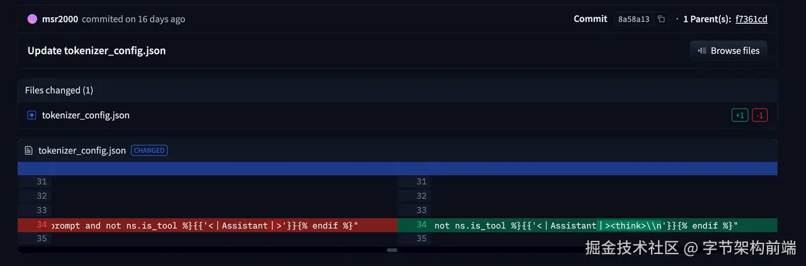

看开发者修改的 chat-template ，给最后追加了个 **`<think>`** \*\*\*\*，因为增加了个这样的 token ，特殊标记（如）可以作为模型输出的强信号，告诉模型接下来应该生成什么类型的内容。在这个例子中，是告诉模型展开其思维过程。

这种方法有效是因为模型在预训练或微调阶段很可能见过类似的标记，并学习了与之相关的输出模式。比如 Deepseek 会对 R1 进行这种模式的格式奖励和内容奖励的训练

增加这一个 能够让 R1 更稳定的输出思维链内容，足以见得 chat template 的重要性。

**你也可以进一步理解到为什么区分了 SystemPrompt 和 UserPrompt**

与标记类似，SystemPrompt和UserPrompt在chat-template中通常有各自独特的标记和处理方式：

- SystemPrompt标记：如`<|system|>、<s>、[INST]`等
- UserPrompt标记：如`<|user|>、[/INST]`等

这种区分通过特殊标记向模型发出明确信号，告诉它当前是谁在说话以及应该如何理解和响应不同来源的输入。它可以建立对模型的控制的优先级，在实际开发agent的价值中，允许应用开发者通过SystemPrompt设置应用特定的行为，而不干扰用户输入，同时增强对 LLM 的重要控制。

这种层级结构在chat-template中通常通过模板语法的条件处理来实现，

```matlab

matlab
 体验AI代码助手
 代码解读
复制代码


  {{ system_message }}

{{ '<|user|>\n' + message['content'] + '\n<|assistant|>\n' }}
```

好了，我们了解了 Chat Template 的概念，虽然 Agent 开发用不到，但是了解这些背景还是有必要的。

## AI Agent 核心概念

### 什么是 agent

**This is what an Agent is: an AI model capable of reasoning, planning, and interacting with its environment.**

能够推理、规划并与环境交互的 AI 模型。

即 AI 能够接受输入，不管是用户的还是环境的，对输入进行规划，调用不同的工具进行执行，并且观察结果最终达到目的。

这里有三个关键：

一个是模型能够自动规划具体怎么做，使用什么样的工具（工具调用能力），和观察结果的能力，即 Plan、Act 、Observe

二个是 Agent 能够集成模型，遍历循环，直到完成目标。

三个是 能够动态集成，获取到外界知识，随时调整。

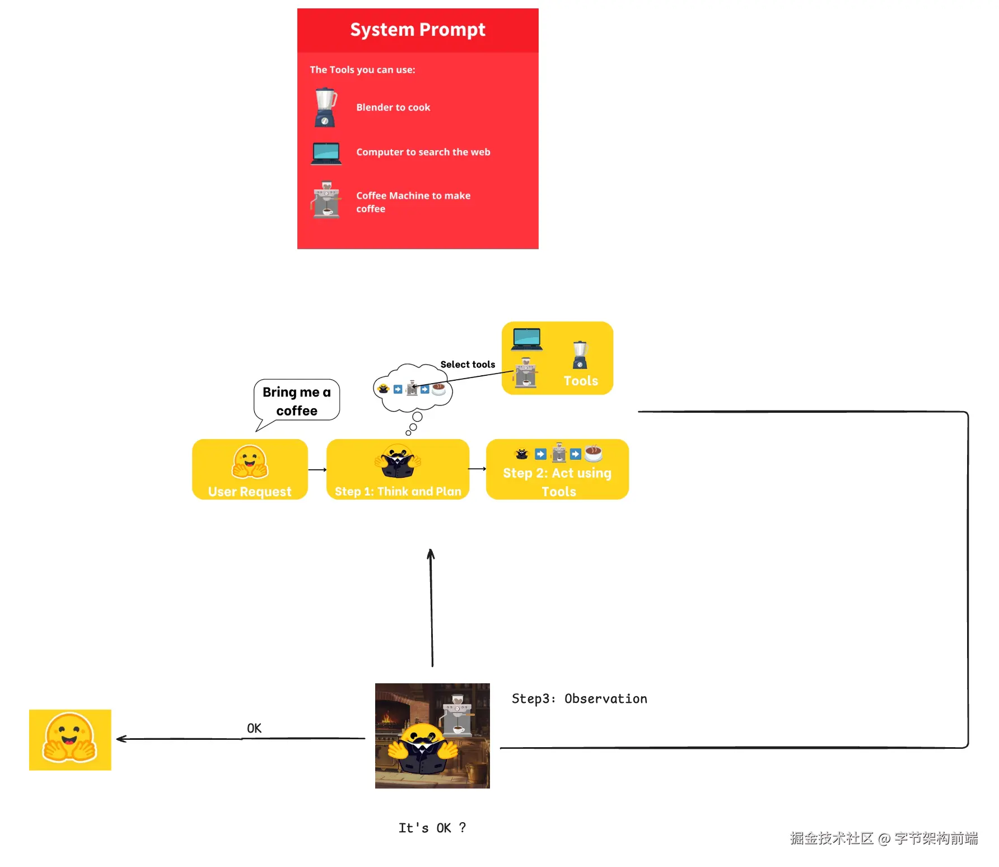

**agent 有哪些组件**

我们借用 mastra 的图 ，mastra 是一个 typescript ai agent framework 他这个图总结的非常到位，列举了 agent 开发中的各种组件，虽然这个框架现在不常用，但是他这个图还是挺好的。

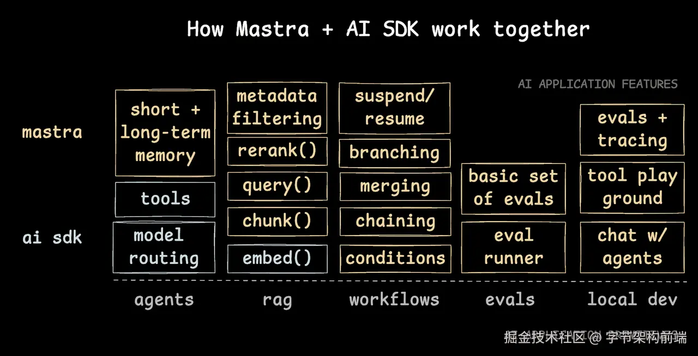

我们可以看到，一个 agent 的组成可以归纳为上述的部分。

1. 与 **LLM** 交互上，agent 有长短期记忆，工具调用，模型路由。
2. 与 **RAG** 上，agent 有检索相关的能力，搜索(query\\requery)、reRank、分块、document embed。这里 rag 可以是 embeding 的内容可以是私有文档，也可以是 web search（ Tavily API or Local Chrome\[puppteer\]) ，还可以利用 记忆能力， 召回(recall)之前的对话消息，
3. **Workflows**：LLM 流程可以用 conditions（条件）、branching（分支结构）、chaining（链式调用）、merging（合成输出）等，也可以有 **human-in-the-loop** 的特性，可以在 agent 循环中接收 user 的 input，进行响应。
4. **evals：** 评估 agent 的好坏
5. **local dev：** 调试工具

我们这篇文章，暂时不会涉及 memory 、rag 、evals、local dev 的内容，主要是体现在最基础的构建 agent 的逻辑上，怎么和 LLM 交互上。

### 模型(chat)

模型有许多关键的能力，根据任务进行选择。先说说模型的通用的一些能力，再说说模型的选择。

#### **Context**

上下文决定成本和输入输出token窗口。

**token** 可以经过简单计算，具体长度依赖模型的 tokenizer，一般厂商有 api 或者 sdk 提供 token 的计算能力

- 1 个英文字符 ≈ 0.3 个 token
- 1 个中文字符 ≈ 0.6 个 token

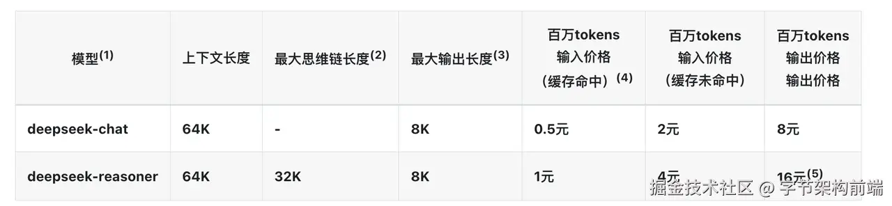

合理使用 token ，一是可以提高输出质量，二是可以减少成本。

#### API

学习 Agent 开发有一个很重要的内容是对模型能力和参数效果的理解。

1. 工具调用：
1. 我们一般会通过大模型厂商提供的 Function Calling 能力进行稳定的函数调用
2. 如果模型厂商没有提供Function Calling能力，则使用指令遵循能力较强的模型，通过 Prompt 工具格式化声明进行工具的使用。
2. 做计划，有些模型比较适合做计划，R1 比较适合用来做 Planing，先思考出一个合适的计划后，再交由每一步给工具调用模型。

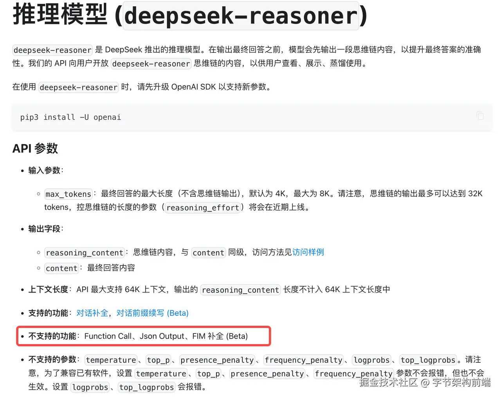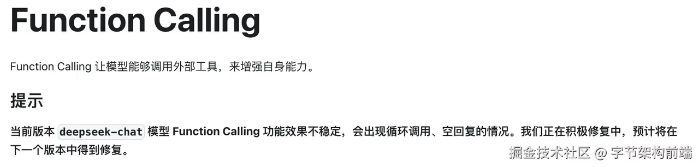

我们来看 openai 的 sdk 中有一个基本都要用上的模块 `openai.chat.completions`

通常 openai 的 sdk 已经是一种标准，虽然 claude 和 gemini 有些 api参数 不太一样，比如 Function Calling 的入参不太一样，不过可以通过框架或者自己实现一下兼容层去解决，不是什么问题。

接下来我们按 open ai 的 api 看大模型的能力，在一些大模型工具的模型接入点中，你会看到有类似 **openai competiable** 的接入方式，比如右图一个 ChatClient 的 model 接入点配置，你可以直接修改 sdk中的 **base\_url** 和 **modelId** 。

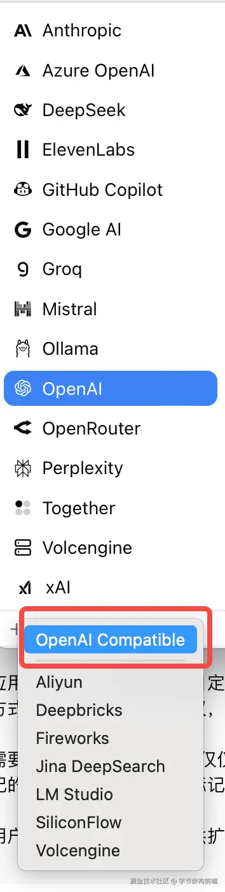

比如我们调用 火山引擎的 deepseek r1 ，只需要修改

**base\_url** ： [ark.cn-beijing.volces.com/api/v3](https://link.juejin.cn/?target=https%3A%2F%2Fark.cn-beijing.volces.com%2Fapi%2Fv3 "https://ark.cn-beijing.volces.com/api/v3")

**modelId ：**

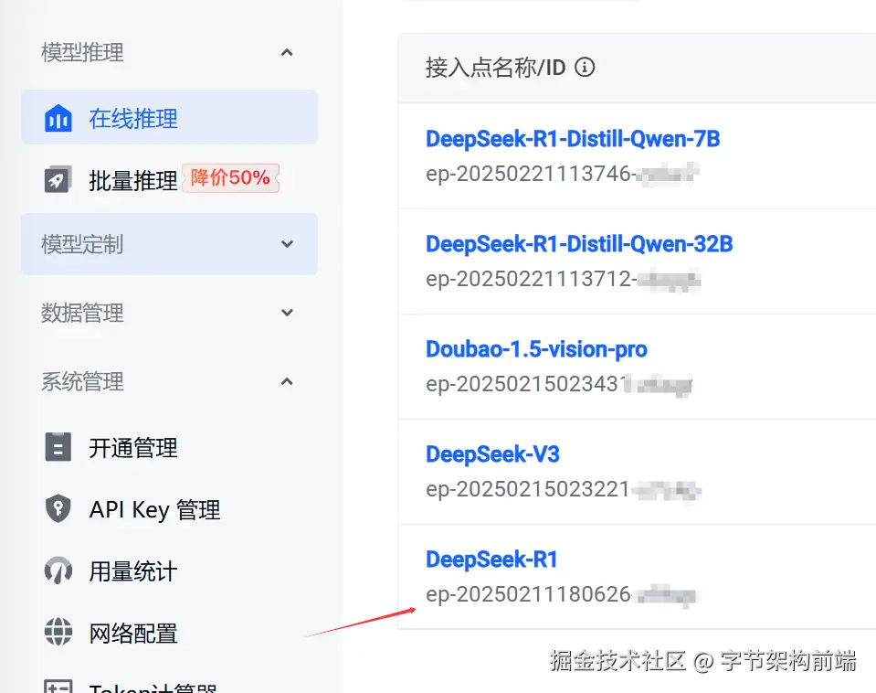

```ini

ini
 体验AI代码助手
 代码解读
复制代码

import os
from openai import OpenAI

client = OpenAI(
    # 从环境变量中读取您的方舟API Key
    api_key=os.environ.get("ARK_API_KEY"),
    base_url="https://ark.cn-beijing.volces.com/api/v3",
    # 深度推理模型耗费时间会较长，建议您设置一个较长的超时时间，推荐为30分钟
    timeout=1800,
    )
response = client.chat.completions.create(
    # 替换 <Model> 为模型的Model ID
    model="ep-2025xxxx-xxx",
    messages=[\
        {"role": "user", "content": "研究推理模型与非推理模型区别"},\
        {"role": "assistant", "content": "推理模型主要依靠逻辑、规则或概率等进行分析、推导和判断以得出结论或决策，非推理模型则是通过模式识别、统计分析或模拟等方式来实现数据描述、分类、聚类或生成等任务而不依赖显式逻辑推理。"},\
        {"role": "user", "content": "我要有研究推理模型与非推理模型区别的课题，怎么体现我的专业性"},\
    ],
)
```

我们直接从 deepseek 的 API params 入手，deepseek 的 api 是 openai competiable 的。

这里就不提及一些多模态相关的API 或者 FIM（Fill-In-the-Middle）补全的 completion api ，主要关注 chat model **。**

> [api-docs.deepseek.com/zh-cn/api/c…](https://link.juejin.cn/?target=https%3A%2F%2Fapi-docs.deepseek.com%2Fzh-cn%2Fapi%2Fcreate-chat-completion "https://api-docs.deepseek.com/zh-cn/api/create-chat-completion")

```python

python
 体验AI代码助手
 代码解读
复制代码

import requests
import json

url = "https://api.deepseek.com/chat/completions"

payload = json.dumps({
  "messages": [\
    {\
      "content": "You are a helpful assistant",\
      "role": "system"\
    },\
    {\
      "content": "Hi",\
      "role": "user"\
    }\
  ],
  "model": "deepseek-chat",
  "frequency_penalty": 0,
  "max_tokens": 2048,
  "presence_penalty": 0,
  "response_format": {
    "type": "text"
  },
  "stop": None,
  "stream": False,
  "stream_options": None,
  "temperature": 1,
  "top_p": 1,
  "tools": None,
  "tool_choice": "none",
  "logprobs": False,
  "top_logprobs": None
})
headers = {
  'Content-Type': 'application/json',
  'Accept': 'application/json',
  'Authorization': 'Bearer <TOKEN>'
}

response = requests.request("POST", url, headers=headers, data=payload)

print(response.text)
```

**message**

Message 是一个消息数组，是本文前面提及的 **Chat Template** 的应用层抽象。

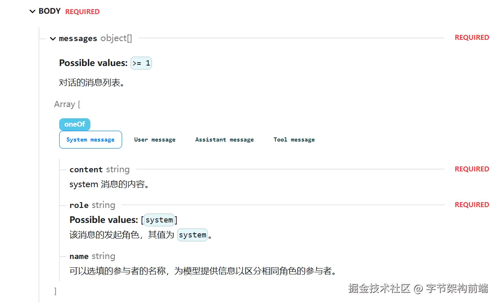

以 deepseek \*\*\*\*为例消息类型有： **System 、User、Assistant、Tool**

System Prompt，一般必须放在 messages 的队列头部，不放在头部很多 API 有校验会报错。

**多轮对话**

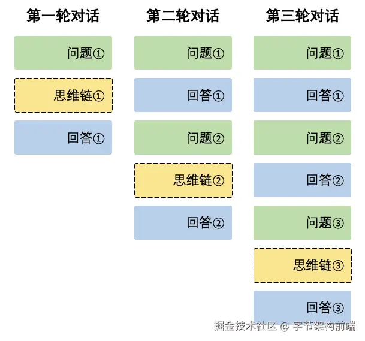

```ini

ini
 体验AI代码助手
 代码解读
复制代码

from openai import OpenAI
client = OpenAI(api_key="<DeepSeek API Key>", base_url="https://api.deepseek.com")

 # Round 1
messages = [{"role": "user", "content": "9.11 and 9.8, which is greater?"}]
response = client.chat.completions.create(
    model="deepseek-reasoner",
    messages=messages
)

reasoning_content = response.choices[0].message.reasoning_content
content = response.choices[0].message.content

 # Round 2
messages.append({'role': 'assistant', 'content': content})
messages.append({'role': 'user', 'content': "How many Rs are there in the word 'strawberry'?"})
response = client.chat.completions.create(
    model="deepseek-reasoner",
    messages=messages
)
# ...
```

上面以 R1 文档里的为例子，reasoning Model 会输出思维链，一般思维链只用来展示。

在对话应用中，我们一般称一次对话 Session 为 Thread，在一个 Thread 里，要求 Agent 开发者维护用户消息历史，我们把每一轮的 LLM 输出 `message.content` 作为下一轮的输入。

在更高级的应用里，消息历史应该被单独提出来做 Context Engineering (上下文工程)，Agent里针对大模型的每一轮对话都对 Agent 有至关重要的作用。 [blog.langchain.com/context-eng…](https://link.juejin.cn/?target=https%3A%2F%2Fblog.langchain.com%2Fcontext-engineering-for-agents%2F "https://blog.langchain.com/context-engineering-for-agents/")

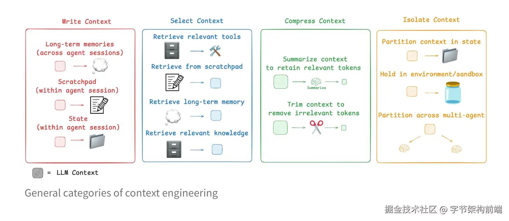

**Temperature & top\_p**

**temperature**

模型可以设置输出的 **temperature**，LLM中控制生成文本多样性和随机性的核心参数。 **其作用机制基于对模型预测概率分布的调整**。你可以理解为模型自由发挥的程度.

Temperature **<1**（例如0.2-0.8）：概率分布更尖锐， **高概率词被强化**，低概率词被抑制。生成文本更保守、连贯，但可能缺乏创意。

Temperature **>1**（例如1.2-2.0）：概率分布更平坦， **低概率词的机会增加，生成结果更具多样性和新颖性**，但可能偏离逻辑或事实。

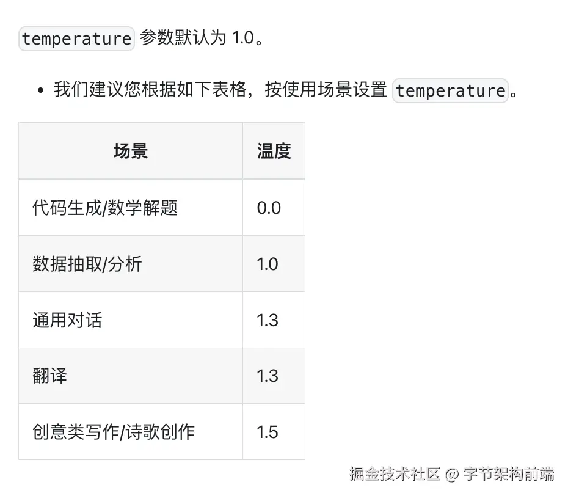

**top\_p**

> Deepseek 文档的回答：作为调节采样温度的替代方案，模型会考虑前 top\_p 概率的 token 的结果。 **`top_p = 0.1`** \*\*\*\*就意味着只有包括在最高 10% 概率中的 token 会被考虑。 我们通常建议修改这个值或者更改 **`temperature`**，但不建议同时对两者进行修改。

**工作原理**

1. **动态候选集选择**： `top_p` 会从概率最高的 token 开始累加，直到总和达到阈值 `p`，形成一个动态候选集。例如，当 `top_p=0.1` 时，模型会选取累积概率超过 10% 的最小 token 集合。

2. **归一化采样**： 候选集中的 token 会按原始概率比例重新分配概率权重，并在该集合内进行随机采样。

Temperature 和 top\_p 两个参数，一个是 最高概率的截断，一个是修改概率分布，本质都是修改模型预测 token 的值的采样的调整。

问了下 deepseek ，推荐 **优先使用** **`top_p`** **，** 若需平衡多样性与可控性，建议固定 `temperature=1.0`（默认值），仅通过 `top_p` 调整候选集范围。

**max\_tokens**

根据任务进行 **max\_tokens** 的大小选择，一般来讲会从任务类型，成本去考虑。如果确定是高随机性的场景，比如创意写作、DeepSearch等，需要提高 **max\_tokens** 值去生成更多内容。如果是工具调用，或者需要快速回答的场景，减少 **max\_token** 加速响应和准确度。

**presence\_penalty & frequency\_penalty**

presence\_penalty主要是对已经出现过的token进行惩罚，不管出现的次数，只要出现过就会降低其概率。固定值减法（ **与出现次数无关**）

frequency\_penalty则是根据token出现的频率来施加惩罚，出现次数越多，惩罚越重。累进式减法（ **与出现次数成比例**）

**stop**

可以选择某个关键词进行截断。截断词是构建 agent 工具调用的常用的方法，可以让输出中间结果更加稳定。

比如我让模型帮我总结某个领域知识的时候，让模型先思考后得出结论。可能会这么输出

```makefile

makefile
 体验AI代码助手
 代码解读
复制代码

Thinking:
xxx
xxxxxxx
Conclusion:
xxxx
```

但是我可以通过中间 `eval-loop`去评测模型的输出质量，然后进行多轮思考，可以设置这个参数

```ini

ini
 体验AI代码助手
 代码解读
复制代码

stop=['Conclusion:']
```

我就可以得到这样的结果，

```makefile

makefile
 体验AI代码助手
 代码解读
复制代码

Thinking:
xxx
xxxxxxx
Conclusion:
```

然后我可以再把这个结果给到 LLM ，让模型做更深层次的思考，思考了后再进行 Conclusion 的输出，这样可能输出的质量就会更高。

后面讲工具调用会再次提到。

**stream**

流式输出，指使用 http sse 进行 token 的输出。常用于 model 对话上。使用 text 进行传输，需要 client 自行处理 parser。

**response\_format - JSON output**

deepseek原文：

设置为 `{"type": "json_object" }` 以启用 JSON 模式，该模式保证模型生成的消息是有效的 JSON。

**注意:** 使用 JSON 模式时，你还必须通过系统或用户消息指示模型生成 JSON。否则，模型可能会生成不断的空白字符，直到生成达到令牌限制，从而导致请求长时间运行并显得“卡住”。此外，如果 finish\_reason="length"，这表示生成超过了 max\_tokens 或对话超过了最大上下文长度，消息内容可能会被部分截断。

````arduino

arduino
 体验AI代码助手
 代码解读
复制代码

你是一个诗歌生成AI，需生成包含自然意象的七言绝句。要求：
1. 每句7个字，共4句
2. 使用JSON格式输出，包含标题(title)和内容(lines)
3. 避免重复用词，允许合理押韵

EXAMPLE JSON OUTPUT:
```json
{"title": "秋夜吟","lines": ["银霜悄落桂枝头","寒蛩低鸣石径幽","孤灯照影书窗寂","玉露凝香夜未收"]}
```
````

**function calling**

函数调用是大型语言模型厂商提供的一种功能，和直接在提示词中编写结构化输出的方法相比更加稳定。

Function calling **并不是** 指模型执行工具， **而是** 提供结构化输出的指令，让应用程序执行工具，保持应用程序的控制权。

比如我们定义工具，

```ini

ini
 体验AI代码助手
 代码解读
复制代码

 tools = [\
        {\
            "type": "function",\
            "function": {\
                "name": "get_weather",\
                "description": "获取指定位置的天气信息",\
                "parameters": {\
                    "type": "object",\
                    "properties": {\
                        "location": {\
                            "type": "string",\
                            "description": "城市名称，如：北京、上海、广州",\
                        },\
                        "unit": {\
                            "type": "string",\
                            "enum": ["celsius", "fahrenheit"],\
                            "description": "温度单位",\
                        },\
                    },\
                    "required": ["location"],\
                },\
            },\
        }\
    ]
```

发送对应的消息给 LLM API

```ini

ini
 体验AI代码助手
 代码解读
复制代码

    # 第一步：发送用户问题和可用工具
    messages = [{"role": "user", "content": "上海今天的天气怎么样？"}]

    response = client.chat.completions.create(
        model="gpt-3.5-turbo",
        messages=messages,
        tools=tools,
        tool_choice="auto",
    )

```

得到结果后，API 会提供 工具相关的字段供开发者进行工具的运行。

```ini

ini
 体验AI代码助手
 代码解读
复制代码

    response_message = response.choices[0].message
    tool_calls = response_message.tool_calls

    # 检查是否需要调用函数
    if tool_calls:
        messages.append(response_message)  # 添加助手的响应到消息历史

        # 处理函数调用
        for tool_call in tool_calls:
            function_name = tool_call.function.name
            function_args = json.loads(tool_call.function.arguments)

            # 执行函数并获取结果
            function_response = functionCall(function_name, function_args)

            # 将函数执行结果添加到消息历史
            messages.append({
                "role": "tool",
                "tool_call_id": tool_call.id,
                "name": function_name,
                "content": function_response,
            })

        # 将函数执行结果发送给AI以获取最终回复
        second_response = client.chat.completions.create(
            model="gpt-3.5-turbo",
            messages=messages,
        )

        return second_response.choices[0].message.content
    else:
        return response_message.content
```

应用层的逻辑不用动，主要是 大模型厂商 做了更稳定的函数调用能力，规范了 function call 的输入输出。

如果不提供 Function Calling 的能力，那开发者就需要自行做模型结构化输出的校验。

```ini

ini
 体验AI代码助手
 代码解读
复制代码

    response = client.chat.completions.create(
        model="gpt-3.5-turbo",
        messages=messages,
        tools=tools,
        tool_choice="auto",
    )

    response_message = response.choices[0].message
    tool_calls = response_message.tool_calls
```

#### **模型的选择**

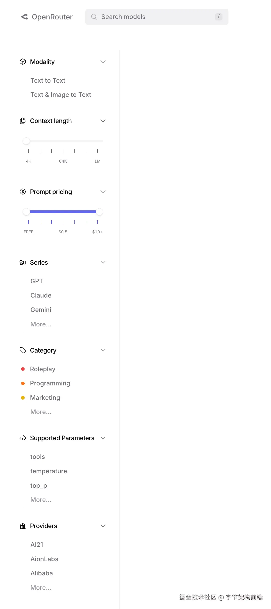

不同模型的能力不同，比如：

1. 有些模型就不支持 function calling， 如：deepseek r1
2. 有些模型指令遵循不好，你告诉他的 prompt 不能很好的执行
3. 还有些模型是 reasoning model，不适合做一些快速的输出，适合做 act 。
4. 还有些时候你需要多模态能力，比如需要使用 vision model 去做浏览器自动化，可以使用视觉模型辅助。
5. 等等...

一个常见的认知是，reasoning model 适合做 planing ，claude 4 sonnet\ kimi k2 适合写代码，做指令遵循，gpt4o 适合做多模态任务等等，最终模型的选择要根据 agent 的效果，以及成本来考虑。

有个偷懒的方法，可以去 OpenRouter 上筛选具体的模型能力。

#### **大模型厂商 maas**

除了 Openai、anthropic 、deepseek 等厂商外，还有各种 maas 服务商：

国内的有：火山引擎方舟、硅基流动等

国外的有：OpenRouter、aimixhub， OpenRouter 支持 支付宝微信支付 ，不太好充值 openai 、anthropic 的同学可以使用。

为什么需要大模型厂商呢？上面我们说模型有不同的能力，有时候你需要去尝试不同的模型去构建自己的应用，大模型厂商帮助你可以方便的调用不同的 model ，并且现在经常打活动，价格也不超出原有价格，经常还有免费的额度，可以白嫖一些试试模型能力。

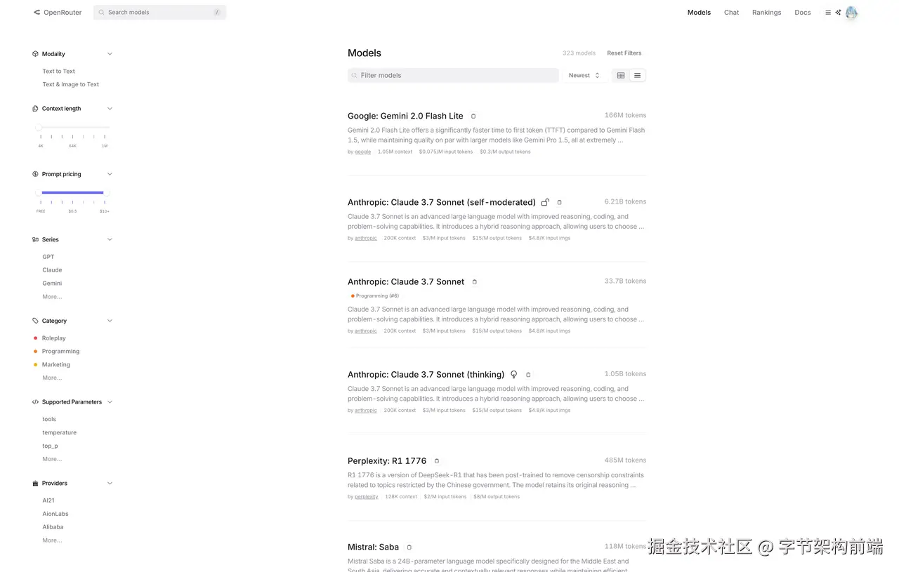

## Agent 设计模式

上面的讲到了 agent 构建的基础，不同的任务有不同的 agent 设计模式，下面我们来提及一下。

### RAG：检索增强生成

早期 AI 和环境交互是以 RAG 为主 ，chat thread 的产品，先去外部信息源（ web search、document vector base）搜索一下相关内容，然后再把用户信息一起输入给 LLM ，最后 LLM 输出文本给用户。

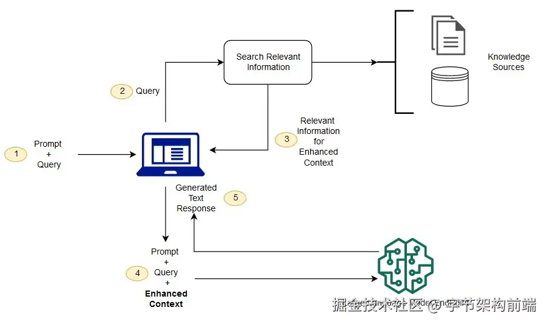

在这个阶段，LLM 基于增强的上下文生成回答，还是 人 到 LLM 的单边 Q&A 过程。

```ini

ini
 体验AI代码助手
 代码解读
复制代码

 # RAG简单实现示例from langchain.embeddings import OpenAIEmbeddings
from langchain.vectorstores import Chroma
from langchain.chat_models import ChatOpenAI
from langchain.chains import RetrievalQA
from langchain.document_loaders import TextLoader
from langchain.text_splitter import CharacterTextSplitter

# 1. 加载文档
loader = TextLoader("knowledge_base.txt")
documents = loader.load()

# 2. 分割文档
text_splitter = CharacterTextSplitter(chunk_size=1000, chunk_overlap=0)
texts = text_splitter.split_documents(documents)

# 3. 创建向量存储
embeddings = OpenAIEmbeddings()
vectorstore = Chroma.from_documents(texts, embeddings)

# 4. 创建检索器
retriever = vectorstore.as_retriever()

# 5. 创建问答链
llm = ChatOpenAI(model_name="gpt-3.5-turbo")
qa_chain = RetrievalQA.from_chain_type(
    llm=llm,
    chain_type="stuff",
    retriever=retriever
)

# 6. 查询
query = "什么是人工智能？"
response = qa_chain.run(query)
print(response)
```

### Anthropic Agent 构建指南

如何让 LLM 更自动化的做一些工作，Anthropic 出了个 Agent 构建指南

[www.anthropic.com/research/bu…](https://link.juejin.cn/?target=https%3A%2F%2Fwww.anthropic.com%2Fresearch%2Fbuilding-effective-agents "https://www.anthropic.com/research/building-effective-agents")

Anthropic 文章里面提及到

> We suggest that developers start by using LLM APIs directly: many patterns can be implemented in a few lines of code. If you do use a framework, ensure you understand the underlying code. Incorrect assumptions about what's under the hood are a common source of customer error.

Anthropic 期望开发者直接使用 LLM api 去构建 agent ，能够更好的适应和修改 agent，文章提到，大部分 LLM 应用不需要框架封装。

比如早期 langchain 存在过度封装，黑盒的问题被人诟病，限制了逻辑的实现。

不过我觉得现在的 agent framework 不止是对 workflow 的封装，也集成了很多 memory 、eval 、trace 的功能，帮助开发者更多关注自己的 agent 产品逻辑，langgraph 提供了比较低级的实现，组合 workflow 图，能省不少事。

这个指南中，提到了 6个 agent 构建模式。

我们先把把 LLM 组合为可以进行 工具调用、RAG、Memory 的 增强 LLM ，在下面的每个节点里都可以作为 这样的 LLM 节点，这些实际上是作为 LLM UserMessage 输入的影响，不影响实际的流程节点。

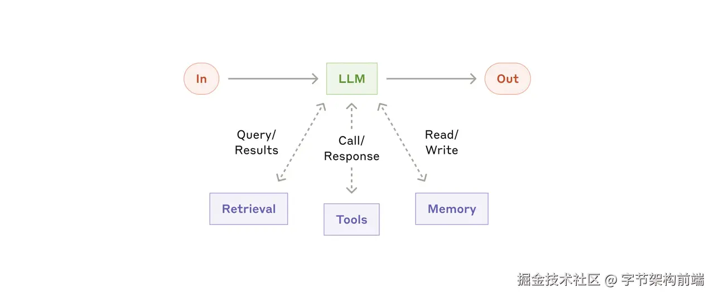

**chain**

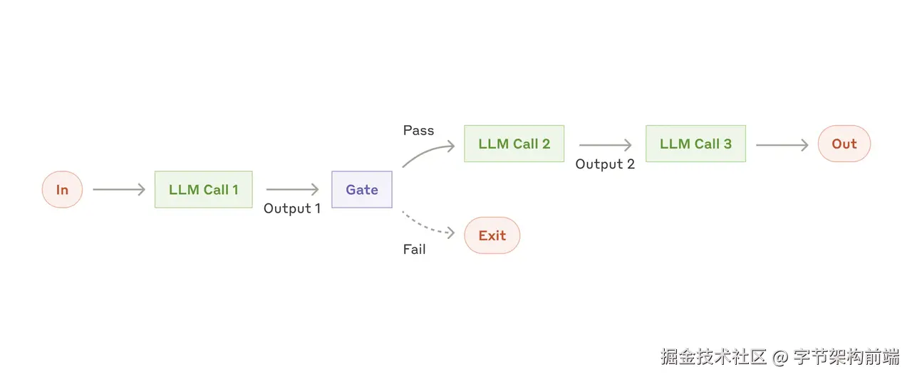

比如你想让 写作Agent 写一篇文章，写完了文章后，先评判文章的是否基于背景合理，然后需要润色文章结构，最后再用英文输出。

上面的需求当然可以用一个 提示次 \+ 一个 LLM 实现，也可以使用 多个 LLM 串行去做，这个就是 chain。通常串行的质量会比一个LLM质量更高，同时也能拿到中间结果。

**routing**

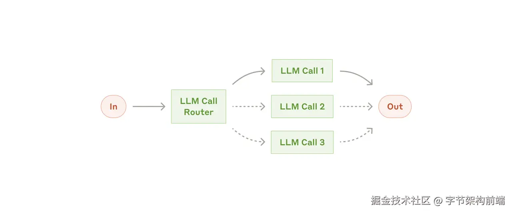

大模型判断好了后，具体走哪个模型去处理。比如最经典的，我们的编程 copilot 早期的一个功能就是 /fix , /test 之类的指令提示，让大模型使用不同的系统提示，用于不同的任务。

**parallelization**

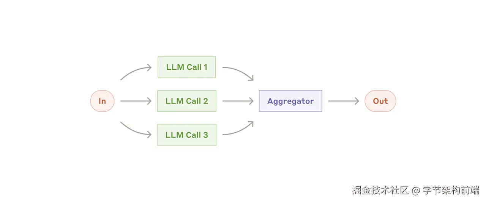

由人提前拆解好任务，人去决定使用什么样的任务。比如你提前想好了对 PRD 做几个角度的评判，从产品经理的角度，工程师的角度，用户的角度，然后你可以将这个任务分解为多个 LLM 去执行，然后最后在用一个聚合器拼接这些角度的输出。

**Orchestrator-workers**

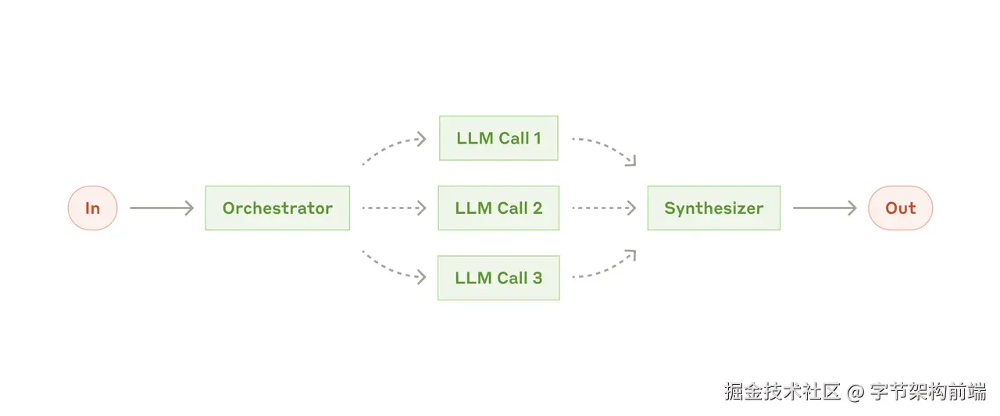

用户的任务比较复杂，需要一个 Orchestrator （协调者） 对任务进行一个拆解，再分发多个子任务给其他大模型，尤其是不知道任务步数的时候。还是可以用上面的 PRD 分析做例子，比如你不规定具体的角色，你就让 LLM 尽可能的从多角度全面的分析问题。

```ini

ini
 体验AI代码助手
 代码解读
复制代码

ORCHESTRATOR_SYSTEM_PROMPT = """你是一个PRD的评判官，你需要进可能的将需求拆解为多视角去分析，比如你可以从用户、产品经理、研发、财务等多视角分析，并且不限于此。
需要分析的问题如下: {question}
返回的输出格式如下:
<analysis> 输出你的分析结果 </analysis>

<tasks>
  <task>视角1</task>
  <task>视角2</task>
</tasks>
"""
```

```ini

ini
 体验AI代码助手
 代码解读
复制代码

TASKWORKER_SYSTEM_PROMPT = """
这是你的问题{question}
你尽可能的详细以这个角度回答 {task}
返回格式如下：
<response>
输出你的返回格式
</resopnse>
"""
```

最后再让 Systhesizer 大模型去总结结果返回。

和 Parallelization 不同的是，Orchestrator-workers 是大模型划分步骤，Parallelization 是人划分步骤。

**Evaluator-optimizer**

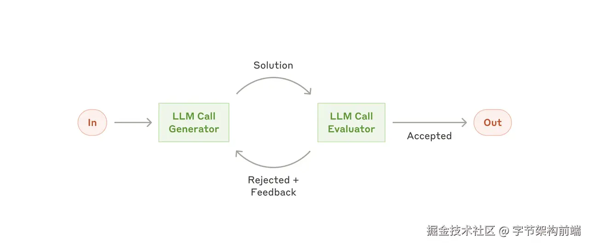

还是拿 PRD 举例，如果这个时候我们想引入一个评价机制，LLM 互相评价。

就可以写一个类似下面伪代码的过程

```scss

scss
 体验AI代码助手
 代码解读
复制代码

gen = callGenLLM(prompts)
while(True)
    score, feedback = callEvaluatorLLM(gen)
    if(score  >= 90)
        return gen
    nextPrompt = f"之前PRD如下 {gen}\nscore: {score}\nfeedback {feedback}"
    gen = callGenLLM(prompts)
```

**ReAct Agent**

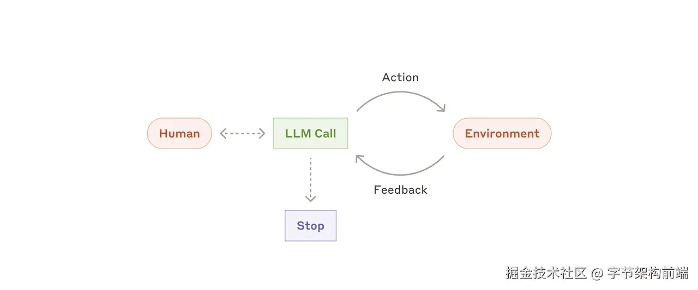

ReAct Agent 就是一个常见的构建方法，开放性问题没法定义工作流。

1. 用户给到输入

2. **Action：** 先让模型决定调用什么工具去完成任务 。

3. **Environment：** 然后你拥有一个环境去执行 LLM 给出的 **action** ，这里文章前面提及到了 tools、mcp 、 codeAgent 中的代码执行环境，这些都是 **environment ，** 甚至 另一个 LLM 也可以当作 tools **。**

4. **Feedback：** 执行完毕后，再次丢给大模型，让大模型去 **observe** 对应的结果，如果不符合要求，则继续给出 Action 让 Environment 去执行，符合则停止。

上述6种构建方式可以自由组合，agent 本身也可以是 tool 的一种，被其他 LLM 调用。

## 更强大的 Agent

### 工具调用 和 ReAct 构建模式

我们深入一下 ReAct 的过程。

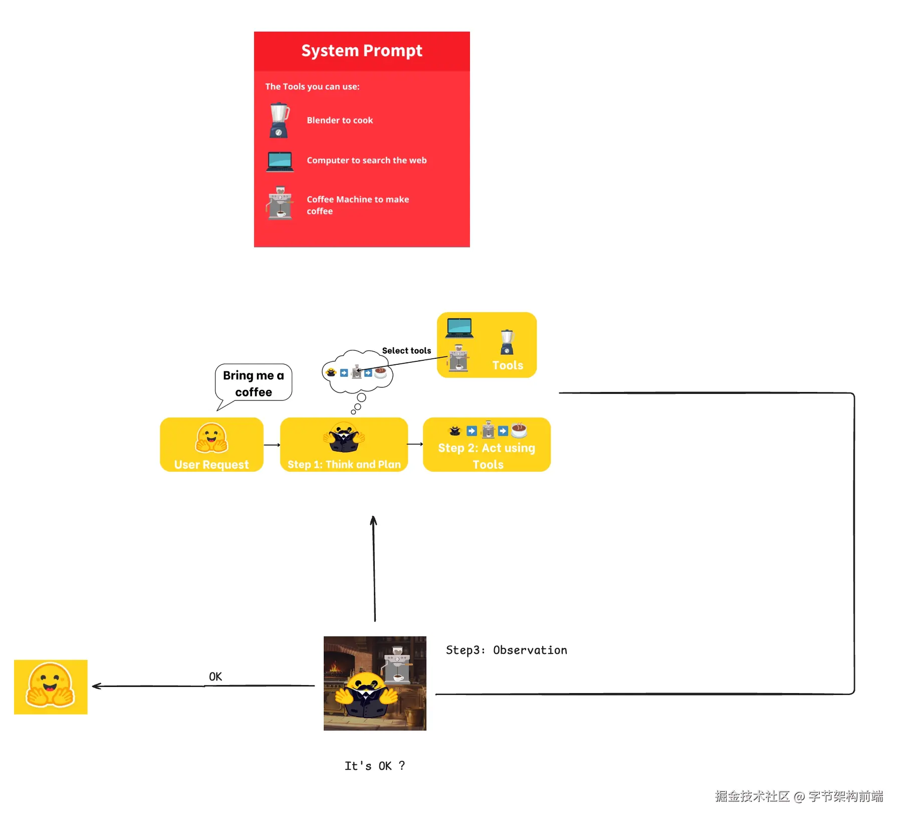

ReAct（Reasoning and Acting）是一种结合推理（Reasoning）和行动（Acting）的 Agent 流程，让大语言模型能够交替进行思考和执行操作。它是大多数现代LLM工具调用的基础方法。

**Huggingface agent course 的 例子,** **[huggingface.co/learn/agent…](https://link.juejin.cn/?target=https%3A%2F%2Fhuggingface.co%2Flearn%2Fagents-course%2Funit1%2Fdummy-agent-library "https://huggingface.co/learn/agents-course/unit1/dummy-agent-library")**

1. System prompt 告诉大模型，用户询问天气情况的时候要调用工具 get\_weather
2. 用户询问 weather
3. 大模型识别到询问天气的意图，需要调用工具，模型返回使用 get\_weather 工具调用描述
4. 然后环境（Agent）去调用相关的工具，再将返回结果，将结果和之前的Prompt 拼成新的 Message 发给大模型作最后的输出。

由于用户的描述不一定有上面的描述那么简单，逐步出现了 Planing + ReAct 的方法的 Agent ， 类似 DeepResearch \ Manus ，用户给定一个目标，大模型先帮用户划分成不同的计划步骤，然后再将每一步执行用 ReAct Agent 去判断执行效果。

#### **OpenDeepResearch**

DeepResearch 是 OpenAI 推出的一款研究产品，你只需要给 Agent 一个任务，他会给你返回一个详细的调研报告。 [mp.weixin.qq.com/s/6NJgaoiDd…](https://link.juejin.cn/?target=https%3A%2F%2Fmp.weixin.qq.com%2Fs%2F6NJgaoiDdNaQ1YcGrgSi2Q "https://mp.weixin.qq.com/s/6NJgaoiDdNaQ1YcGrgSi2Q")

OpenDeepResearch 是 Langchain 官方用 langgraph 构建的例子 [github.com/langchain-a…](https://link.juejin.cn/?target=https%3A%2F%2Fgithub.com%2Flangchain-ai%2Fopen_deep_research "https://github.com/langchain-ai/open_deep_research")

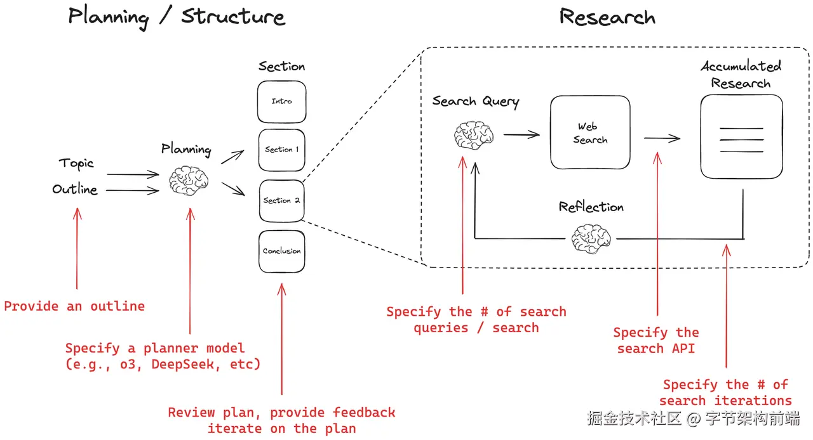

1. Input：用户提供一个主题
2. Planing：使用 Reasoning Model 提供每个章节的计划，langgraph 有 human-in-the-loop 的能力，可以在这个过程中，人进行介入后调整大纲决定后续 research 内容。
3. ToolCall：然后每个章节再丢给 Research Agent 调用工具学习，做多轮 Web搜索，总结，反思，再搜索。
4. 最后再把所有的 Research 汇总，编程方式做 Markdown 输出。

#### **OpenManus**

OpenManus 由两个 Agent 协作，

1. TODO-List Agent: 代码中叫做 PlaningFlow，负责 TODO List planing 的产生和状态变化。
2. ReAct Agent：代码中叫做 ManusAgent 负责工具调用和 ReAct 流程

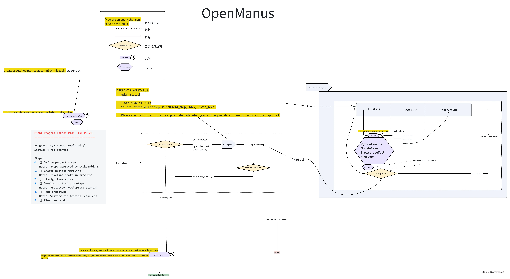

- PlaningFlow 产生一个 TODO List 计划表，然后每一步丢给 ManusAgent 执行，完成后会对 TODO List 打上 ✓ ，当没有任务运行的时候，会丢给 LLM 做 Summerize，每一步驱动一个 ManusAgent 工作。

- ManusAgent 是一个绑定了下面几个工具的 ReAct Agent
  - PythonExecute：python exec
  - GoogleSearch： [pypi.org/project/goo…](https://link.juejin.cn/?target=https%3A%2F%2Ft.co%2F7ME5JvsOfN "https://t.co/7ME5JvsOfN")
  - BrowserUseTool： [browser-use.com](https://link.juejin.cn/?target=https%3A%2F%2Ft.co%2FuA9rjrLEet "https://t.co/uA9rjrLEet")
  - FileSaver： aiofiles write string

完成每一项 Plan 中的 Task ，并通过 UserPrompt 的提示让LLM返回 Summerize

看项目里还规划了许多工具和Agent，是一个非常经典简洁的 Planing + ReAct 的代码，没有使用 LangGraph 之类的框架，直接使用 API ，是一个比较好的入门 Agent开发的仓库。

上面粗略看了基本的 Agent 构建思路，下面我们再看一下比较重要的部分，怎么具体编写工具调用的逻辑。

工具调用是一个非常重要的事情，在大模型作为大脑 🧠 很强大的情况下，决定大模型的身体 🏋️ 的上限。

### 工具调用的编写

#### Prompt Tools Schema

通过系统提示词设计，指导AI以特定格式（如XML或JSON）调用工具。它确保AI输出的工具调用格式清晰，便于应用程序解析和执行。例如，提示词可以包括工具描述和预期输出的示例，告诉AI如何生成函数调用。

**工作流程：**

1. **工具定义**：在系统提示中定义工具及其调用格式
2. **格式约束**：明确指定AI需要使用的响应格式（XML/JSON）
3. **工具调用**：AI根据指定格式生成工具调用请求
4. **解析执行**：系统解析AI生成的格式化内容并执行对应操作

它为后续的函数调用奠定了基础，通过结构化提示减少了AI输出的歧义。例如，提示可以指定

```ini

ini
 体验AI代码助手
 代码解读
复制代码

当需要执行查看天气的时候，请使用以下XML格式：
<tool name="get_weather">
  <param name="city">{cityName}</param>
  ... 其他参数 ...
</tool>
```

但是这种需要模型有很强的指令遵循能力 Instruct ，比如 claude 4 sonnet。开发者需要考虑模型如果没有遵循指令的情况，对模型输出做解析、校验和重试。

```ini

ini
 体验AI代码助手
 代码解读
复制代码

import os
from openai import OpenAI

# 初始化OpenAI客户端
client = OpenAI(api_key=os.environ.get("OPENAI_API_KEY"))

def run_conversation():
    # 系统提示中定义工具调用格式
    system_prompt = """你是一个有用的AI助手。当需要执行工具操作时，请使用以下XML格式：
    <tool name="工具名称">
      <param name="参数名">参数值</param>
      ... 其他参数 ...
    </tool>

    可用工具列表:
    1. calculator - 执行数学计算
       参数: expression (字符串) - 要计算的数学表达式
    2. weather - 查询天气
       参数: location (字符串) - 要查询天气的位置
    """

    response = client.chat.completions.create(
        model="gpt-4",
        messages=[\
            {"role": "system", "content": system_prompt},\
            {"role": "user", "content": "计算345乘以982是多少？然后告诉我北京的天气。"}\
        ],
        temperature=0
    )

    assistant_message = response.choices[0].message.content
    print("助手回应:", assistant_message)

    # 这里需要解析XML格式的工具调用并执行相应操作
    # 解析逻辑取决于实际应用需求

if __name__ == "__main__":
    run_conversation()
```

##### bolt.new

经典的使用这种方法构建的 Agent 有 [bolt.new/](https://link.juejin.cn/?target=https%3A%2F%2Fbolt.new%2F "https://bolt.new/") , 一个 UI AI Agent

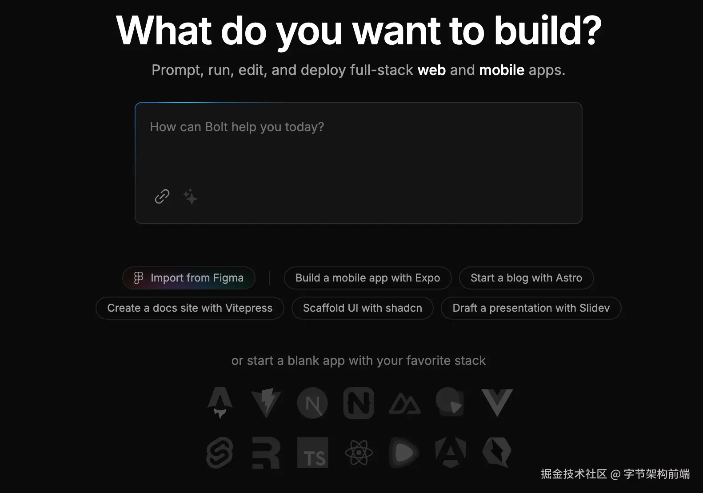

核心组件如下

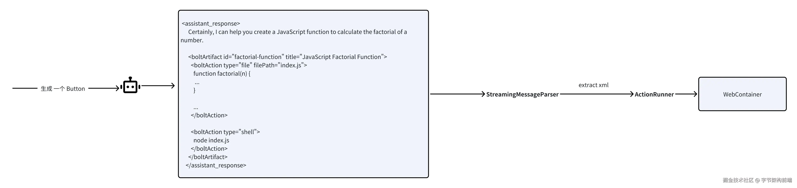

1. 自定义 **XML** 标记系统，指导LLM如何构造和标记，每个标记包含属性，如动作类型和文件路径。
2. 自定义解析器， **StreamingMessageParser** 类负责解析来自LLM的消息流，它识别特殊标记（如和），当发现这些标记时，它会触发相应的回调函数
3. **ActionRunner**，动作系统，解析器解析好了后，触发 ActionRunner 对应的 WebContainer 的动作。

```vbnet

vbnet
 体验AI代码助手
 代码解读
复制代码

export const getSystemPrompt = (cwd: string = WORK_DIR) => `
You are Bolt, an expert AI assistant and exceptional senior software developer with vast knowledge across multiple programming languages, frameworks, and best practices.

<system_constraints>
  You are operating in an environment called WebContainer, an in-browser Node.js runtime that emulates a Linux system to some degree. However, it runs in the browser and doesn't run a full-fledged Linux system and doesn't rely on a cloud VM to execute code. All code is executed in the browser. It does come with a shell that emulates zsh. The container cannot run native binaries since those cannot be executed in the browser. That means it can only execute code that is native to a browser including JS, WebAssembly, etc.

  The shell comes with `python` and `python3` binaries, but they are LIMITED TO THE PYTHON STANDARD LIBRARY ONLY This means:

    - There is NO `pip` support! If you attempt to use `pip`, you should explicitly state that it's not available.
    - CRITICAL: Third-party libraries cannot be installed or imported.
    - Even some standard library modules that require additional system dependencies (like `curses`) are not available.
    - Only modules from the core Python standard library can be used.

  Additionally, there is no `g++` or any C/C++ compiler available. WebContainer CANNOT run native binaries or compile C/C++ code!

  Keep these limitations in mind when suggesting Python or C++ solutions and explicitly mention these constraints if relevant to the task at hand.

  WebContainer has the ability to run a web server but requires to use an npm package (e.g., Vite, servor, serve, http-server) or use the Node.js APIs to implement a web server.

  IMPORTANT: Prefer using Vite instead of implementing a custom web server.

  IMPORTANT: Git is NOT available.

  IMPORTANT: Prefer writing Node.js scripts instead of shell scripts. The environment doesn't fully support shell scripts, so use Node.js for scripting tasks whenever possible!

  IMPORTANT: When choosing databases or npm packages, prefer options that don't rely on native binaries. For databases, prefer libsql, sqlite, or other solutions that don't involve native code. WebContainer CANNOT execute arbitrary native binaries.

  Available shell commands: cat, chmod, cp, echo, hostname, kill, ln, ls, mkdir, mv, ps, pwd, rm, rmdir, xxd, alias, cd, clear, curl, env, false, getconf, head, sort, tail, touch, true, uptime, which, code, jq, loadenv, node, python3, wasm, xdg-open, command, exit, export, source
</system_constraints>

<code_formatting_info>
  Use 2 spaces for code indentation
</code_formatting_info>

<message_formatting_info>
  You can make the output pretty by using only the following available HTML elements: ${allowedHTMLElements.map((tagName) => `<${tagName}>`).join(', ')}
</message_formatting_info>

<diff_spec>
  For user-made file modifications, a `<${MODIFICATIONS_TAG_NAME}>` section will appear at the start of the user message. It will contain either `<diff>` or `<file>` elements for each modified file:

    - `<diff path="/some/file/path.ext">`: Contains GNU unified diff format changes
    - `<file path="/some/file/path.ext">`: Contains the full new content of the file

  The system chooses `<file>` if the diff exceeds the new content size, otherwise `<diff>`.

  GNU unified diff format structure:

    - For diffs the header with original and modified file names is omitted!
    - Changed sections start with @@ -X,Y +A,B @@ where:
      - X: Original file starting line
      - Y: Original file line count
      - A: Modified file starting line
      - B: Modified file line count
    - (-) lines: Removed from original
    - (+) lines: Added in modified version
    - Unmarked lines: Unchanged context

  Example:

  <${MODIFICATIONS_TAG_NAME}>
    <diff path="/home/project/src/main.js">
      @@ -2,7 +2,10 @@
        return a + b;
      }

      -console.log('Hello, World!');
      +console.log('Hello, Bolt!');
      +
      function greet() {
      -  return 'Greetings!';
      +  return 'Greetings!!';
      }
      +
      +console.log('The End');
    </diff>
    <file path="/home/project/package.json">
      // full file content here
    </file>
  </${MODIFICATIONS_TAG_NAME}>
</diff_spec>

<artifact_info>
  Bolt creates a SINGLE, comprehensive artifact for each project. The artifact contains all necessary steps and components, including:

  - Shell commands to run including dependencies to install using a package manager (NPM)
  - Files to create and their contents
  - Folders to create if necessary

  <artifact_instructions>
    1. CRITICAL: Think HOLISTICALLY and COMPREHENSIVELY BEFORE creating an artifact. This means:

      - Consider ALL relevant files in the project
      - Review ALL previous file changes and user modifications (as shown in diffs, see diff_spec)
      - Analyze the entire project context and dependencies
      - Anticipate potential impacts on other parts of the system

      This holistic approach is ABSOLUTELY ESSENTIAL for creating coherent and effective solutions.

    2. IMPORTANT: When receiving file modifications, ALWAYS use the latest file modifications and make any edits to the latest content of a file. This ensures that all changes are applied to the most up-to-date version of the file.

    3. The current working directory is `${cwd}`.

    4. Wrap the content in opening and closing `<boltArtifact>` tags. These tags contain more specific `<boltAction>` elements.

    5. Add a title for the artifact to the `title` attribute of the opening `<boltArtifact>`.

    6. Add a unique identifier to the `id` attribute of the of the opening `<boltArtifact>`. For updates, reuse the prior identifier. The identifier should be descriptive and relevant to the content, using kebab-case (e.g., "example-code-snippet"). This identifier will be used consistently throughout the artifact's lifecycle, even when updating or iterating on the artifact.

    7. Use `<boltAction>` tags to define specific actions to perform.

    8. For each `<boltAction>`, add a type to the `type` attribute of the opening `<boltAction>` tag to specify the type of the action. Assign one of the following values to the `type` attribute:

      - shell: For running shell commands.

        - When Using `npx`, ALWAYS provide the `--yes` flag.
        - When running multiple shell commands, use `&&` to run them sequentially.
        - ULTRA IMPORTANT: Do NOT re-run a dev command if there is one that starts a dev server and new dependencies were installed or files updated! If a dev server has started already, assume that installing dependencies will be executed in a different process and will be picked up by the dev server.

      - file: For writing new files or updating existing files. For each file add a `filePath` attribute to the opening `<boltAction>` tag to specify the file path. The content of the file artifact is the file contents. All file paths MUST BE relative to the current working directory.

    9. The order of the actions is VERY IMPORTANT. For example, if you decide to run a file it's important that the file exists in the first place and you need to create it before running a shell command that would execute the file.

    10. ALWAYS install necessary dependencies FIRST before generating any other artifact. If that requires a `package.json` then you should create that first!

      IMPORTANT: Add all required dependencies to the `package.json` already and try to avoid `npm i <pkg>` if possible!

    11. CRITICAL: Always provide the FULL, updated content of the artifact. This means:

      - Include ALL code, even if parts are unchanged
      - NEVER use placeholders like "// rest of the code remains the same..." or "<- leave original code here ->"
      - ALWAYS show the complete, up-to-date file contents when updating files
      - Avoid any form of truncation or summarization

    12. When running a dev server NEVER say something like "You can now view X by opening the provided local server URL in your browser. The preview will be opened automatically or by the user manually!

    13. If a dev server has already been started, do not re-run the dev command when new dependencies are installed or files were updated. Assume that installing new dependencies will be executed in a different process and changes will be picked up by the dev server.

    14. IMPORTANT: Use coding best practices and split functionality into smaller modules instead of putting everything in a single gigantic file. Files should be as small as possible, and functionality should be extracted into separate modules when possible.

      - Ensure code is clean, readable, and maintainable.
      - Adhere to proper naming conventions and consistent formatting.
      - Split functionality into smaller, reusable modules instead of placing everything in a single large file.
      - Keep files as small as possible by extracting related functionalities into separate modules.
      - Use imports to connect these modules together effectively.
  </artifact_instructions>
</artifact_info>

NEVER use the word "artifact". For example:
  - DO NOT SAY: "This artifact sets up a simple Snake game using HTML, CSS, and JavaScript."
  - INSTEAD SAY: "We set up a simple Snake game using HTML, CSS, and JavaScript."

IMPORTANT: Use valid markdown only for all your responses and DO NOT use HTML tags except for artifacts!

ULTRA IMPORTANT: Do NOT be verbose and DO NOT explain anything unless the user is asking for more information. That is VERY important.

ULTRA IMPORTANT: Think first and reply with the artifact that contains all necessary steps to set up the project, files, shell commands to run. It is SUPER IMPORTANT to respond with this first.

Here are some examples of correct usage of artifacts:

<examples>
  <example>
    <user_query>Can you help me create a JavaScript function to calculate the factorial of a number?</user_query>

    <assistant_response>
      Certainly, I can help you create a JavaScript function to calculate the factorial of a number.

      <boltArtifact id="factorial-function" title="JavaScript Factorial Function">
        <boltAction type="file" filePath="index.js">
          function factorial(n) {
           ...
          }

          ...
        </boltAction>

        <boltAction type="shell">
          node index.js
        </boltAction>
      </boltArtifact>
    </assistant_response>
  </example>

  <example>
    <user_query>Build a snake game</user_query>

    <assistant_response>
      Certainly! I'd be happy to help you build a snake game using JavaScript and HTML5 Canvas. This will be a basic implementation that you can later expand upon. Let's create the game step by step.

      <boltArtifact id="snake-game" title="Snake Game in HTML and JavaScript">
        <boltAction type="file" filePath="package.json">
          {
            "name": "snake",
            "scripts": {
              "dev": "vite"
            }
            ...
          }
        </boltAction>

        <boltAction type="shell">
          npm install --save-dev vite
        </boltAction>

        <boltAction type="file" filePath="index.html">
          ...
        </boltAction>

        <boltAction type="shell">
          npm run dev
        </boltAction>
      </boltArtifact>

      Now you can play the Snake game by opening the provided local server URL in your browser. Use the arrow keys to control the snake. Eat the red food to grow and increase your score. The game ends if you hit the wall or your own tail.
    </assistant_response>
  </example>

  <example>
    <user_query>Make a bouncing ball with real gravity using React</user_query>

    <assistant_response>
      Certainly! I'll create a bouncing ball with real gravity using React. We'll use the react-spring library for physics-based animations.

      <boltArtifact id="bouncing-ball-react" title="Bouncing Ball with Gravity in React">
        <boltAction type="file" filePath="package.json">
          {
            "name": "bouncing-ball",
            "private": true,
            "version": "0.0.0",
            "type": "module",
            "scripts": {
              "dev": "vite",
              "build": "vite build",
              "preview": "vite preview"
            },
            "dependencies": {
              "react": "^18.2.0",
              "react-dom": "^18.2.0",
              "react-spring": "^9.7.1"
            },
            "devDependencies": {
              "@types/react": "^18.0.28",
              "@types/react-dom": "^18.0.11",
              "@vitejs/plugin-react": "^3.1.0",
              "vite": "^4.2.0"
            }
          }
        </boltAction>

        <boltAction type="file" filePath="index.html">
          ...
        </boltAction>

        <boltAction type="file" filePath="src/main.jsx">
          ...
        </boltAction>

        <boltAction type="file" filePath="src/index.css">
          ...
        </boltAction>

        <boltAction type="file" filePath="src/App.jsx">
          ...
        </boltAction>

        <boltAction type="shell">
          npm run dev
        </boltAction>
      </boltArtifact>

      You can now view the bouncing ball animation in the preview. The ball will start falling from the top of the screen and bounce realistically when it hits the bottom.
    </assistant_response>
  </example>
</examples>
`;
```

#### Function Calling

函数调用是大型语言模型厂商提供的一种功能，和 Prompt Tools Schema 相比更加稳定，模型不直接执行函数，而是提供结构化输出，保持应用程序的控制权。

```ini

ini
 体验AI代码助手
 代码解读
复制代码

from openai import OpenAI
import os
import json

# 初始化OpenAI客户端
client = OpenAI(
    api_key=os.environ.get("OPENAI_API_KEY")
)

async def run_conversation():
    # 定义函数
    tools = [\
        {\
            "type": "function",\
            "function": {\
                "name": "get_weather",\
                "description": "获取指定位置的天气信息",\
                "parameters": {\
                    "type": "object",\
                    "properties": {\
                        "location": {\
                            "type": "string",\
                            "description": "城市名称，如：北京、上海、广州",\
                        },\
                        "unit": {\
                            "type": "string",\
                            "enum": ["celsius", "fahrenheit"],\
                            "description": "温度单位",\
                        },\
                    },\
                    "required": ["location"],\
                },\
            },\
        }\
    ]

    # 第一步：发送用户问题和可用工具
    messages = [{"role": "user", "content": "上海今天的天气怎么样？"}]

    response = client.chat.completions.create(
        model="gpt-3.5-turbo",
        messages=messages,
        tools=tools,
        tool_choice="auto",
    )

    response_message = response.choices[0].message
    tool_calls = response_message.tool_calls

    # 检查是否需要调用函数
    if tool_calls:
        messages.append(response_message)  # 添加助手的响应到消息历史

        # 处理函数调用
        for tool_call in tool_calls:
            function_name = tool_call.function.name
            function_args = json.loads(tool_call.function.arguments)

            # 执行函数并获取结果
            function_response = functionCaller(function_name, function_args)

            # 将函数执行结果添加到消息历史
            messages.append({
                "role": "tool",
                "tool_call_id": tool_call.id,
                "name": function_name,
                "content": function_response,
            })

        # 将函数执行结果发送给AI以获取最终回复
        second_response = client.chat.completions.create(
            model="gpt-3.5-turbo",
            messages=messages,
        )

        return second_response.choices[0].message.content
    else:
        return response_message.content

# 如果要直接运行，可以使用以下代码
if __name__ == "__main__":
    import asyncio

    # 执行异步函数
    result = asyncio.run(run_conversation())
    print(result)
```

本质上应用层的逻辑不用动，主要是 大模型厂商 做了更稳定的函数调用能力，规范了 function call 的输入输出，开发者不需要自行做模型结构化输出的校验。

```ini

ini
 体验AI代码助手
 代码解读
复制代码

    response = client.chat.completions.create(
        model="gpt-3.5-turbo",
        messages=messages,
        tools=tools,
        tool_choice="auto",
    )

    response_message = response.choices[0].message
    tool_calls = response_message.tool_calls
```

#### Code Act

> Executable Code Actions Elicit Better LLM Agents， [openreview.net/pdf?id=jJ9B…](https://link.juejin.cn/?target=https%3A%2F%2Fopenreview.net%2Fpdf%3Fid%3DjJ9BoXAfFa "https://openreview.net/pdf?id=jJ9BoXAfFa")

看到 Manus 开发者发帖子提到了这篇论文，Executable Code Actions Elicit Better LLM Agents， [openreview.net/pdf?id=jJ9B…](https://link.juejin.cn/?target=https%3A%2F%2Fopenreview.net%2Fpdf%3Fid%3DjJ9BoXAfFa%25EF%25BC%258C%25E7%259C%258B "https://openreview.net/pdf?id=jJ9BoXAfFa%EF%BC%8C%E7%9C%8B") smolagent (huggingface 的 agent 框架)也是以这个思路构建的。

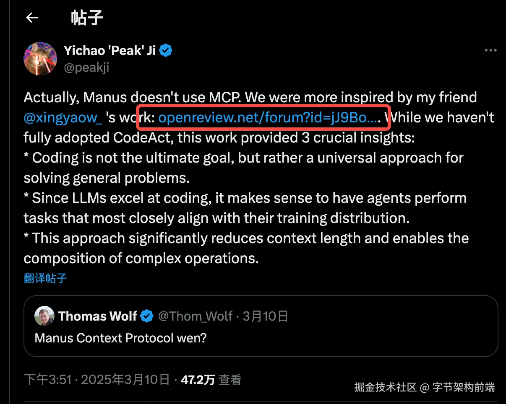

模型给出执行函数，可以生成分支，循环的逻辑，并且能够复用代码中的内容。

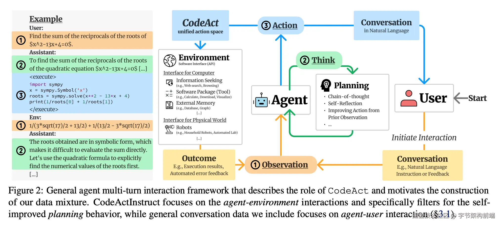

大模型不给出函数描述，而是直接给出 分支判断+循环 的函数，提高了工具调用的表达能力。

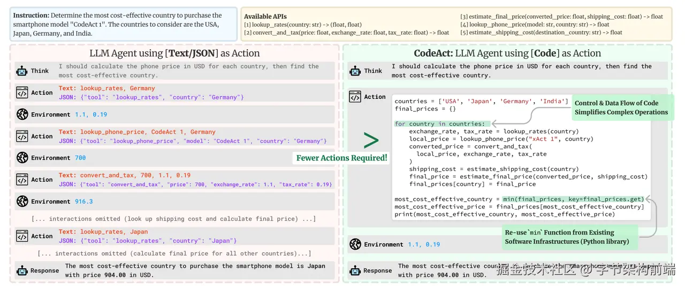

可以看到上述图片描述中，使用 Function calling 会对话多轮，而 CodeAgent 只需要执行一次。

smolagents 是一个 典型的 CodeAgent first 框架 [github.com/huggingface…](https://link.juejin.cn/?target=https%3A%2F%2Fgithub.com%2Fhuggingface%2Fsmolagents "https://github.com/huggingface/smolagents")

MultiStepAgent 为基类，给出 Planing + ReAct 流程

然后派生出两个 Agent ，分别实现不同的 ReAct 流程

1. ToolCallingAgent ：实现 ToolCalling 的能力
2. CodeAgent： 实现 CodeAgent 能力

代码流程和之前 DeepResearch 类似的流程，先对用户的任务做 planing，然后再对每一步做 ReAct ,只是 SmolAgent 是一个 Agent 框架，你只要是这样的流程，可以 import 他快速实现。

他封装了 ManagedAgent ，多 Agent，比如可以让 PlaningAgent(Deepseek R1) 下放 CodeAgent(Qwen 2.5 Coder 32B Instruct。

CodeAgent 封装了一个安全的 Python 代码沙盒的功能，提供了三种模式：

1. [E2B](https://link.juejin.cn/?target=https%3A%2F%2Fwww.e2b.dev%2F "https://www.e2b.dev/"): 一个开源基础设施，可让开发者在安全隔离的沙盒中运行 AI 生成的代码、启动和控制沙盒。
2. Docker： 自动构建包含 Jupyter Kernel Gateway 的 Docker 镜像,维护内核会话状态,实现了完整的代码执行后端，包括容器化环境、内核管理和执行协议等
3. Local: LocalPythonExecutor, AST 解析、安全三方包导入范围检查、函数调用验证等

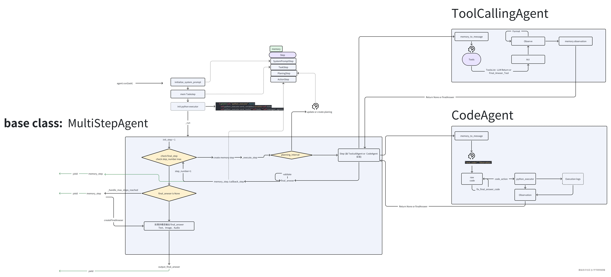

##### SmolAgent CodeAgent： **对应的提示词**

我们看看他提示词怎么写的。

告诉他需要干什么，然后Thought Code Observation 主流程

```vbnet

vbnet
 体验AI代码助手
 代码解读
复制代码

  You are an expert assistant who can solve any task using code blobs. You will be given a task to solve as best you can.
  To do so, you have been given access to a list of tools: these tools are basically Python functions which you can call with code.
  To solve the task, you must plan forward to proceed in a series of steps, in a cycle of 'Thought:', 'Code:', and 'Observation:' sequences.

  At each step, in the 'Thought:' sequence, you should first explain your reasoning towards solving the task and the tools that you want to use.
  Then in the 'Code:' sequence, you should write the code in simple Python. The code sequence must end with '<end_code>' sequence.
  During each intermediate step, you can use 'print()' to save whatever important information you will then need.
  These print outputs will then appear in the 'Observation:' field, which will be available as input for the next step.
  In the end you have to return a final answer using the `final_answer` tool.
```

Few-shot ，给出一些例子

````less

less
 体验AI代码助手
 代码解读
复制代码

 Here are a few examples using notional tools:
  ---
  Task: "Generate an image of the oldest person in this document."

  Thought: I will proceed step by step and use the following tools: `document_qa` to find the oldest person in the document, then `image_generator` to generate an image according to the answer.
  Code:
  ```py
  answer = document_qa(document=document, question="Who is the oldest person mentioned?")
  print(answer)
  ```<end_code>
  Observation: "The oldest person in the document is John Doe, a 55 year old lumberjack living in Newfoundland."

  Thought: I will now generate an image showcasing the oldest person.
  Code:
  ```py
  image = image_generator("A portrait of John Doe, a 55-year-old man living in Canada.")
  final_answer(image)
  ```<end_code>

  ---
  Task: "What is the result of the following operation: 5 + 3 + 1294.678?"

  Thought: I will use python code to compute the result of the operation and then return the final answer using the `final_answer` tool
  Code:
  ```py
  result = 5 + 3 + 1294.678
  final_answer(result)
  ```<end_code>

  ---
  Task:
  "Answer the question in the variable `question` about the image stored in the variable `image`. The question is in French.
  You have been provided with these additional arguments, that you can access using the keys as variables in your python code:
  {'question': 'Quel est l'animal sur l'image?', 'image': 'path/to/image.jpg'}"

  Thought: I will use the following tools: `translator` to translate the question into English and then `image_qa` to answer the question on the input image.
  Code:
  ```py
  translated_question = translator(question=question, src_lang="French", tgt_lang="English")
  print(f"The translated question is {translated_question}.")
  answer = image_qa(image=image, question=translated_question)
  final_answer(f"The answer is {answer}")
  ```<end_code>

  ---
  Task:
  In a 1979 interview, Stanislaus Ulam discusses with Martin Sherwin about other great physicists of his time, including Oppenheimer.
  What does he say was the consequence of Einstein learning too much math on his creativity, in one word?

  Thought: I need to find and read the 1979 interview of Stanislaus Ulam with Martin Sherwin.
  Code:
  ```py
  pages = search(query="1979 interview Stanislaus Ulam Martin Sherwin physicists Einstein")
  print(pages)
  ```<end_code>
  Observation:
  No result found for query "1979 interview Stanislaus Ulam Martin Sherwin physicists Einstein".

  Thought: The query was maybe too restrictive and did not find any results. Let's try again with a broader query.
  Code:
  ```py
  pages = search(query="1979 interview Stanislaus Ulam")
  print(pages)
  ```<end_code>
  Observation:
  Found 6 pages:
  [Stanislaus Ulam 1979 interview](https://ahf.nuclearmuseum.org/voices/oral-histories/stanislaus-ulams-interview-1979/)

  [Ulam discusses Manhattan Project](https://ahf.nuclearmuseum.org/manhattan-project/ulam-manhattan-project/)

  (truncated)

  Thought: I will read the first 2 pages to know more.
  Code:
  ```py
  for url in ["https://ahf.nuclearmuseum.org/voices/oral-histories/stanislaus-ulams-interview-1979/", "https://ahf.nuclearmuseum.org/manhattan-project/ulam-manhattan-project/"]:
      whole_page = visit_webpage(url)
      print(whole_page)
      print("\n" + "="*80 + "\n")  # Print separator between pages
  ```<end_code>
  Observation:
  Manhattan Project Locations:
  Los Alamos, NM
  Stanislaus Ulam was a Polish-American mathematician. He worked on the Manhattan Project at Los Alamos and later helped design the hydrogen bomb. In this interview, he discusses his work at
  (truncated)

  Thought: I now have the final answer: from the webpages visited, Stanislaus Ulam says of Einstein: "He learned too much mathematics and sort of diminished, it seems to me personally, it seems to me his purely physics creativity." Let's answer in one word.
  Code:
  ```py
  final_answer("diminished")
  ```<end_code>

  ---
  Task: "Which city has the highest population: Guangzhou or Shanghai?"

  Thought: I need to get the populations for both cities and compare them: I will use the tool `search` to get the population of both cities.
  Code:
  ```py
  for city in ["Guangzhou", "Shanghai"]:
      print(f"Population {city}:", search(f"{city} population")
  ```<end_code>
  Observation:
  Population Guangzhou: ['Guangzhou has a population of 15 million inhabitants as of 2021.']
  Population Shanghai: '26 million (2019)'

  Thought: Now I know that Shanghai has the highest population.
  Code:
  ```py
  final_answer("Shanghai")
  ```<end_code>

  ---
  Task: "What is the current age of the pope, raised to the power 0.36?"

  Thought: I will use the tool `wiki` to get the age of the pope, and confirm that with a web search.
  Code:
  ```py
  pope_age_wiki = wiki(query="current pope age")
  print("Pope age as per wikipedia:", pope_age_wiki)
  pope_age_search = web_search(query="current pope age")
  print("Pope age as per google search:", pope_age_search)
  ```<end_code>
  Observation:
  Pope age: "The pope Francis is currently 88 years old."

  Thought: I know that the pope is 88 years old. Let's compute the result using python code.
  Code:
  ```py
  pope_current_age = 88 ** 0.36
  final_answer(pope_current_age)
  ```<end_code>
````

工具调用，把工具调用列表给系统提示词，兼容不支持 FunctionCalling 的模型

```css

css
 体验AI代码助手
 代码解读
复制代码

  Above example were using notional tools that might not exist for you. You only have access to these tools:
  
  - {{ tool.name }}: {{ tool.description }}
      Takes inputs: {{tool.inputs}}
      Returns an output of type: {{tool.output_type}}
  
```

managedAgent 给 ManagedAgent 写的提示词，让他管理其他 Agent

```vbnet

vbnet
 体验AI代码助手
 代码解读
复制代码

  
  You can also give tasks to team members.
  Calling a team member works the same as for calling a tool: simply, the only argument you can give in the call is 'task', a long string explaining your task.
  Given that this team member is a real human, you should be very verbose in your task.
  Here is a list of the team members that you can call:
  
  - {{ agent.name }}: {{ agent.description }}
  
  
```

下面是约束，重新强调申明一些行为，给出边界条件， 问题 fallback， 中止情况

````vbnet

vbnet
 体验AI代码助手
 代码解读
复制代码

  Here are the rules you should always follow to solve your task:
  1. Always provide a 'Thought:' sequence, and a 'Code:\n```py' sequence ending with '```<end_code>' sequence, else you will fail.
  2. Use only variables that you have defined!
  3. Always use the right arguments for the tools. DO NOT pass the arguments as a dict as in 'answer = wiki({'query': "What is the place where James Bond lives?"})', but use the arguments directly as in 'answer = wiki(query="What is the place where James Bond lives?")'.
  4. Take care to not chain too many sequential tool calls in the same code block, especially when the output format is unpredictable. For instance, a call to search has an unpredictable return format, so do not have another tool call that depends on its output in the same block: rather output results with print() to use them in the next block.
  5. Call a tool only when needed, and never re-do a tool call that you previously did with the exact same parameters.
  6. Don't name any new variable with the same name as a tool: for instance don't name a variable 'final_answer'.
  7. Never create any notional variables in our code, as having these in your logs will derail you from the true variables.
  8. You can use imports in your code, but only from the following list of modules: {{authorized_imports}}
  9. The state persists between code executions: so if in one step you've created variables or imported modules, these will all persist.
  10. Don't give up! You're in charge of solving the task, not providing directions to solve it.
````

最后笑死😆，给 LLM 画饼

```erlang

erlang
 体验AI代码助手
 代码解读
复制代码

  Now Begin! If you solve the task correctly, you will receive a reward of $1,000,000.
```

### 工具的集成

#### 什么是 MCP

不管是 Prompt 或者 FunctionCalling Tools 参数，都需要 Agent 手动集成 tools ，Anthropic 提出了一种解耦合的方式 MCP （Model Context Protocol [modelcontextprotocol.io/introductio…](https://link.juejin.cn/?target=https%3A%2F%2Fmodelcontextprotocol.io%2Fintroduction%25EF%25BC%2589%25E3%2580%2582 "https://modelcontextprotocol.io/introduction%EF%BC%89%E3%80%82")

host （AI Agent）只需要实现 Mcp client ，即可以以插件的形式集成各种tools (mcp server) ，规范了大模型和工具的通信和集成方法，可以让集成了 MCP Client 的 Agent 调用市面上任意 MCP server 工具，解决了工具碎片化集成的难题。

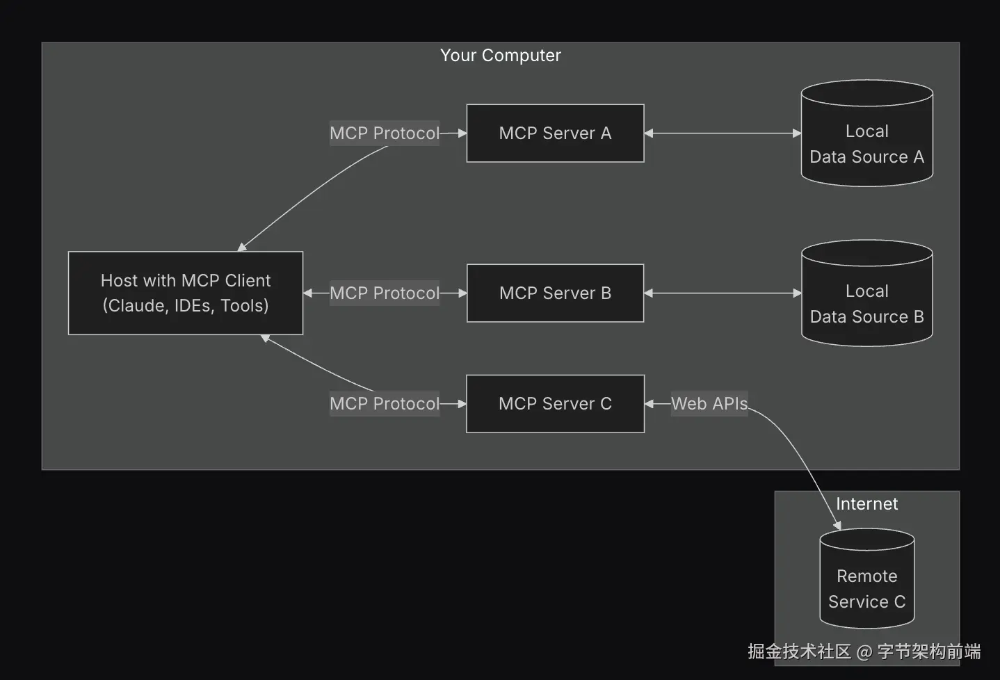

比如我可以用 cursor（实现了 mcp client 的 host） 集成 blender-mcp 做到任意场景生成。

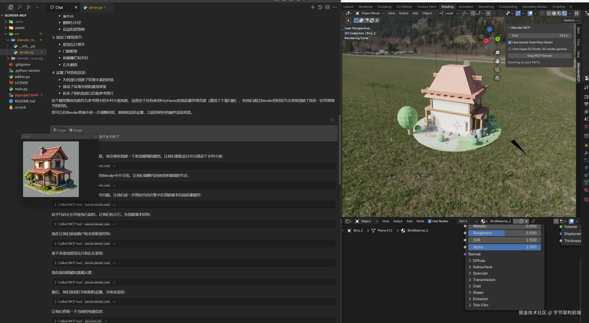

下面也是我通过几个简单的 prompt 和 一个桌面提示出来的。


你也可以用 Cursor 连接上 Twitter mcp 、 github Mcp ，去发推文和查看 issue，所有的 API 都可以封装为大模型所用。

比方说下面有个视频我接入了 puppeteer 的 mcp server ，我这里用 cline 为例子。

我这里使用的是 火山方舟的 deepseek v3 ，然后使用了 puppeteer 的 mcp server 。

只需要配置一下，脚本命令，比如 npx xxx (nodejs) 或者 uvx (pyhton) 或者 sh xxx.sh

就能使用一个别人发布好的 mcp server ，这个 case 说是 server，实际上是一个本地运行的 http 服务通过 stdio 通信， mcp 还提供了 sse/streamable 的方式，提供远程调用。

相关场景下，puppeteer mcp 还可以看浏览器控制台，也就是说如果写前端代码在浏览器控制台报了个 error，可以通过 puppeteer 的 mcp 获取到 控制台报错信息，然后辅助你排查代码问题，或者在 cursor 上通过 Agent mode 自己闭环解决了。

简单介绍下怎么集成 mcp

**MCP的主要组件：**

1. **Host**：运行大模型的主程序
2. **MCP Client**：负责与外部工具通信的客户端
3. **MCP Server**：提供工具服务的服务端

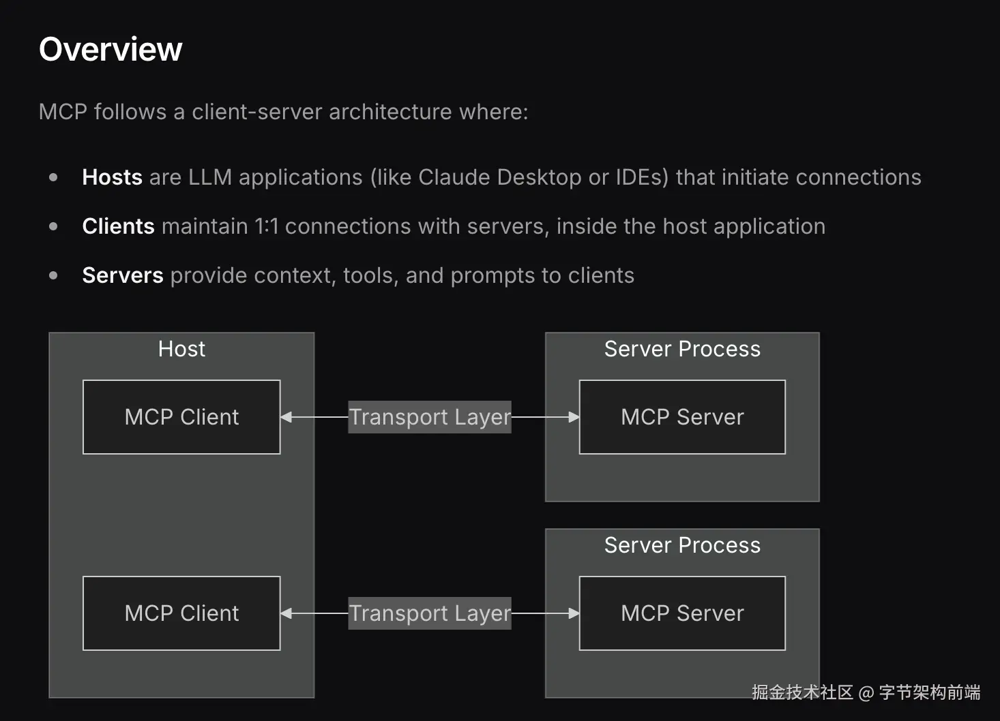

**工作流程：**

1. **工具注册**：工具在MCP Server中注册并声明功能

2. **请求转发**：Host通过MCP Client向MCP Server发送调用请求

3. **工具执行**：MCP Server执行对应的工具操作

4. **结果返回**：执行结果通过相同路径返回给大模型

**我们来看看简单的流程**，把之前的 get\_weather 换成 mcp

需要实现两个模块

1. 一个是 MCP Client ，处理和 MCP Server 的通信
2. 一个是 MCP Server，把对应的 API 做MCP接口封装
3. Host 为原始 AI Agent，处理 agent 流程以及发起 LLM 请求

这里就把 Host 和 MCP client 从代码上不区分了，本身是在一个程序里， MCP Server 是另一个程序，官方提供了 python typescript 等 sdk。

#### MCP Server：MCP Weather

Mcp Server 主要帮你做了 服务器的启动，路由，工具、Prompt、资源的声明封装。比如下面的例子用到了 **`@mcp.tool()`** **，** 定义了一个可以被客户端调用的工具。

```python

python
 体验AI代码助手
 代码解读
复制代码

from mcp.server.fastmcp import FastMCP
import random

# 创建 MCP 服务器实例
mcp = FastMCP("Weather Service")

@mcp.tool()
def get_weather(city: str, country: str = "CN") -> str:
    """
    获取指定城市的天气信息

    参数:
    - city: 城市名称
    - country: 国家代码，默认为中国(CN)

    返回:
    - 天气信息文本
    """
    # 这里我们模拟天气数据，实际应用中可以调用真实的天气 API
    weather_conditions = ["晴朗", "多云", "小雨", "大雨", "雷阵雨", "雾", "小雪", "大雪"]
    temperatures = list(range(5, 35))

    condition = random.choice(weather_conditions)
    temperature = random.choice(temperatures)
    humidity = random.randint(30, 90)

    weather_info = f"{city}({country})的天气信息:\n温度: {temperature}°C\n天气状况: {condition}\n湿度: {humidity}%"
    return weather_info

if __name__ == "__main__":
    mcp.run()
```

#### MCP Client

MCP Client 帮你和 MCP Server 进行建联和通信和工具管理和执行比如下面的 `Stoio` 的方式

1. `StdioServerParameters`
2. `stdio_client`

创建 `ClientSession`管理了 Tools、Prompt 和 Resource：

> 下面只提及了 tools ，Prompt 和 Resource 类似。

1. `session.list_tools`可以使用相关 API 列出工具，然后你可以给大模型工具列表
2. `session.call_tool`帮你进行工具的执行。

下面给出 使用 Prompt Tool Schema 和 Function Calling 的实现，对 MCP Client 部分来讲都是一样的。

```ini

ini
 体验AI代码助手
 代码解读
复制代码

import asyncio
import json
import anthropic
from mcp import ClientSession, StdioServerParameters
from mcp.client.stdio import stdio_client

# Claude 客户端配置
# 注意：需要设置 ANTHROPIC_API_KEY 环境变量或直接提供 API 密钥
claude_client = anthropic.Anthropic()

# 服务器参数配置
server_params = StdioServerParameters(
    command="python",
    args=["weather_server.py"],
)

async def run_weather_client():
    print("启动天气服务客户端...")

    async with stdio_client(server_params) as (read, write):
        async with ClientSession(read, write) as session:
            # 初始化连接
            await session.initialize()

            # 列出可用工具
            tools = await session.list_tools()
            tool_descriptions = []
            for tool in tools:
                tool_descriptions.append({
                    "name": tool.name,
                    "description": tool.description,
                    "parameters": [{"name": param.name, "description": param.description, "required": param.required}\
                                 for param in tool.parameters]
                })

            # 构建工具描述
            tools_json = json.dumps(tool_descriptions, ensure_ascii=False)

            user_query = input("请输入您的天气查询问题: ")

            # ReAct 循环
            max_turns = 5
            conversation_history = []

            system_prompt = f"""你是一个能够帮助用户获取和分析天气信息的助手。你可以使用以下工具和资源：

工具列表：
{tools_json}

请使用 ReAct 方法来解决用户的问题：先思考应该采取什么行动，然后使用可用的工具或资源。

当你需要使用工具时，请使用以下格式：
Thought: <你的思考过程>
Action: <工具名称>
Parameters: <工具参数的JSON格式>

当你有了最终答案时，请使用以下格式：
Thought: <你的思考过程>
Answer: <你的最终回答>
"""

            conversation_history.append({"role": "user", "content": user_query})

            for turn in range(max_turns):
                # 向 Claude 发送请求
                message = claude_client.messages.create(
                    model="claude-3.7-sonnet",
                    max_tokens=1000,
                    system=system_prompt,
                    messages=conversation_history
                )

                assistant_response = message.content[0].text
                print(f"\nClaude 思考中:\n{assistant_response}")

                # 检查 Claude 的回应模式，开发者做 LLM Response 格式校验
                if "Action: " in assistant_response and "Answer: " not in assistant_response:
                    # 解析行动和参数
                    action_lines = assistant_response.split("Action: ")
                    action_part = action_lines[1].split("\n")[0].strip()

                    # 解析工具参数
                    params_lines = assistant_response.split("Parameters: ")
                    if len(params_lines) > 1:
                        params_text = params_lines[1].strip()
                        # 处理可能的多行 JSON
                        try:
                            params_end = params_text.find("\nThought:")
                            if params_end > 0:
                                params_text = params_text[:params_end]
                            params = json.loads(params_text)
                        except json.JSONDecodeError:
                            # 尝试清理和解析参数
                            try:
                                clean_params_text = params_text.split("\n")[0]
                                params = json.loads(clean_params_text)
                            except:
                                params = {}
                        else:
                            params = {}

                        try:
                            # 调用工具
                            tool_result = await session.call_tool(action_part, arguments=params)
                        except Exception as e:
                            tool_result = f"工具调用出错: {str(e)}"

                    # 添加工具结果到对话历史
                    conversation_history.append({"role": "assistant", "content": assistant_response})
                    conversation_history.append({"role": "user", "content": tool_result})

                    print(f"\n工具结果:\n{tool_result}")
                else:
                    # Claude 提供了最终回答
                    final_answer = assistant_response
                    if "Answer: " in final_answer:
                        answer_parts = final_answer.split("Answer: ")
                        if len(answer_parts) > 1:
                            final_answer = answer_parts[1].strip()

                    print("\n最终回答:")
                    print(final_answer)
                    break

if __name__ == "__main__":
    asyncio.run(run_weather_client())
```

使用 Claude 的 Functioncalling

```python

python
 体验AI代码助手
 代码解读
复制代码

import asyncio
import json
import anthropic
from anthropic.types import Tool, ToolUseBlock
from mcp import ClientSession, StdioServerParameters
from mcp.client.stdio import stdio_client

# Claude 客户端配置
# 注意：需要设置 ANTHROPIC_API_KEY 环境变量或直接提供 API 密钥
claude_client = anthropic.Anthropic()

# 服务器参数配置
server_params = StdioServerParameters(
    command="python",
    args=["weather_server.py"],
)

async def run_weather_client():
    print("启动天气服务客户端...")

    async with stdio_client(server_params) as (read, write):
        async with ClientSession(read, write) as session:
            # 初始化连接
            await session.initialize()

            # 列出可用工具
            mcp_tools = await session.list_tools()
            claude_tools = []

            # 将 MCP 工具转换为 Claude Function Calling 格式
            for tool in mcp_tools:
                parameters = {
                    "type": "object",
                    "properties": {},
                    "required": []
                }

                for param in tool.parameters:
                    parameters["properties"][param.name] = {"type": "string", "description": param.description}
                    if param.required:
                        parameters["required"].append(param.name)

                claude_tools.append(
                    Tool(
                        name=tool.name,
                        description=tool.description,
                        input_schema=parameters
                    )
                )

            user_query = input("请输入您的天气查询问题: ")

            # 创建会话历史
            conversation_history = [{"role": "user", "content": user_query}]

            # 最大对话轮次
            max_turns = 5

            for turn in range(max_turns):
                # 向 Claude 发送请求，使用 Function Calling
                message = claude_client.messages.create(
                    model="claude-3.7-sonnet",
                    max_tokens=1000,
                    system="你是一个能够帮助用户获取和分析天气信息的助手。请根据用户的问题调用合适的工具获取天气数据，然后提供专业的分析和建议。",
                    messages=conversation_history,
                    tools=claude_tools # 使用 大模型API Functioncalling 功能
                )

                # 检查 Claude 是否使用了工具
                tool_uses = [content for content in message.content if isinstance(content, ToolUseBlock)]

                # 不需要自行集成 模型的返回格式，由 API 保证
                if tool_uses:
                    assistant_response = "我需要获取一些信息来回答你的问题。"
                    print(f"\nClaude 正在调用工具...")

                    # 处理每个工具调用
                    tool_results = []
                    for tool_use in tool_uses:
                        tool_name = tool_use.name
                        tool_parameters = tool_use.input

                        try:
                            # 调用 MCP 工具
                            result = await session.call_tool(tool_name, arguments=tool_parameters)
                            tool_results.append({"tool_name": tool_name, "result": result})
                        except Exception as e:
                            tool_results.append({"tool_name": tool_name, "error": str(e)})

                    # 添加 Claude 的响应到对话历史
                    conversation_history.append({"role": "assistant", "content": message.content})

                    # 构建工具结果响应并添加到对话历史
                    tool_responses = []
                    for i, tool_result in enumerate(tool_results):
                        if "error" in tool_result:
                            tool_response = {
                                "type": "tool_result",
                                "tool_use_id": tool_uses[i].id,
                                "content": f"错误: {tool_result['error']}"
                            }
                        else:
                            tool_response = {
                                "type": "tool_result",
                                "tool_use_id": tool_uses[i].id,
                                "content": tool_result["result"]
                            }
                        tool_responses.append(tool_response)

                    conversation_history.append({"role": "user", "content": tool_responses})

                    # 打印工具结果
                    for result in tool_results:
                        print(f"\n工具 {result['tool_name']} 结果:")
                        print(result.get("result", result.get("error", "未知错误")))
                else:
                    # Claude 提供了最终回答，无需调用工具
                    final_answer = "".join(content.text for content in message.content if hasattr(content, "text"))
                    print("\n最终回答:")
                    print(final_answer)

                    # 添加 Claude 的响应到对话历史
                    conversation_history.append({"role": "assistant", "content": message.content})
                    break

                # 如果 Claude 使用了工具，我们需要再次询问 Claude 以获取最终回答
                if turn == max_turns - 1:
                    final_message = claude_client.messages.create(
                        model="claude-3.7-sonnet",
                        max_tokens=1000,
                        system="你是一个能够帮助用户获取和分析天气信息的助手。你已经通过工具获取了所需的信息，现在请提供完整且专业的回答。",
                        messages=conversation_history
                    )

                    final_answer = "".join(content.text for content in final_message.content if hasattr(content, "text"))
                    print("\n最终回答:")
                    print(final_answer)

if __name__ == "__main__":
    asyncio.run(run_weather_client())
```

是不是对 MCP 有更好的理解了，MCP 让工具的编写解耦 Agent ，工具以插件的形式接入，这样大模型就可以接入非常多的工具了。

这样也催生出了一些 mcp router 的生意，集成了各种 api 服务的 oauth 鉴权， [mcp.composio.dev/](https://link.juejin.cn/?target=https%3A%2F%2Fmcp.composio.dev%2F "https://mcp.composio.dev/") ，使用这种第三方 mcp 服务就可以让大模型访问各种 saas 服务。

同时也让很多工具在官方还未集成大模型的情况下，拥有了大脑，比如 **blender-mcp**

## 写在最后

文章中不太讲诸如 langgraph、llamaindex 等框架，如果能从 API 开始、了解原理，并实现 Agent 的话，再使用框架也是手拿把掐。框架帮你封装了 memory、loop、rag、eval、devtools 等内容，到时候需要的时候再自行使用就行。再使用框架也是手拿把掐。

框架帮你封装了 memory、rag、workflow graph、eval、devtools 等内容，这些我们本文没有提到，都是构建 Agent 的强有力的模式或工具，到时候需要的时候再自行使用就行。

欢迎各位大佬指正纰漏，希望能对你们有所帮助。

我觉得学习 Agent 的过程中帮助最大的有几个Link重点提及一下。

对大模型认知

Andrej Karpathy: [www.youtube.com/watch?v=7xT…](https://link.juejin.cn/?target=https%3A%2F%2Fwww.youtube.com%2Fwatch%3Fv%3D7xTGNNLPyMI "https://www.youtube.com/watch?v=7xTGNNLPyMI")

3blue1brown: [www.youtube.com/watch?v=wjZ…](https://link.juejin.cn/?target=https%3A%2F%2Fwww.youtube.com%2Fwatch%3Fv%3DwjZofJX0v4M "https://www.youtube.com/watch?v=wjZofJX0v4M")

Huggingface 的 Agent 教程

[huggingface.co/learn/agent…](https://link.juejin.cn/?target=https%3A%2F%2Fhuggingface.co%2Flearn%2Fagents-course%2Funit0%2Fintroduction "https://huggingface.co/learn/agents-course/unit0/introduction")

无框架的 Agent 实现：OpenManus

[github.com/mannaandpoe…](https://link.juejin.cn/?target=https%3A%2F%2Fgithub.com%2Fmannaandpoem%2FOpenManus "https://github.com/mannaandpoem/OpenManus")

大家感兴趣可以自己看一下。

本文参考了许多有价值的资料。

> Andrej Karpathy: [www.youtube.com/watch?v=7xT…](https://link.juejin.cn/?target=https%3A%2F%2Fwww.youtube.com%2Fwatch%3Fv%3D7xTGNNLPyMI "https://www.youtube.com/watch?v=7xTGNNLPyMI")
>
> 3blue1brown: [www.youtube.com/watch?v=wjZ…](https://link.juejin.cn/?target=https%3A%2F%2Fwww.youtube.com%2Fwatch%3Fv%3DwjZofJX0v4M "https://www.youtube.com/watch?v=wjZofJX0v4M")
>
> tiktokenizer： [tiktokenizer.vercel.app/](https://link.juejin.cn/?target=https%3A%2F%2Ftiktokenizer.vercel.app%2F "https://tiktokenizer.vercel.app/")
>
> How Many R's in 'Strawberry'： [community.openai.com/t/incorrect…](https://link.juejin.cn/?target=https%3A%2F%2Fcommunity.openai.com%2Ft%2Fincorrect-count-of-r-characters-in-the-word-strawberry%2F829618%2F6 "https://community.openai.com/t/incorrect-count-of-r-characters-in-the-word-strawberry/829618/6")
>
> what-are-generation-prompts： [huggingface.co/docs/transf…](https://link.juejin.cn/?target=https%3A%2F%2Fhuggingface.co%2Fdocs%2Ftransformers%2Fmain%2Fen%2Fchat_templating%23what-are-generation-prompts "https://huggingface.co/docs/transformers/main/en/chat_templating#what-are-generation-prompts")
>
> prompt engineer： [www.promptingguide.ai/zh](https://link.juejin.cn/?target=https%3A%2F%2Fwww.promptingguide.ai%2Fzh "https://www.promptingguide.ai/zh")
>
> deepseek repo： [huggingface.co/deepseek-ai…](https://link.juejin.cn/?target=https%3A%2F%2Fhuggingface.co%2Fdeepseek-ai%2FDeepSeek-R1%2F "https://huggingface.co/deepseek-ai/DeepSeek-R1/")
>
> Deepseek api docs： [api-docs.deepseek.com/zh-cn/api/c…](https://link.juejin.cn/?target=https%3A%2F%2Fapi-docs.deepseek.com%2Fzh-cn%2Fapi%2Fcreate-chat-completion "https://api-docs.deepseek.com/zh-cn/api/create-chat-completion")
>
> openai sdk ： [github.com/openai/open…](https://link.juejin.cn/?target=https%3A%2F%2Fgithub.com%2Fopenai%2Fopenai-python "https://github.com/openai/openai-python")
>
> mcp： [modelcontextprotocol.io/](https://link.juejin.cn/?target=https%3A%2F%2Fmodelcontextprotocol.io%2F "https://modelcontextprotocol.io/")
>
> mcp directory： [cursor.directory/mcp](https://link.juejin.cn/?target=https%3A%2F%2Fcursor.directory%2Fmcp "https://cursor.directory/mcp")
>
> cline： [github.com/cline/cline…](https://link.juejin.cn/?target=https%3A%2F%2Fgithub.com%2Fcline%2Fcline%2Fblob%2Fmain%2Fsrc%2Fcore%2Fprompts%2Fsystem.ts "https://github.com/cline/cline/blob/main/src/core/prompts/system.ts")
>
> anthropic： [www.anthropic.com/research/bu…](https://link.juejin.cn/?target=https%3A%2F%2Fwww.anthropic.com%2Fresearch%2Fbuilding-effective-agents "https://www.anthropic.com/research/building-effective-agents")
>
> deepresearch： [github.com/langchain-a…](https://link.juejin.cn/?target=https%3A%2F%2Fgithub.com%2Flangchain-ai%2Follama-deep-researcher "https://github.com/langchain-ai/ollama-deep-researcher")
>
> deepresearch： [github.com/langchain-a…](https://link.juejin.cn/?target=https%3A%2F%2Fgithub.com%2Flangchain-ai%2Fopen_deep_research "https://github.com/langchain-ai/open_deep_research")
>
> smolagent： [huggingface.co/docs/smolag…](https://link.juejin.cn/?target=https%3A%2F%2Fhuggingface.co%2Fdocs%2Fsmolagents%2Fen%2Fconceptual_guides%2Fintro_agents "https://huggingface.co/docs/smolagents/en/conceptual_guides/intro_agents")

标签：

[前端](https://juejin.cn/tag/%E5%89%8D%E7%AB%AF) [AI编程](https://juejin.cn/tag/AI%E7%BC%96%E7%A8%8B)

评论 10


0/ 1000

标点符号、链接等不计算在有效字数内

Ctrl + Enter

发送

登录 / 注册即可发布评论！

最热

最新

[](https://juejin.cn/user/133500015747882/robots)

[RongX](https://juejin.cn/user/133500015747882)

这个痛点我深有体会，之前看了一堆 Agent 架构图和流程图，结果动手时还是懵的。给你几个建议：\*\*1. 先跑通最小 demo\*\*别上来就搞复杂框架，用 OpenAI SDK + function calling 写个能调天气 API 的 agent，理解"LLM 决策 → 执行工具 → 返回结果"这个循环\*\*2. 重点搞懂这几个\*\*- Prompt 怎么让模型"知道"自己能调哪些工具- Function calling 的 schema 怎么写- 怎么把工具执行结果喂回给模型继续推理\*\*3. 实战项目推荐\*\*做个"自动查资料+总结"的 agent，涉及搜索、爬取、总结，麻雀虽小五脏俱全代码层面其实不复杂，核心是理解 LLM 作为"大脑"怎么调度工具。建议边写边调 prompt，看模型的思考过程，比看十篇文章管用。

1月前

点赞

评论

- 屏蔽作者：RongX

- 举报

[](https://juejin.cn/user/4476867079059053/robots)

[Gavin\_Guq](https://juejin.cn/user/4476867079059053)

前端开发 @上海安畅网络科技

啃不动

5月前

点赞

评论

- 屏蔽作者：Gavin\_Guq

- 举报

[](https://juejin.cn/user/2101921961747005/robots)

[非知名程序猿](https://juejin.cn/user/2101921961747005)

全栈工程师 @讯飞听见

太硬了，要慢慢消化

6月前

点赞

评论

- 屏蔽作者：非知名程序猿

- 举报

查看全部 10 条评论


170


10


收藏

加个关注，精彩更新不错过~


关注

为你推荐

[手摸手教你入门到实践最全 MCP 整理](https://juejin.cn/post/7495598542405730331 "手摸手教你入门到实践最全 MCP 整理")

[入门讲解 MCP：让大语言模型不只是聊天，更能"动手做事"的开放协议：https://juejin.cn/post/7492339631699345460 6000字+6个案例：写给普通人的MCP入门](https://juejin.cn/post/7495598542405730331)

- [XCaptain](https://juejin.cn/user/3052665287739005)

- 1年前

- 2.6k
- 12

- 评论

[MCP](https://juejin.cn/tag/MCP "MCP")

[一文带你上手 Skills：构建可复用的 AI 能力体系](https://juejin.cn/post/7597653098563895350 "一文带你上手 Skills：构建可复用的 AI 能力体系")

[一、 为什么需要 Skills 在传统 LLM 使用场景中，我们通常依赖 Prompt 来让模型完成任务，例如： 这种方式存在三个核心问题： 不稳定：模型对同一个 Prompt 的理解可能不同，输出结](https://juejin.cn/post/7597653098563895350)

- [奇舞精选](https://juejin.cn/user/4388906147515367)

- 4月前

- 1.6k
- 7

- 1

[Claude](https://juejin.cn/tag/Claude "Claude") [AIGC](https://juejin.cn/tag/AIGC "AIGC")

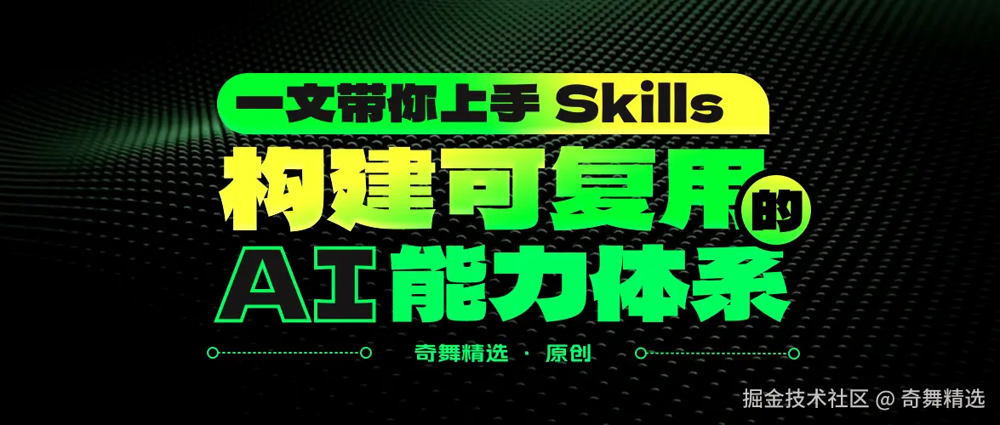

[一文读懂OpenClaw核心特性与原理解析(文末附国产大模型+聊天软件接入OpenClaw视频教程地址)](https://juejin.cn/post/7602466689713078287 "一文读懂OpenClaw核心特性与原理解析(文末附国产大模型+聊天软件接入OpenClaw视频教程地址)")

[本文分享了OpenClaw核心特性与设计原理，并提供接入国产大模型与聊天工具的实用指南。OpenClaw通过独特的网关系统，四层记忆架构、并借助Agent Skills体系灵活扩展向着未来数字员工迈进](https://juejin.cn/post/7602466689713078287)

- [大模型真好玩](https://juejin.cn/user/3140624091453053)

- 3月前

- 6.9k
- 18

- 评论

[人工智能](https://juejin.cn/tag/%E4%BA%BA%E5%B7%A5%E6%99%BA%E8%83%BD "人工智能") [LangChain](https://juejin.cn/tag/LangChain "LangChain") [Agent](https://juejin.cn/tag/Agent "Agent")

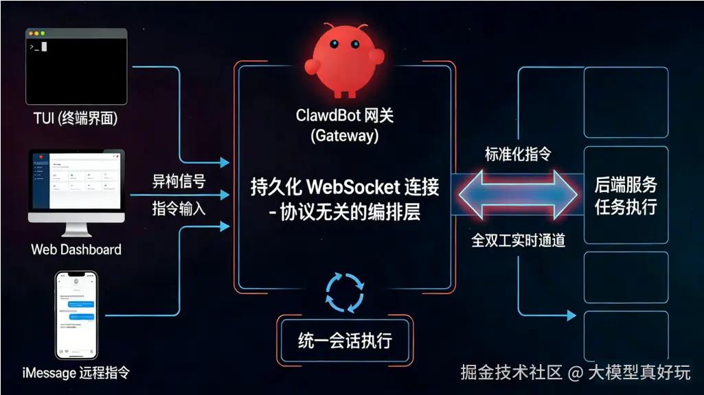

[一文带你了解火过 OpenClaw 的 Hermes Agent](https://juejin.cn/post/7631040435457458222 "一文带你了解火过 OpenClaw 的 Hermes Agent")

[截至 4 月 20 日，Hermes Agent 已斩获 100k+ Star，持续霸榜 GitHub，成为近期开发者社区最受关注的 Agent 之一。](https://juejin.cn/post/7631040435457458222)

- [七牛开发者](https://juejin.cn/user/1620027025142875)

- 1月前

- 102
- 点赞

- 评论

[Agent](https://juejin.cn/tag/Agent "Agent")


[大模型系列——一文带你快速了解MCP\_原创](https://juejin.cn/post/7495961326160347155 "大模型系列——一文带你快速了解MCP_原创")

[自从 OpenAI 于 2023 年推出函数调用（Function Calling）以来，我一直在思考，一个围绕 Agent 与工具使用（Tool Use）的生态将是如何的？随着基础模型的智能程度不断](https://juejin.cn/post/7495961326160347155)

- [码农小羊](https://juejin.cn/user/2412757874911389)

- 1年前

- 218
- 点赞

- 评论

[MCP](https://juejin.cn/tag/MCP "MCP") [AI编程](https://juejin.cn/tag/AI%E7%BC%96%E7%A8%8B "AI编程")

[VSCode + Copilot 保姆级 AI 编程实战教程，免费用 Claude，夯爆了！](https://juejin.cn/post/7617303081518596131 "VSCode + Copilot 保姆级 AI 编程实战教程，免费用 Claude，夯爆了！")

[VSCode+GitHub Copilot AI编程实战指南：从安装到塔罗牌网站开发，帮助开发者高效实现AI编程。](https://juejin.cn/post/7617303081518596131)

- [程序员鱼皮](https://juejin.cn/user/2444938365386621)

- 2月前

- 8.1k
- 97

- 15

[AI编程](https://juejin.cn/tag/AI%E7%BC%96%E7%A8%8B "AI编程") [人工智能](https://juejin.cn/tag/%E4%BA%BA%E5%B7%A5%E6%99%BA%E8%83%BD "人工智能") [前端](https://juejin.cn/tag/%E5%89%8D%E7%AB%AF "前端")

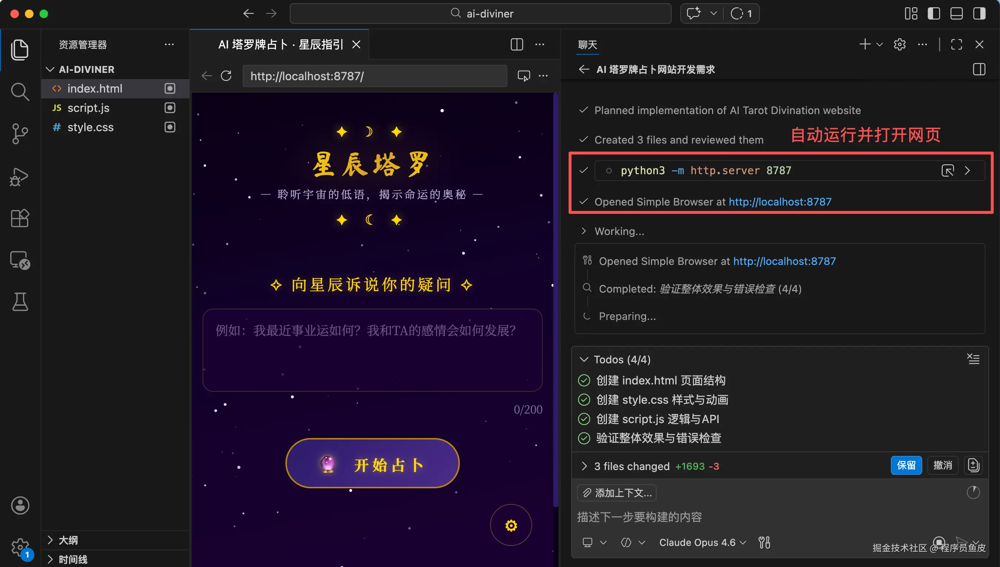

[深入浅出LangChain AI Agent智能体开发教程（一）—认识LangChain&LangGraph](https://juejin.cn/post/7526993716071202851 "深入浅出LangChain AI Agent智能体开发教程（一）—认识LangChain&LangGraph")

[本篇分享从LangChain&LangGraph的核心概念、核心特性、与其它框架的对比以及热门项目四个方面带大家详细了解了LangChain和LangGraph框架特性，为后期系列分享奠定理论基础。](https://juejin.cn/post/7526993716071202851)

- [大模型真好玩](https://juejin.cn/user/3140624091453053)

- 10月前

- 5.5k
- 41

- 4

[人工智能](https://juejin.cn/tag/%E4%BA%BA%E5%B7%A5%E6%99%BA%E8%83%BD "人工智能") [Python](https://juejin.cn/tag/Python "Python") [MCP](https://juejin.cn/tag/MCP "MCP")

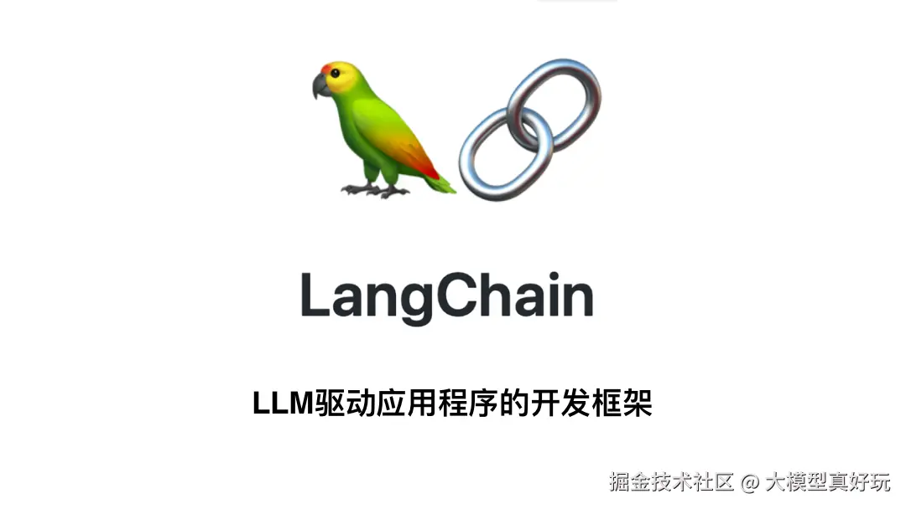

[一文带你搞懂AI大模型技术版图](https://juejin.cn/post/7491881721278136354 "一文带你搞懂AI大模型技术版图")

[从2022年11月ChatGPT的问世，到现在已经两年有余，AI大模型相关技术在不断的发展，相关的AI智能产品也在不断走向成熟。](https://juejin.cn/post/7491881721278136354)

- [闫同学](https://juejin.cn/user/990022531286247)

- 1年前

- 398
- 点赞

- 评论

[AIGC](https://juejin.cn/tag/AIGC "AIGC") [AI编程](https://juejin.cn/tag/AI%E7%BC%96%E7%A8%8B "AI编程") [Cursor](https://juejin.cn/tag/Cursor "Cursor")

[一文带你俯瞰大模型领域的世界](https://juejin.cn/post/7512502594021179443 "一文带你俯瞰大模型领域的世界")

[本文主要的目的就是介绍大模型领域的名词及核心概念，从而避免在各种大模型信息之中不知道这个是什么。 其实大模型领域这些名词也好，概念也好，我们简单对他们理解下就是该领域的一些技术栈。 希望通过本文能](https://juejin.cn/post/7512502594021179443)

- [架构师那些事儿](https://juejin.cn/user/2173109067847144)

- 11月前

- 428
- 1

- 评论

[AIGC](https://juejin.cn/tag/AIGC "AIGC") [AI编程](https://juejin.cn/tag/AI%E7%BC%96%E7%A8%8B "AI编程") [LangChain](https://juejin.cn/tag/LangChain "LangChain")

[（干货篇）一文带你将 DeepSeek 部署到本地，并对接至Vscode！](https://juejin.cn/post/7467570359190519859 "（干货篇）一文带你将 DeepSeek 部署到本地，并对接至Vscode！")

[你是否对AI大模型充满好奇，却苦于不会写代码、不会配环境？ 今天就以从2024年爆火到2025年的具备全球影响力的国产大模型 DeepSeek R1 为例，一步步的部署+配置，不仅可以部署到本地，还可](https://juejin.cn/post/7467570359190519859)

- [开源星探](https://juejin.cn/user/2977915149494248)

- 1年前

- 13k
- 72

- 15

[GitHub](https://juejin.cn/tag/GitHub "GitHub") [人工智能](https://juejin.cn/tag/%E4%BA%BA%E5%B7%A5%E6%99%BA%E8%83%BD "人工智能") [DeepSeek](https://juejin.cn/tag/DeepSeek "DeepSeek")

[10 行代码带你上手 LangChain 智能 Agent](https://juejin.cn/post/7591375103520096296 "10 行代码带你上手 LangChain 智能 Agent")

[大模型时代，如果你想快速做一个「会思考、会调用工具」的智能 Agent， LangChain几乎是绕不开的选择。 它是一个开源框架，内置了完善的代理（Agent）架构，并且可以和各种模型、工具、外部系](https://juejin.cn/post/7591375103520096296)

- [星浩AI](https://juejin.cn/user/2904236059009760)

- 4月前

- 545
- 2

- 6

[后端](https://juejin.cn/tag/%E5%90%8E%E7%AB%AF "后端") [人工智能](https://juejin.cn/tag/%E4%BA%BA%E5%B7%A5%E6%99%BA%E8%83%BD "人工智能")

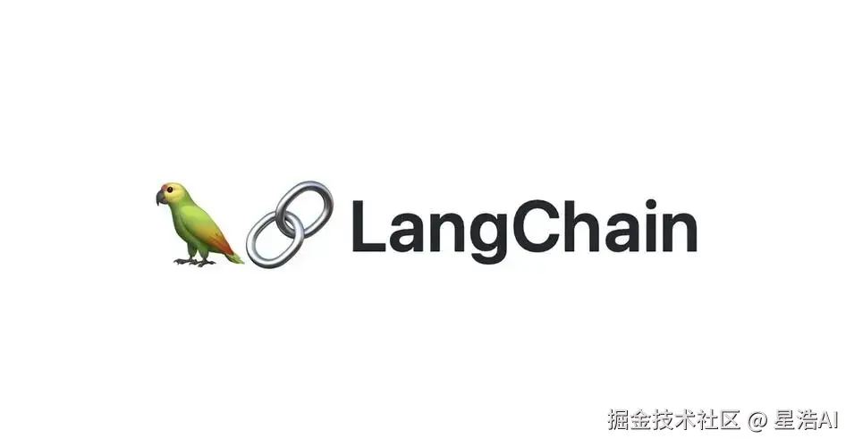

[2026年最火的AI技术Agent Skills，真的有那么神？一文看懂“傻瓜式”上手指南](https://juejin.cn/post/7602206323461046323 "2026年最火的AI技术Agent Skills，真的有那么神？一文看懂“傻瓜式”上手指南")

[如果你最近刷社交媒体、科技论坛或者AI圈的朋友圈，大概率已经看到“Agent Skills”这个词被疯狂刷屏。有人说它是2026年最值得掌握的AI新范式，也有人吐槽：“不就是换个名字的自动化脚本？”到](https://juejin.cn/post/7602206323461046323)

- [大黄评测](https://juejin.cn/user/714024404135696)

- 3月前

- 640
- 1

- 评论

[后端](https://juejin.cn/tag/%E5%90%8E%E7%AB%AF "后端")

[Vibe Coding 概念大全](https://juejin.cn/post/7602191709389176874 "Vibe Coding 概念大全")

[Vibe Coding 概念大全 AI 基础概念 人工智能（AI） 大语言模型（LLM） 模型参数 训练和推理 微调（Fine-tuning） Token 和计费 Token 输入 Token 和输出](https://juejin.cn/post/7602191709389176874)

- [金金金\_\_](https://juejin.cn/user/1979586945487064)

- 3月前

- 3.1k
- 42

- 9

[AI编程](https://juejin.cn/tag/AI%E7%BC%96%E7%A8%8B "AI编程")

[Trae 小册上线了！7 大项目带你玩转 AI 实战编程！](https://juejin.cn/post/7520158346361552933 "Trae 小册上线了！7 大项目带你玩转 AI 实战编程！")

[在软件开发被 AI 深度重塑的今天，一场静悄悄的革命正在改变我们编码的方式。当我们还在讨论 AI 是否会取代程序员时，聪明的开发者们已经意识到，未来的核心竞争力，不再是日以继夜地](https://juejin.cn/post/7520158346361552933)

- [智见君](https://juejin.cn/user/3227821869407208)

- 11月前

- 1.4k
- 7

- 5

[前端](https://juejin.cn/tag/%E5%89%8D%E7%AB%AF "前端") [Trae](https://juejin.cn/tag/Trae "Trae") [AI编程](https://juejin.cn/tag/AI%E7%BC%96%E7%A8%8B "AI编程")

[AI Agent编程语言开源发布](https://juejin.cn/post/7618363968400064527 "AI Agent编程语言开源发布")

[AI Agent编程语言开源发布 我为什么要设计一个 AI Agent DSL编程语言，AgentDSL 用 Groovy DSL 定义 AI Agent，描述即开发，一行配置抵 80 行胶水代码。](https://juejin.cn/post/7618363968400064527)

- [硅基极客](https://juejin.cn/user/626084740100425)

- 2月前

- 212
- 点赞

- 2

[Agent](https://juejin.cn/tag/Agent "Agent")

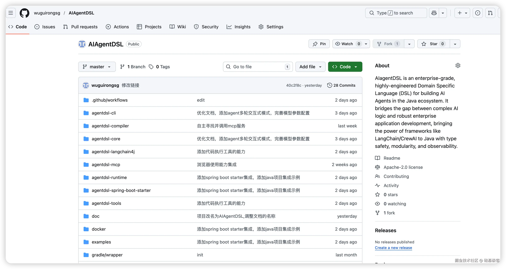

收藏成功！

已添加到「」， 点击更改

- 微信
微信扫码分享

- 新浪微博
- QQ


AI代码助手上线啦

选中代码，体验AI替你一键快速解读代码

立即体验

APP内打开

- 下载APP

下载APP
- 微信扫一扫

微信公众号
- [新浪微博](https://weibo.com/xitucircle)


选择你感兴趣的技术方向

后端

前端

Android

iOS

人工智能

开发工具

代码人生

阅读

跳过

上一步

至少选择1个分类

温馨提示

当前操作失败，如有疑问，可点击申诉

前往申诉我知道了

沉浸阅读

确定屏蔽该用户

屏蔽后，对方将不能关注你、与你产生任何互动，无法查看你的主页
