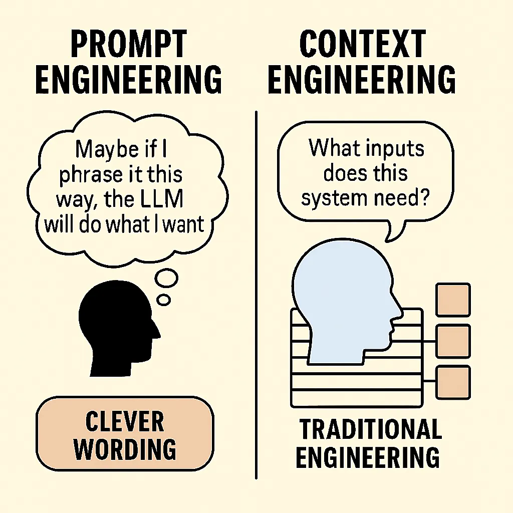
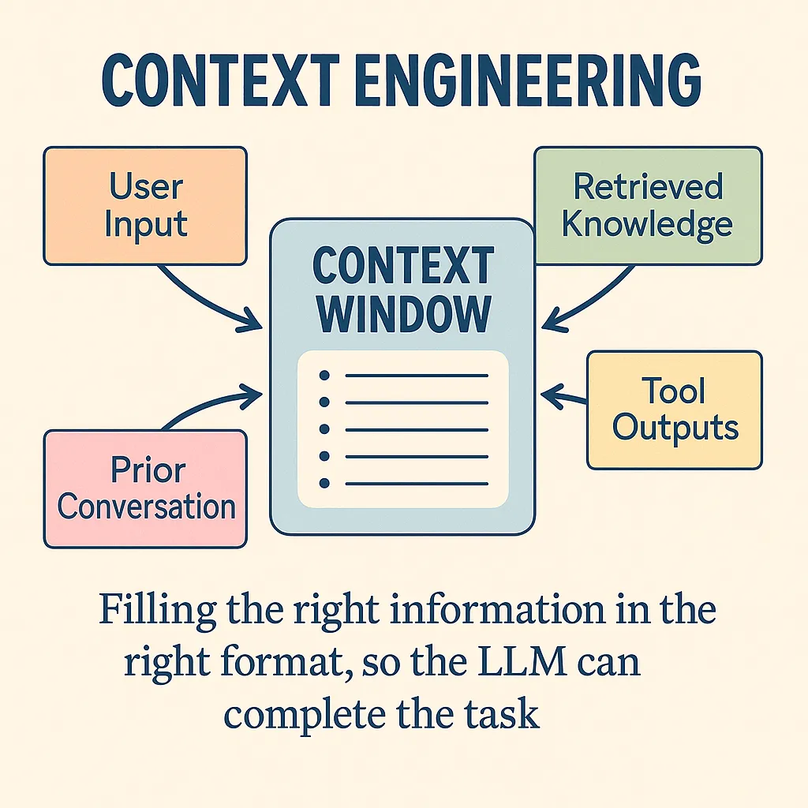
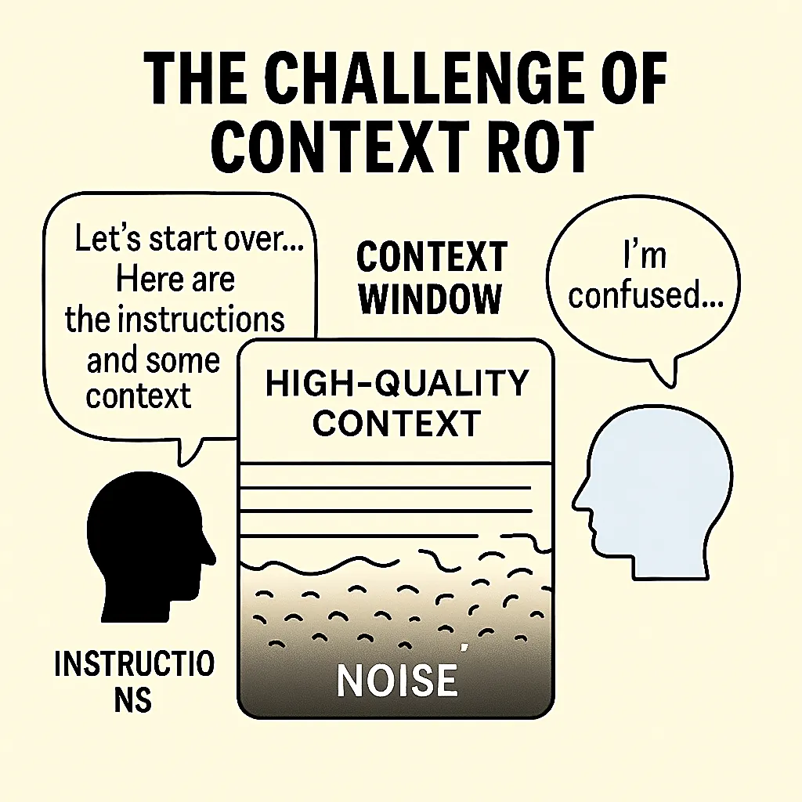
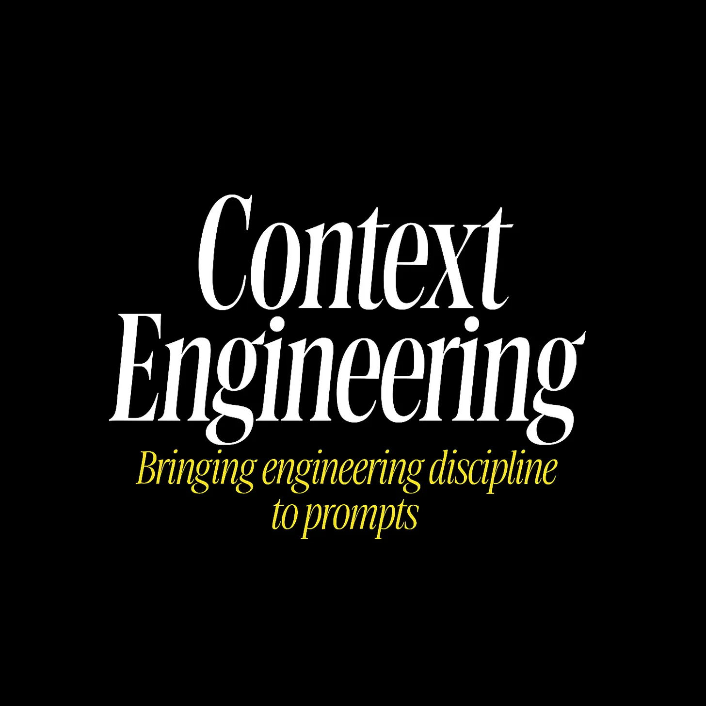

# 上下文工程：为提示词注入工程学的严谨性

> 原文链接：https://baoyu.io/translations/context-engineering-prompt-engineering-by-addy
> 文章时间：2025-07-19

## 重点内容与核心观点

原文： Context Engineering: Bringing Engineering Discipline to Prompts

[See all posts](https://baoyu.io/translations)

Published on 2025-07-19

# 上下文工程：为提示词注入工程学的严谨性

原文： [Context Engineering: Bringing Engineering Discipline to Prompts](https://substack.com/home/post/p-168177841)

### 一份关于 AI 提示词信息架构的实用指南

作者： [Addy Osmani](https://substack.com/@addyosmani)

**核心摘要：** _“上下文工程” (Context engineering) 指的是为 AI（如大语言模型）提供成功完成任务所需的所有信息和工具——而不仅仅是一句精心设计的提示词。它是“_ [_提示词工程_](https://addyo.substack.com/p/the-prompt-engineering-playbook-for) _” (prompt engineering) 的演进，体现了一种更宏大、更系统化的方法。_

* * *

## 上下文工程技巧：

**要想从 AI 那里获得最佳结果，你需要提供清晰而具体的上下文。AI 输出的质量直接取决于你输入的质量。**

**如何改进你的 AI 提示词**

- **力求精确：** 模糊的请求只会得到模糊的回答。你描述得越具体，结果就越好。

- **提供相关代码：** 分享与你请求核心相关的特定文件、文件夹或代码片段。

- **附上设计文档：** 粘贴或附上相关设计文档的章节，让 AI 了解宏观背景。

- **分享完整的错误日志：** 在调试时，务必提供完整的错误信息和任何相关的日志或堆栈跟踪。

- **展示数据库结构图：** 在处理数据库时，一张数据库结构的截图能帮助 AI 生成准确的数据交互代码。

- **利用 PR 反馈：** Pull Request (代码合并请求) 中的评论是富含上下文的绝佳提示词素材。

- **给出示例：** 展示一个你期望的最终输出是什么样子的例子。

- **明确你的限制：** 清晰地列出所有要求，比如必须使用哪些库、遵循哪些模式，或者需要避免什么。

* * *

## 从“提示词工程”到“上下文工程”

**提示词工程关注的是如何巧妙地措辞提问；而上下文工程则关注如何构建一个完整的信息环境，以便 AI 能够可靠地解决问题。**

“提示词工程”曾是一个时髦词，本质上是指通过遣词造句来获得更好输出的技巧。它教会我们用巧妙的“一句话”进行“散文式编程”。但在 AI 圈子外，许多人将提示词工程简单理解为在聊天机器人里输入花哨的请求。这个词从未能完全传达出有效使用大语言模型所涉及的真正复杂性。

随着应用日益复杂，仅关注单个提示词的局限性也变得显而易见。一篇分析文章曾俏皮地评论道： _提示词工程的探索，是为了给上下文工程的腾飞铺路。_ 换句话说，一句机智的一次性提示词或许能在演示中惊艳我们，但要构建 **可靠的、工业级的大语言模型系统**，则需要更全面的东西。

正是这种认识，让我们的领域逐渐凝聚在 **“上下文工程”** 这个词上，它更准确地描述了从 AI 获取卓越成果的这门手艺。上下文工程意味着构建大语言模型所能看到的整个 **上下文窗口** ——不仅是一条简短的指令，还包括完成任务所需的所有相关背景信息、示例和指南。

这个短语在 2025 年中由 Shopify 的 CEO Tobi Lütke 和 AI 领域的领军人物 Andrej Karpathy 等开发者推广开来。

> Tobi 写道：“ _相比提示词工程，我真的更喜欢‘上下文工程’这个词。它更好地描述了核心技能：为任务提供所有上下文，使其能被大语言模型合情理地解决的艺术。_” Karpathy 对此表示强烈赞同，并指出， _人们通常将提示词与简短指令联系在一起，但在每一个严肃的大语言模型应用中，_ **_上下文工程_** _都是一门精巧的艺术和科学，需要在每一步为上下文窗口填充恰到好处的信息_。

换句话说，现实世界中的大语言模型应用并非靠运气或一次性的提示词成功，而是通过围绕模型的查询精心组装上下文来实现的。

术语的变化反映了方法的演进。如果说提示词工程是想出一句神奇的咒语，那么上下文工程就是 [为 AI **编写完整的剧本**](https://analyticsindiamag.com/ai-features/context-engineering-is-the-new-vibe-coding/#:~:text=If%20prompt%20engineering%20was%20about,in%20favour%20of%20context%20engineering)。这是一种结构性的转变：提示词工程在你精心制作好一个提示词后就结束了，而上下文工程则始于设计整个系统，以便有组织地引入记忆、知识、工具和数据。

正如 Karpathy 解释的那样，要做好这一点，涉及到方方面面，从 **清晰的任务指令** 和解释，到提供少样本示例、检索到的事实（RAG）、可能的多模态数据、相关工具、状态历史，以及将所有这些小心翼翼地压缩到一个有限的窗口中。 **上下文太少（或类型不对），模型将缺乏信息，无法达到最佳性能；无关的上下文太多，则会浪费计算资源（token），甚至降低性能。** **找到那个最佳平衡点并非易事。** 难怪 Karpathy 称之为一门科学，也是一门艺术。

“ **上下文工程**”这个词之所以流行，是因为它直观地捕捉到了我们在构建大语言模型解决方案时实际在做的事情。“提示词”听起来像是一个简短的查询；而“上下文”则意味着我们为 AI 准备的更丰富的信息状态。

撇开语义不谈，为什么这个转变如此重要？因为它标志着我们 AI 开发心态的成熟。我们已经认识到， **生产环境中的生成式 AI 不像念一句魔法咒语，而更像是为 AI 设计一个完整的工程环境**。一次性的提示词或许能做出炫酷的演示，但对于稳健的解决方案，你需要在每一步都控制模型“知道”什么和“看到”什么。这通常意味着检索相关文档、总结历史记录、注入结构化数据或提供工具——无论需要什么，只要能让模型不是在黑暗中猜测。结果是，我们不再将提示词视为我们希望 AI 能理解的一次性指令。我们开始从 **上下文管道** 的角度思考：所有那些为 AI 成功铺路的信息和交互片段。

为了说明这一点，我们来看看视角的差异。提示词工程常常是一场文字游戏（“也许我换种方式说，大语言模型就能做我想做的事了”）。相比之下，上下文工程感觉更像是传统的工程学： _这个系统需要哪些输入（数据、示例、状态）？我如何获取这些输入并提供给系统？以什么格式？在什么时间？_ 我们基本上已经从从单个提示词中榨取性能，转向设计 **由大语言模型驱动的系统**。

* * *

## 上下文工程究竟是什么？

**上下文工程意味着在运行时，动态地为 AI 提供成功所需的一切——指令、数据、示例、工具和历史记录——所有这些都被打包到模型的输入上下文中。**

一个有用的 [心智模型](https://blog.langchain.com/context-engineering-for-agents/#:~:text=As%20Andrej%20Karpathy%20puts%20it%2C,Karpathy%20summarizes%20this%20well)（由 Andrej Karpathy 等人提出）是，将大语言模型看作一个 CPU，将其上下文窗口（它一次能看到的文本输入）看作是 RAM 或工作内存。作为工程师，你的工作类似于一个操作系统： **将恰到好处的代码和数据加载到那个工作内存中，以完成任务**。在实践中，这些上下文可以来自许多来源：用户的查询、系统指令、从数据库或文档中检索到的知识、其他工具的输出，以及先前交互的摘要。上下文工程就是将所有这些部分编排成模型最终看到的提示词。它不是一个静态的提示词，而是在运行时动态组装信息的过程。

_图解：多个信息源被组合到大语言模型的上下文窗口（其“工作内存”）中。上下文工程师的目标是用正确的信息、正确的格式填充该窗口，以便模型能够有效地完成任务。_

让我们来分解一下这具体涉及什么：

- **它是一个系统，而非一次性提示词。** 在一个精心设计的系统中，大语言模型最终看到的提示词可能包含几个部分：例如，开发者编写的角色指令，加上最新的用户查询，再加上动态获取的相关数据，或许还有一些期望输出格式的示例。所有这些都是通过程序化方式编织在一起的。例如，想象一个编程助手 AI，收到了查询“如何修复这个身份验证 bug？”它背后的系统可能会自动在你的代码库中搜索相关代码，检索相关的文件片段，然后构建一个像这样的提示词：“ _你是一位专家级编程助手。用户正面临一个身份验证 bug。这里是相关的代码片段：\[代码\]。用户的错误信息：\[日志\]。请提供一个修复方案。_” 注意，这个最终的提示词是如何由多个部分构成的。 **上下文工程就是决定引入哪些部分以及如何将它们连接起来的逻辑。** 这类似于编写一个为另一个函数调用准备参数的函数——只不过这里的“参数”是上下文的片段，而“函数”是大语言模型的调用。

- **它是动态的，因地制宜。** 与单个硬编码的提示词不同，上下文的组装是 _根据每个请求_ 进行的。系统可能会根据查询或对话状态包含不同的信息。如果是一场多轮对话，你可能会包含对话至今的摘要，而不是完整的记录，以节省空间（和理智）。如果用户的问题引用了某个文档（“设计规范中关于 X 是怎么说的？”），系统可能会从维基中获取该规范并包含相关的摘录。简而言之，上下文工程的逻辑会 _响应_ 当前的状态——很像程序的行为取决于输入一样。这种动态性至关重要。你不会为翻译的每一句话都给翻译模型完全相同的提示词；你会每次都给它新的句子。同样，在一个 AI 智能体中，随着状态的演变，你会不断更新你提供的上下文。

- **它融合多种类型的内容。** LangChain [将](https://blog.langchain.com/context-engineering-for-agents/#:~:text=What%20are%20the%20types%20of,a%20few%20different%20context%20types) 上下文工程描述为一个涵盖至少三个方面上下文的保护伞：（1） **指令性上下文**——我们提供的提示词或指导（包括系统角色指令和少样本示例），（2） **知识性上下文**——我们提供的领域信息或事实，通常通过从外部来源检索获得，以及（3） **工具性上下文**——来自模型环境通过工具或 API 调用获得的信息（例如，网络搜索、数据库查询或代码执行的结果）。一个稳健的大语言模型应用通常需要所有这三种：关于任务的清晰指令、插入的相关知识，以及可能让模型使用工具并将工具结果整合回其思考过程的能力。上下文工程就是管理所有这些信息流并将它们连贯地合并起来的学科。

- **格式与清晰度至关重要。** 不仅是你在上下文中包含 _什么_ 内容，还有你 _如何_ 呈现它。与 AI 模型沟通与和人沟通有惊人的相似之处：如果你扔给它一大堆非结构化的文本，模型可能会感到困惑或抓不住重点，而一个组织良好的输入则会引导它。上下文工程的一部分工作是找出如何压缩和组织信息，以便模型能抓住重点。这可能意味着总结长文本，使用项目符号或标题来突出关键事实，甚至将数据格式化为 JSON 或伪代码，如果这有助于模型解析的话。例如，如果你检索了一个文档片段，你可能会在它前面加上类似“相关文档：”的前缀，并将其放在引号中，这样模型就知道这是参考材料。如果你有一个错误日志，你可能只显示最后 5 行，而不是 100 行的堆栈跟踪。有效的上下文工程通常涉及创造性的 **信息设计**——使输入对大语言模型来说尽可能易于消化。

最重要的是，上下文工程是为了 **给 AI 的成功创造条件**。

请记住，大语言模型功能强大但并非通灵——它只能根据其输入内容加上其训练期间学到的知识来作答。如果它失败或产生幻觉，根本原因往往是我们没有给它正确的上下文，或者我们给了它结构混乱的上下文。当一个大语言模型“智能体”行为失常时，通常是\*“适当的上下文、指令和工具没有传达给模型” _。垃圾进，垃圾出。反之，如果你_ 确实\*提供了所有相关信息和清晰的指导，模型的性能会显著提高。

**提供高质量上下文的实用技巧**

那么，具体来说，我们如何确保我们正在给 AI 它所需要的一切呢？以下是我在构建 AI 编程助手和其他大语言模型应用时发现的一些实用技巧：

- **包含相关的源代码和数据。** 如果你要求 AI 处理代码，请提供相关的代码文件或片段。不要假设模型会从记忆中回忆起一个函数——给它看实际的代码。同样，对于问答任务，包含相关的论据或文档（通过检索）。 _低质量的上下文保证了低质量的输出。_ 模型无法回答它没有被告知的事情。

- **指令要精确。** 清晰地说明你想要什么。如果你需要特定格式的答案（JSON、特定风格等），请说明。如果 AI 在编写代码，请指定约束条件，如使用（或避免使用）哪些库或模式。你请求中的模糊性会导致答案漫无边际。

- **提供期望输出的示例。** 少样本示例非常强大。如果你想要一个以特定风格记录的函数，就在提示词中展示一两个正确记录的函数示例。对输出进行建模有助于大语言模型准确理解你想要什么。

- **利用外部知识。** 如果任务需要超出模型训练范围的领域知识（例如，公司特定的细节、API 规范），请检索这些信息并将其放入上下文中。例如，附上设计文档的相关部分或 API 文档的片段。当大语言模型能够引用所提供文本中的事实，而不是从记忆中回忆时，它们的准确性会高得多。

- **在调试时包含错误信息和日志。** 如果要求 AI 修复一个 bug，请给它看完整的错误跟踪或日志片段。这些通常包含了解决问题的关键线索。同样，如果问为什么测试失败，请包含任何测试输出。

- **（聪明地）维护对话历史。** 在聊天场景中，反馈对话至今的重要部分。通常你不需要完整的历史记录——关键点或决策的简明摘要就足够了，而且可以节省 token 空间。这为模型提供了已经讨论过的内容的上下文。

- **不要回避元数据和结构。** 有时告诉模型 _为什么_ 你给它一段上下文会有所帮助。例如：“ _这是用户的查询。_”或“ _这里是相关的数据库结构图：_”作为前缀标签。像“用户输入：… / 助手回应：…”这样的简单分节标题有助于模型解析多部分提示词。使用格式（Markdown、项目符号列表、编号步骤）使提示词逻辑清晰。

记住黄金法则： **大语言模型功能强大，但它们不会读心术。** 输出的质量与你提供的上下文的质量和相关性成正比。上下文太少（或缺少部分），AI 就会用猜测（通常是错误的）来填补空白。无关或嘈杂的上下文可能同样糟糕，会将模型引向错误的方向。因此，我们作为上下文工程师的工作就是精确地为模型提供它所需要的，而不是它不需要的。

* * *

## 回应质疑者

让我们直接面对批评。许多经验丰富的开发者认为“上下文工程”要么是换了层皮的提示词工程，要么更糟，是伪科学的流行词创造。这些担忧并非空穴来风。传统的提示词工程专注于你给大语言模型的指令。而上下文工程则涵盖了整个信息生态系统：动态数据检索、内存管理、工具编排，以及跨多轮交互的状态维护。当前许多 AI 工作确实缺乏我们期望于工程学科的那种严谨性。有太多的试错，太少的衡量，以及不充分的系统化方法论。说实话：即使有完美的上下文工程，大语言模型仍然会产生幻觉，犯逻辑错误，并在复杂推理上失败。上下文工程并非万能灵药——它是在当前约束下的损害控制与优化。

* * *

## 有效上下文的艺术与科学

**出色的上下文工程能够达成一种平衡——包含模型真正需要的一切，但避免可能分散其注意力（并增加成本）的无关或过多的细节。**

正如 Karpathy 所描述的，上下文工程是 _科学_ 与 _艺术_ 的精妙结合。

“科学”部分涉及遵循某些原则和技术来系统地提高性能。例如：如果你在做代码生成，包含相关代码和错误信息几乎是科学常识；如果你在做问答，检索支持性文档并提供给模型是合乎逻辑的。有一些成熟的方法，如少样本提示、检索增强生成（RAG）和思维链提示，我们知道（通过研究和试验）可以提升结果。尊重模型的约束也是一门科学——每个模型都有上下文长度限制，过度填充该窗口不仅会增加延迟/成本，如果重要部分被噪音淹没，还可能 _降低_ 质量。

> Karpathy 总结得很好：“ _上下文太少或形式不对，大语言模型就没有获得最佳性能的正确环境。太多或太无关，大语言模型的成本可能会上升，性能可能会下降。_”

所以，科学在于选择、修剪和优化格式化上下文的技术。例如，使用嵌入（embeddings）来找到最相关的文档以包含进来（这样你就不会插入不相关的文本），或者将长历史压缩成摘要。研究人员甚至已经对 _长_ 上下文的失败模式进行了分类——比如 **上下文投毒**（context poisoning，指上下文中早期的幻觉导致进一步的错误）或 **上下文干扰**（context distraction，指过多的无关细节导致模型失去焦点）。了解这些陷阱后，一个好的工程师会仔细地策划上下文。

然后是“艺术”的一面——源于经验的直觉和创造力。

这关乎于理解大语言模型的怪癖和微妙行为。可以把它想象成一个经验丰富的程序员，“凭感觉”就知道如何组织代码以提高可读性：一个经验丰富的上下文工程师会对如何为特定模型组织提示词形成一种感觉。例如，你可能感觉到某个模型在你先概述解决方案方法再深入细节时表现更好，所以你在提示词中加入一个初始步骤，如“让我们一步一步地思考……”。或者你注意到模型经常误解你领域中的某个特定术语，所以你在上下文中预先澄清它。这些都不在手册里——你是通过观察模型输出和迭代来学习的。 **这就是旧意义上的提示词制作（prompt-crafting）仍然重要的地方**，但现在它服务于更大的上下文。这类似于软件设计模式：理解常见的解决方案是科学，但知道何时以及如何应用它们是艺术。

让我们探讨一些上下文工程师用来打造有效上下文的常用策略和模式：

- **检索相关知识：** 最强大的技术之一是检索增强生成（Retrieval-Augmented Generation, RAG）。如果模型需要其训练记忆中不保证存在的 तथ्य 或领域特定数据，让你的系统获取这些信息并将其包含进来。例如，如果构建一个文档助手，你可能会对你的文档进行向量搜索，并将匹配度最高的段落插入到提示词中，然后再提出问题。这样，模型的答案将基于你提供的真实数据，而不是其有时过时的内部知识。这里的关键技能包括设计好的搜索查询或嵌入空间以获取正确的片段，以及清晰地格式化插入的文本（带有引文或引号），以便模型知道要使用它。当大语言模型“幻觉”出事实时，通常是因为我们未能提供真正的事实——检索是对此的解药。

- **少样本示例和角色指令：** 这可以追溯到经典的提示词工程。如果你希望模型以特定的风格或格式输出内容，给它看例子。例如，要获得结构化的 JSON 输出，你可以在提示词中包含一两个 JSON 格式的输入和输出示例，然后再要求一个新的。少样本上下文通过示例有效地教导模型。同样，设置一个 **系统角色** 或人设可以引导语气和行为（“你是一位帮助用户的专家级 Python 开发者……”）。这些技术之所以是基本功，是因为它们有效：它们使模型偏向于你想要的模式。在上下文工程的思维模式中，提示词的措辞和示例只是上下文的一部分，但它们仍然至关重要。事实上，你可以说提示词工程（制作指令和示例）现在是上下文工程的一个 _子集_——它是工具箱中的一个工具。我们仍然非常关心措辞和示范性示例，但我们还在它们周围做所有这些其他的事情。

- **管理状态和记忆：** 许多应用涉及多轮交互或长时间运行的会话。上下文窗口不是无限的，因此上下文工程的一个主要部分是决定如何处理对话历史或中间结果。一个常见的技术是 **摘要压缩**——每几次交互后，对其进行总结，并使用该摘要继续，而不是全文。例如，Anthropic 的 Claude 助手在对话变长时会自动这样做，以避免上下文溢出（你会看到它生成一个“\[先前讨论的摘要\]”来浓缩早期的轮次）。另一种策略是明确地将重要事实写入外部存储（文件、数据库等），然后在需要时检索它们，而不是在每个提示词中都带着它们。这就像一个外部记忆。一些先进的智能体框架甚至让大语言模型生成“给自己的笔记”，这些笔记被存储起来，并可以在未来的步骤中被回忆起来。这里的艺术在于弄清楚 **保留什么**、 **何时总结**，以及 **如何在正确的时机重新呈现过去的信息**。做得好，它能让 AI 在非常长的任务中保持连贯性——这是纯粹的提示词工程难以做到的。

- **工具使用和环境上下文：** 现代 AI 智能体可以使用工具（例如，调用 API、运行代码、浏览网页）作为其操作的一部分。当它们这样做时，每个工具的输出都成为下一次模型调用的新上下文。在这种情况下，上下文工程意味着指导模型 _何时以及如何_ 使用工具，然后将结果反馈回来。例如，一个智能体可能有一条规则：“如果用户问一个数学问题，调用计算器工具。” 使用后，结果（比如 42）被插入到提示词中：“ _工具输出：42。_” 这需要清晰地格式化工具输出，并可能添加一个后续指令，如“ _根据这个结果，现在回答用户的问题。_” 智能体框架（如 LangChain 等）中的大量工作本质上是围绕工具使用的上下文工程——给模型一个可用工具的列表、调用它们的语法指南，以及如何整合结果的模板。关键在于，你，作为工程师， **编排** 了模型与外部世界之间的这种对话。

- **信息格式化和打包：** 我们已经谈到过这一点，但它值得强调。通常你拥有的信息比能容纳或完全有用的要多。所以你压缩或格式化它。如果你的模型在编写代码，而你有一个庞大的代码库，你可能只包含函数签名或文档字符串，而不是整个文件，以给它上下文。如果用户查询很冗长，你可能会在末尾突出主要问题以集中模型的注意力。使用标题、代码块、表格——任何最能传达数据的结构。例如，与其说：“用户数据：\[庞大的 JSON\]…现在回答问题。”你可能会提取所需的几个字段并呈现：“用户名：X，账户创建时间：Y，最后登录时间：Z。” 这既便于模型解析，又使用更少的 token。简而言之，像用户体验（UX）设计师一样思考，但你的“用户”是大语言模型——为 **它的** 消费设计提示词。

这些技术的影响是巨大的。当你看到一个令人印象深刻的大语言模型演示解决复杂任务（比如，调试代码或规划一个多步骤过程）时，你可以打赌，幕后不仅仅是一个聪明的提示词。有一个上下文组装的管道在支持它。

例如，一个 AI 结对程序员可能会实现一个这样的工作流程：

1. 在代码库中搜索相关代码

2. 将这些代码片段与用户的请求一起包含在提示词中

3. 如果模型提出一个修复方案，在后台运行测试

4. 如果测试失败，将失败的输出反馈到提示词中，让模型改进其解决方案

5. 循环直到测试通过。

每一步都有精心设计的上下文：搜索结果、测试输出等，都以受控的方式被送入模型。这与“只提示大语言模型修复我的 bug”并期望最好的结果相去甚远。

* * *

## 上下文腐烂的挑战

随着我们越来越擅长组装丰富的上下文，我们遇到了一个新问题：随着时间的推移，上下文实际上会自我毒化。这种现象被 Hacker News 上的开发者 [Workaccount2](https://news.ycombinator.com/item?id=44308711#44310054) 恰当地称为“上下文腐烂”(context rot)，它描述了 **随着对话变长，上下文质量因积累了干扰、死胡同和低质量信息而下降** 的过程。

这种模式令人沮丧地常见：你以一个精心制作的上下文和清晰的指令开始一个会话。AI 一开始表现出色。但随着对话的继续——尤其是在有错误的开端、调试尝试或探索性的兔子洞之后——上下文窗口充满了越来越嘈杂的信息。模型的响应逐渐变得不那么准确，更加混乱，或者开始产生幻觉。

为什么会发生这种情况？上下文窗口不仅仅是存储——它们是模型的工作内存。当这个内存被失败的尝试、矛盾的信息或离题的讨论弄得乱七八糟时，就像试图在一张堆满旧草稿和无关文件的桌子上工作。模型很难辨别什么是当前相关的，什么是历史噪音。对话中早期的错误可能会累积，形成一个反馈循环，模型引用自己糟糕的输出，并进一步偏离轨道。

这在迭代性工作流程中尤其成问题——而这正是上下文工程大放异彩的那种复杂任务。调试会话、代码重构、文档编辑或研究项目自然会涉及错误的开端和路线修正。但每一次失败的尝试都会在上下文中留下痕迹，这些痕迹可能会干扰后续的推理。

管理上下文腐烂的实用策略包括：

- **上下文修剪与刷新：** Workaccount2 的解决方案是：“我通过定期对实例进行总结，然后用新的上下文启动一个新实例，并输入前一个实例的摘要来解决这个问题。” 这种方法在丢弃噪音的同时保留了基本状态。你基本上是在为你的上下文做垃圾回收。

- **结构化的上下文边界：** 使用清晰的标记来分隔不同的工作阶段。例如，明确将某些部分标记为“先前的尝试（仅供参考）”与“当前工作上下文”。这有助于模型理解优先次序。

- **渐进式上下文精炼：** 在取得重大进展后，有意识地从头开始重建上下文。提取关键决策、成功的方法和当前状态，然后重新开始。这就像重构代码——偶尔你需要清理积累的垃圾。

- **检查点摘要：** 定期让模型总结已完成的工作和当前状态。在开始新会话时，使用这些摘要作为新上下文的种子。

- **上下文分窗：** 对于非常长的任务，将它们分解为具有自然边界的阶段，在这些边界处你可以重置上下文。每个阶段都以一个干净的开始，只带有前一阶段的基本延续信息。

这个挑战也凸显了为什么“把所有东西都扔进上下文”不是一个可行的长期策略。就像好的软件架构一样， **好的上下文工程需要有意识的信息管理**——不仅要决定包含什么，还要决定何时排除、总结或刷新。

* * *

## 上下文工程在大语言模型应用全局中的位置

**上下文工程至关重要，但它只是构建完整大语言模型应用所需更大技术栈中的一个组件——与控制流、模型编排、工具集成和护栏等并存。**

用 Karpathy 的话来说，上下文工程是\*“一个正在兴起的、非同小可的厚重软件层中的一小部分”\*，这个软件层驱动着真正的大语言模型应用。因此，虽然我们专注于如何打造好的上下文，但看清它在整体架构中的位置很重要。

一个生产级的大语言模型系统通常需要处理许多提示之外的问题，例如：

- **问题分解和控制流：** 稳健的系统通常不是将用户查询视为一个单一的庞大提示词，而是将问题分解为子任务或多步工作流。例如，一个 AI 智能体可能首先被提示概述一个计划，然后在后续步骤中被提示执行每一步。设计这个流程（以什么顺序调用哪些提示词，如何决定分支或循环）是一个经典的编程任务——只不过这里的“函数”是带有上下文的大语言模型调用。上下文工程在这里的作用是确保每一步的提示词都有所需的信息，但 _决定要有步骤_ 本身是一个更高层次的设计。这就是为什么你会看到一些框架，你基本上是在编写一个协调多个大语言模型调用和工具使用的脚本。

- **模型选择和路由：** 你可能会为不同的工作使用不同的 AI 模型。也许一个轻量级模型用于简单任务或初步回答，一个重量级模型用于最终解决方案。或者一个代码专用模型用于编码任务，而一个通用模型用于对话任务。系统需要逻辑来将请求路由到适当的模型。每个模型可能有不同的上下文长度限制或格式要求，上下文工程必须考虑到这些（例如，为一个较小的模型更积极地截断上下文）。这方面更多是工程而非提示：可以把它看作是为工作匹配合适的工具。

- **工具集成和外部操作：** 如果你的 AI 可以执行操作（如调用 API、数据库查询、打开网页、运行代码），你的软件需要管理这些能力。这包括为 AI 提供可用工具的列表和使用说明，以及实际执行这些工具调用并捕获结果。正如我们讨论的，结果随后成为进一步模型调用的新上下文。从架构上讲，这意味着你的应用通常有一个循环：提示模型 -> 如果模型输出指示使用工具 -> 执行工具 -> 整合结果 -> 再次提示模型。可靠地设计这个循环是一个挑战。

- **用户交互和用户体验流程：** 许多大语言模型应用都涉及用户的参与。例如，一个编码助手可能会提出更改建议，然后请求用户确认应用。或者一个写作助手可能会提供几个草稿选项供用户选择。这些用户体验决策也影响上下文。如果用户说“选项 2 不错，但再短一点”，你需要将这个反馈带入下一个提示词（例如， _“用户选择了草稿 2，并要求缩短它。”_）。设计一个流畅的人机交互流程是应用的一部分，虽然不直接关乎提示词。尽管如此，上下文工程通过确保每一轮的提示词准确反映交互状态（比如记住选择了哪个选项，或者用户手动编辑了什么）来支持它。

- **护栏和安全：** 在生产环境中，你必须考虑滥用和错误。这可能包括内容过滤器（以防止有毒或敏感的输出）、工具的身份验证和权限检查（这样 AI 就不会因为指令里有就删除数据库），以及对输出的验证。有些设置使用第二个模型或规则来复核第一个模型的输出。例如，在主模型生成答案后，你可能会运行另一个检查： _“这个答案是否包含任何敏感信息？如果是，请编辑掉。”_ 这些检查本身可以用提示词或代码来实现。在任何情况下，它们通常都会在上下文中添加额外的指令（比如一个系统消息： _“如果用户要求不允许的内容，请拒绝。”_ 是许多已部署提示词的一部分）。所以上下文可能总是包含一些安全样板。平衡这一点（确保模型遵守政策而不损害帮助性）是这个拼图的又一块。

- **评估和监控：** 不用说，你需要不断监控 AI 的表现。记录每个请求和响应（在用户同意和保护隐私的前提下）可以让你分析失败和异常值。你可能会整合实时评估——例如，根据某些标准对模型的答案进行评分，如果分数低，就自动让模型重试或转交人工处理。虽然评估不属于生成单个提示词内容的一部分，但它会随着时间的推移反馈到改进提示词和上下文策略上。本质上，你把提示词和上下文组装当作可以利用生产数据进行 _调试_ 和优化的东西。

我们实际上在谈论的是 **一种新型的应用架构**。在这种架构中，核心逻辑涉及管理信息（上下文）并通过一系列 AI 交互来适应它，而不仅仅是运行确定性函数。Karpathy 列出了控制流、模型调度、内存管理、工具使用、验证步骤等元素，这些都在上下文填充之上。它们共同构成了他戏称为 AI 应用的“一个正在兴起的厚重软件层”——厚重是因为它做了很多事！当我们构建这些系统时，我们本质上是在编写元程序：编排另一个“程序”（AI 的输出）来解决任务的程序。

对于我们软件工程师来说，这既令人兴奋又充满挑战。令人兴奋是因为它开启了我们以前没有的能力——例如，构建一个能无缝处理自然语言、代码和外部操作的助手。充满挑战是因为许多技术都是新的，并且仍在不断变化。我们必须考虑诸如提示词版本控制、AI 可靠性和道德输出过滤等问题，这些在以前并不是应用开发的标准部分。在这种背景下， **上下文工程位于系统的核心**：如果你不能在正确的时间将正确的信息输入模型，其他任何东西都救不了你的应用。但正如我们所看到的，即使是完美的上下文本身也不够；你还需要它周围的所有支持结构。

结论是， **我们正在从提示词设计转向系统设计**。上下文工程是该系统设计的核心部分，但它与许多其他组件并存。

* * *

## 结论

**核心要点：** _通过掌握完整上下文的组装（并将其与扎实的测试相结合），我们可以增加从 AI 模型获得最佳输出的机会。_

对于经验丰富的工程师来说，这种范式的核心在很多方面都很熟悉——它关乎于良好的软件实践——只是应用在一个新的领域。想想看：

- 我们一直都知道 **垃圾进，垃圾出**。现在这个原则体现为“坏上下文进，坏答案出”。所以我们更加努力确保高质量的输入（上下文），而不是寄希望于模型自己能搞定。

- 我们在代码中重视 **模块化和抽象**。现在我们实际上是将任务抽象到高层次（描述任务，给出示例，让 AI 实现），并构建 AI + 工具的模块化管道。我们是在编排组件（一些是确定性的，一些是 AI），而不是自己编写所有逻辑。

- 我们在传统开发中实践 **测试和迭代**。现在我们正将同样的严谨性应用于 AI 行为，编写评估并改进提示词，就像在性能分析后改进代码一样。

在拥抱上下文工程时，你实际上是在说： _我，作为开发者，对 AI 的行为负责。_ 它不是一个神秘的预言家；它是我需要用正确的数据和规则来配置和驱动的一个组件。

这种心态的转变是赋能的。它意味着我们不必将 AI 视为不可预测的魔法——我们可以用扎实的工程技术（加上一点创造性的提示词艺术）来驯服它。

实际上，你如何在工作中采纳这种以上下文为中心的方法呢？

- **投资于数据和知识管道。** 上下文工程的一大部分是拥有可注入的数据。所以，去构建你的文档的向量搜索索引，或者设置你的智能体可以使用的数据库查询。将知识源视为开发中的一等公民。例如，如果你的 AI 助手是用于编码的，请确保它可以从代码仓库中拉取代码或参考风格指南。你从 AI 中获得的大量价值来自于你提供给它的 _外部知识_。

- **开发提示词模板和库。** 与其使用临时的提示词，不如开始为你的需求创建结构化的模板。你可能有一个“带引文回答”或“根据错误生成代码差异”的模板。这些变得像你重复使用的函数。将它们保存在版本控制中。记录它们的预期行为。这就是你建立一个经过验证的上下文设置工具箱的方式。随着时间的推移，你的团队可以共享和迭代这些，就像他们对共享代码库所做的那样。

- **使用能给你控制权的工具和框架。** 如果你需要可靠性，请避免使用黑箱式的“只给我们一个提示词，剩下的我们来做”的解决方案。选择那些能让你深入了解并调整事物的框架——无论是像 LangChain 这样的底层库，还是你构建的自定义编排。你对上下文组装的可见性和控制权越多，当出现问题时就越容易调试。

- **监控和检测一切。** 在生产环境中，记录输入和输出（在隐私限制内），以便你以后可以分析它们。使用可观察性工具（如 LangSmith 等）来追踪每个请求的上下文是如何构建的。当输出不好时，追溯并查看模型看到了什么——是否缺少了什么？是否有东西格式不佳？这将指导你的修复。本质上，将你的 AI 系统视为一个有点不可预测的服务，你需要像监控任何其他服务一样监控它——提示词使用情况、成功率等的仪表板。

- **让用户参与其中。** 上下文工程不仅仅是关于机器对机器的信息；它最终是关于解决用户的问题。通常，如果以正确的方式提问，用户可以提供上下文。考虑那些 AI 提出澄清问题或用户可以提供额外细节来完善上下文（如附加文件，或选择哪个代码库部分是相关的）的用户体验设计。术语“AI 辅助”是双向的——AI 辅助用户，但用户可以通过提供上下文来辅助 AI。一个设计良好的系统会促进这一点。例如，如果一个 AI 答案是错误的，让用户纠正它，并将该纠正反馈到下一次的上下文中。

- **培训你的团队（和你自己）。** 使上下文工程成为一个共享的纪律。在代码审查中，也开始审查提示词和上下文逻辑（“这个检索是否抓取了正确的文档？这个提示词部分是否清晰无歧义？”）。如果你是技术负责人，鼓励团队成员提出 AI 输出的问题，并集思广益，探讨如何通过调整上下文来解决它。知识共享是关键，因为这个领域是新的——一个人发现的一个聪明的提示词技巧或格式化见解很可能对其他人有益。我个人就从阅读他人的提示词示例和 AI 失败的事后分析中学到了很多。

随着我们前进，我预计 **上下文工程将成为第二天性**——就像今天编写 API 调用或 SQL 查询一样。它将成为软件开发标准技能的一部分。已经有很多人在为问题抓取上下文时，进行快速的向量相似性搜索已经不再三思；这只是流程的一部分。几年后，“你把上下文设置好了吗？”将成为和“你处理好那个 API 响应了吗？”一样常见的代码审查问题。

在拥抱这一新范式时，我们并非抛弃旧的工程原则——我们是以新的方式重新应用它们。如果你花了多年时间磨练你的软件技艺，那份经验现在非常宝贵：它让你能够设计合理的流程，发现边缘情况，确保正确性。AI 并没有让这些技能过时；它放大了它们在指导 AI 中的重要性。软件工程师的角色并没有减弱——它正在演变。我们正在成为 AI 的 **导演** 和 **编辑**，而不仅仅是代码的编写者。而上下文工程就是我们有效指导 AI 的技术。

**开始从你提供给模型的信息的角度思考，而不仅仅是你问什么问题。** 去实验它，迭代它，并分享你的发现。通过这样做，你不仅能从今天的 AI 中获得更好的结果，而且你也在为即将到来的更强大的 AI 系统做好准备。那些懂得如何喂养 AI 的人将永远拥有优势。

祝你上下文编码愉快！

_作者 Addy Osmani 正在与 O'Reilly 合作撰写一本新的_ [_《AI 辅助工程》_](https://www.oreilly.com/library/view/vibe-coding-the/9798341634749/) _书籍。如果你喜欢我在这里的文章，你可能会有兴趣去看看。_

* * *

[See all posts](https://baoyu.io/translations)
