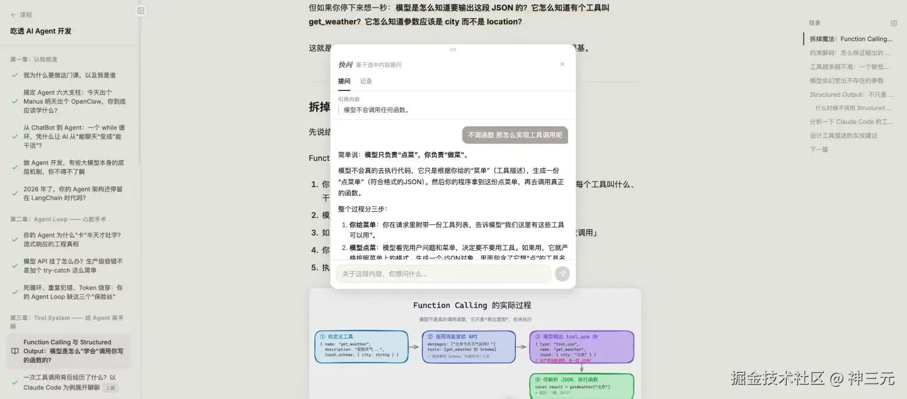
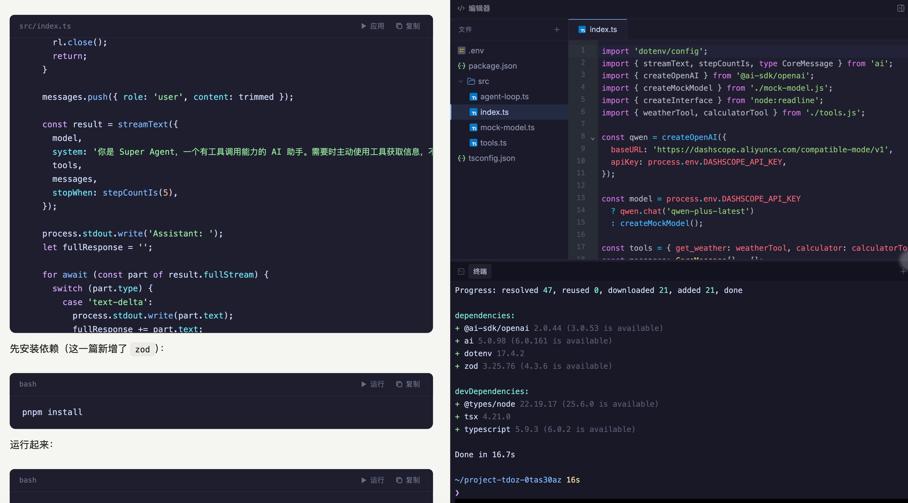

# 最近半年，我做了个 AI-Native 的 Agent 从零到进阶教程

> 原文链接：https://juejin.cn/post/7636277855711395846
> 文章时间：未标注

## 重点内容与核心观点

文章介绍作者围绕 AI-Native Agent 构建的一套课程和实践体系，重点从 Agent 基础、ReAct、上下文工程、MCP、长时记忆、多 Agent、LLMOps 到生产级项目逐步展开。核心观点是，Agent 学习不能只停留在调用模型或写 prompt，而要理解工程化架构、工具接入、评估闭环和真实项目交付，才能把 Agent 从演示样例推进到可运行的产品系统。

[神三元](https://juejin.cn/user/430664257382462/posts)

2026-05-05

965

阅读7分钟

关注

## 契机

很久没有更新了朋友们，最近半年一直在忙创业相关的事情，也在运营公众号，很少发一些掘金文章了。但平时和一些读者朋友聊下来，我发现大家对 Agent 开发特别有需求，有的业务直接 All in Agent 的，有的觉得传统前后端技术到瓶颈了、想转型做 Agent 开发的，也有跳槽要找 Agent 相关岗位工作的。

而且大家觉得现在信息爆炸，噪音太多了，贩卖焦虑的声音也特别多，导致真正核心的东西没有学好。

所以我几个月前就在想，要不要系统出门课来帮助大家学会 Agent 开发，因为这些正好又是我的强项所在。

在字节的时候，我一个人做了一个内部的 Vibe Coding 平台——就是你现在看到满大街的那种，用自然语言描述需求，AI 帮你生成完整应用，一键部署。类似 Lovable、v0、Bolt 这些产品。

不过我做得非常早，2024 年上半年就有雏形了。

那时候市面上还没有这些东西，我跟别人说"以后写代码可以用自然语言"，大部分人觉得我在说梦话。但我自己清楚这个方向是对的，因为我每天都在用，每天都在感受到那种效率的飞跃。

后来的事情你们都知道了——2025 年 Vibe Coding 彻底爆发，Claude Code 成了现象级产品，Cursor 融了几十亿美金。我当初做的那个"超前"的东西，突然变成了行业共识。

> 说这些不是为了吹牛，是想说：我在 AI + 编程这个交叉领域，确实踩过很多坑，也比大多数人更早地经历了从"这玩意儿能用吗"到"这玩意儿离不开了"的完整过程。

[详情可以看这里](https://link.juejin.cn/?target=http%3A%2F%2Fmp.weixin.qq.com%2Fs%3F__biz%3DMzU0MTU4OTU2MA%3D%3D%26mid%3D2247492615%26idx%3D1%26sn%3D99f5f3dcf0a301b6da4a8e9dbfee4d0a%26chksm%3Dfaae35d4d36d994455f832090eb35bc5ae412a58a4d4f434e2ab1bf9d0b671a4ee8ba832a15e%26scene%3D126%26sessionid%3D1778034865%26subscene%3Dundefined%26clicktime%3D1778034868%26enterid%3D1778034868%23rd "http://mp.weixin.qq.com/s?__biz=MzU0MTU4OTU2MA==&mid=2247492615&idx=1&sn=99f5f3dcf0a301b6da4a8e9dbfee4d0a&chksm=faae35d4d36d994455f832090eb35bc5ae412a58a4d4f434e2ab1bf9d0b671a4ee8ba832a15e&scene=126&sessionid=1778034865&subscene=undefined&clicktime=1778034868&enterid=1778034868#rd")

所以我想，干脆做一门课吧。把我这些年积累的认知、踩过的坑、拆过的源码，系统地用人话整理出来，延续我之前接地气的风格，分享给同样想深入 Agent 开发的朋友。

## 我想做点不一样的

### 我先做了个 AI 私教产品

我先说一个我观察到的普遍痛点：

大部分技术课程的体验是这样的——你看完一篇文章，觉得"哦，我懂了"，但一到实际场景需要你用的时候，脑子就空了。这不是你的问题，也不是课程内容不好，而是 **被动阅读本身就很难产生真正的理解**。心理学上有一个词叫"流畅性错觉"——因为作者写得太清晰了，你误以为自己也搞清楚了，实际上有很多盲区。

这个问题怎么解决？最有效的方式其实大家都知道——找个好老师 1v1 带你。老师会追问你、戳穿你的"假懂"、引导你自己把逻辑理清楚。但好老师太贵了，也不可能 24 小时陪着你。

我本身是做产品的人，我相信好的产品能规模化地解决问题。所以我做了一个 AI 私教平台 [Sitor](https://link.juejin.cn/?target=https%3A%2F%2Fsitor.ai "https://sitor.ai")，并且把这门课的每一节都接入了进去。你不只是看文章，而是有一个 AI 私教全程陪着你学：

- **先摸底**——它会先通过几个问题判断你的真实水平，跳过你已经会的，从你真正需要的地方开始。
- **苏格拉底式追问**——它不会直接告诉你答案，而是顺着你的回答继续追问，让你自己发现理解中的漏洞。
- **掌握了才能往下走**——每个概念都有掌握度评分，达标才解锁下一个节点，没有人可以蒙混过关。
- **它记得你**——你的知识背景、易错点、学习偏好，AI 都会记住，下次回来不用从头开始。

说白了，我希望你学这门课，不只是买了一堆文章，而是买了一个随时在线的 1v1 私教。你看文章建立认知，看不懂的地方、想深入的地方，直接跟 AI 私教聊，它会陪你把每个概念都想明白。

所以，这不是仅仅图文版的教程，而是一门活的 AI-Native 的课程。

### 随时快问的能力

我之前写了一些文章，读者很多时候会对某些文章里面的细节进行提问，因为大家基础都不一样。但这个问题如今完全可以被 AI 解决，我在课程里面加了快问的功能，早期的学员朋友也反馈非常满意。

什么意思呢？你遇到任何不懂的地方，可以直接选中任何课程内容，然后直接问我们的 AI 私教，立马给你解答，不用切换窗口。

更重要的是，快问功能融合了课程内容、你的历史学习记录、个性化偏好，会给你输出非常高质量的回答，与普通的 AI Chat 体验完全不同。

### 沉浸式在线实战环境

除了知识体系课，我还做了一门配套的实战课——从零搭建一个完整的 AI Agent，能接聊天软件、有记忆、有工具系统、能装插件。每一篇都有起始代码模板，打开就能跑。完整跟下来，你就能做出一个生产级别的 Agent。

而且，实战课内置了完整的浏览器端编码环境——左边是课程文章，右边就是编辑器和终端。你不需要在本地配任何环境，打开浏览器就能写代码、装依赖、跑程序，所见即所得。代码块还能一键「应用」到编辑器里，改完直接在终端里验证效果。

以前的教程，要你手动 copy 代码，还不见得能在本地跑起来。我做的这个教程，全部能在浏览器实时跑，100% 保证可以运行。

## 内容设计

> "我知道 Agent 很重要，但我不知道从哪学起。感觉每天都在出新东西，学不完。"

很多读者跟我这样反馈的，但说实话，如果你真正研究过各个生产级别的 Agent 之后，你会发现大家都在解决同一组问题。基本就是围绕如下的几个板块来做：

- Agent Loop
- Tool System 工具调用系统
- Context Engineering
- Memory
- Multi Agent
- Harness 基建

课程里面我会把这些模块一一击破，并且带你实战出一个对标 Openclaw 生产级 Agent 项目。无论是为了面试还是日常开发，都有直接的帮助。

具体的内容就不赘述了，因为现在课程已经上线了，在 [sitor.ai/courses](https://link.juejin.cn/?target=https%3A%2F%2Fsitor.ai%2Fcourses "https://sitor.ai/courses") 里面可以直接看到，也可以在这个网站上直接报名，支持 PC 和移动端阅读和体验。

如果报名成功了，可以加我微信 sanyuan0704 来拉课程群，现在已经有 400+ 小伙伴加入学习了，每天会深入地去交流课程内容，以及业界的最新动态，相当于也有了一个高质量的圈子。

希望能对大家有所帮助，在此共勉！

> 报名链接: [sitor.ai/courses](https://link.juejin.cn/?target=https%3A%2F%2Fsitor.ai%2Fcourses "https://sitor.ai/courses")
