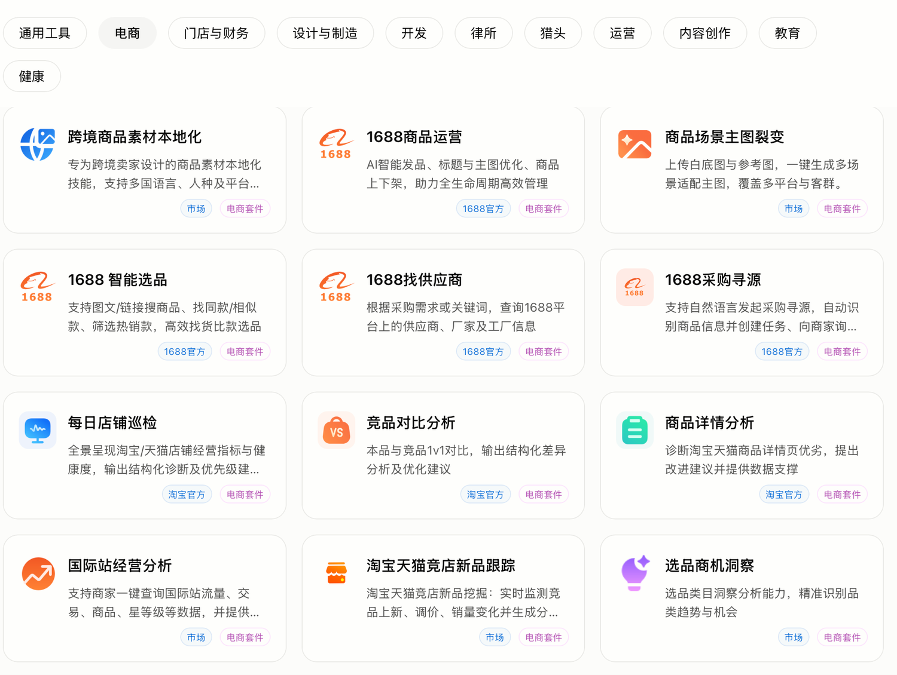
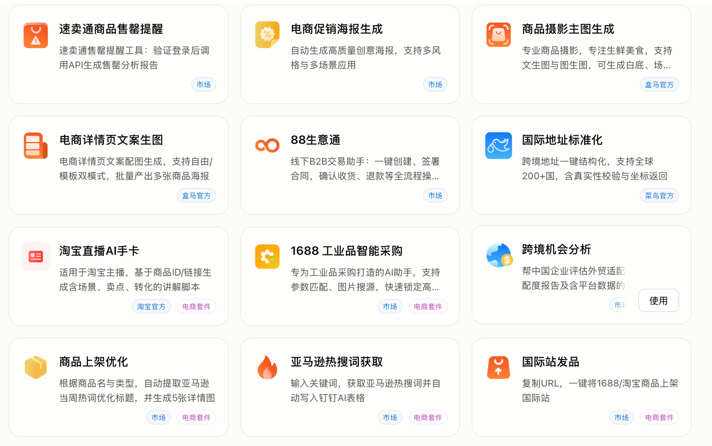
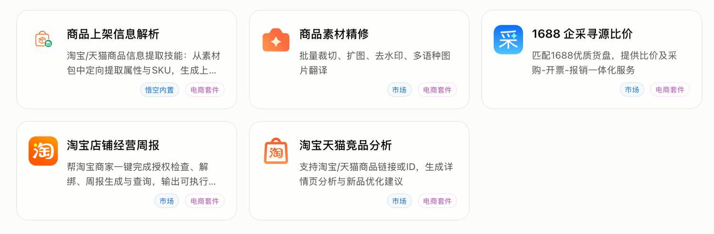

# 有段时间没用悟空了，今天发现它上了一批电商相关 Skill

> 原文链接：https://m.okjike.com/originalPosts/69fa23d553e36367c38dc0b2
> 文章时间：未标注

## 重点内容与核心观点

这条即刻动态的重点是：悟空已经把 1688、淘宝、速卖通等电商场景接入到一批垂直 Skill 中，说明 Agent 产品正在从通用对话和通用编码，进一步下沉到具体业务链路。核心观点是，电商 Agent 的价值不在于单点能力炫技，而在于把选品、商品信息处理、平台操作等连续场景打通，形成可直接嵌入业务流程的自动化能力。

栗噔噔

6天前

有段时间没用悟空了，今天一打开发现它闷声不响上了一大批电商相关的skill，把1688、淘宝、速卖通各个场景一一打通，真是相当的卷……

